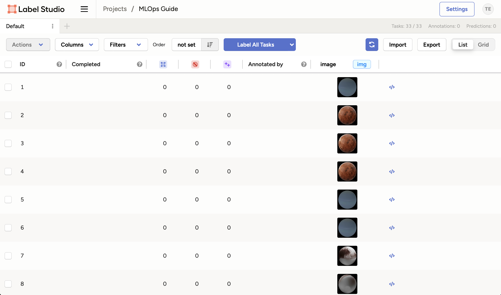
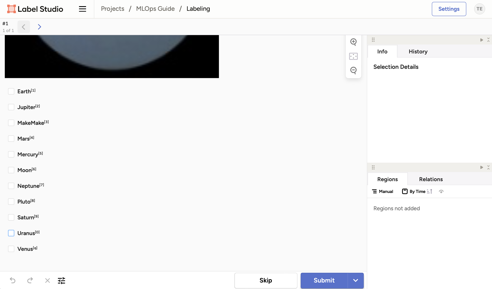

# Chapter 20 - Label new data with Label Studio

## Introduction

In this chapter, you will explore the process of using Label Studio to manually
annotate images.

The following diagram illustrates the control flow of the experiment at the end
of this chapter:

## Steps

### Start the Labeling Interface

Make sure Label Studio is running at <http://localhost:8080>.

Click on the **Label All Tasks** button to start labeling the images. The images
will be displayed one by one in sequential order.

### Label an image

You will be presented with the image and the choices you defined earlier.

!!! tip

    Next to each label, you will see a number or letter in brackets. This is the
    **keyboard shortcut** for the label. You can use this to quickly label the image
    by pressing the corresponding key on your keyboard.

1. Select the correct label for the image. In this case, the image is of the
   planet Uranus.
2. Click **Submit** to save the label.
3. We will stop at the next displayed image for labeling.

!!! warning

    We will not be labeling more images, as we need to keep some unlabeled data for
    the next chapter. You can go back to the project view by
    **clicking on your project name** on the top navigation bar.

### Track the progress

In the project view, you can see the progress of the labeling task.

!!! info

    Label Studio provides a lot of information such as the date and annotation
    author. This allows to have multiple annotations for the same data, which is a
    must for larger datasets as it helps to reduce bias.

Note that you can also import additional data and export the labels.

Currently, we have labeled one image but in the next chapter, we will learn how
to use the model we trained earlier to label the images automatically.

## Summary

You have labeled new data manually using Label Studio, which ensures the
annotation process is not only systematic, but also uniform. The organizational
capabilities of Label Studio contribute to creating high-quality labeled
datasets.

That concludes this chapter.

## State of the labeling process

- [x] Labeling of supplemental data can be done systematically and uniformly
- [ ] Labeling of supplemental data is time intensive
- [ ] Model needs to be retrained using higher-quality data

## Souces

- [_Label Studio Labeling Guide_](https://labelstud.io/guide/labeling)
