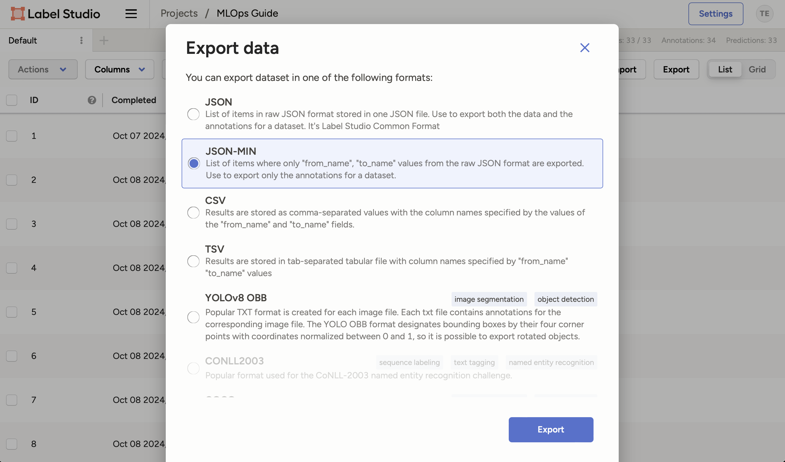
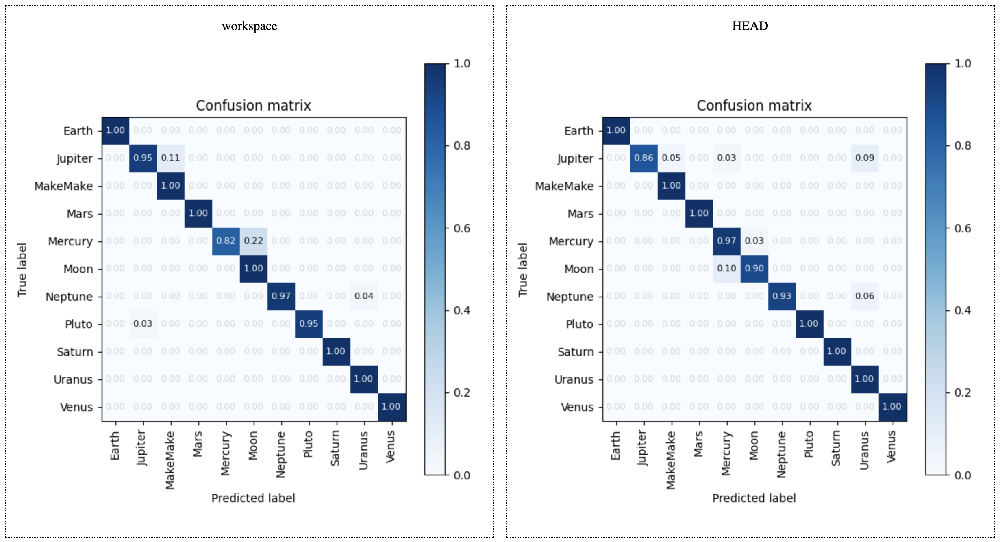

# Chapter 21 - Retrain the model from new data with DVC

## Introduction

In this chapter, we will retrain the model using the new data we labeled in the
previous chapter. We will download the annotations from Label Studio and use
them to retrain the model. We will then evaluate the new model to see if it has
improved.

## Steps

### Download the Annotations

Make sure Label Studio is running at <http://localhost:8080>.

1. In the project view, click on the `Export` button and select `JSON-MINI`.

    

2. Click on the `Export` button to download the annotations.

3. Rename the downloaded json file to `annotations.json`.

4. Move the file to your mlops repository (`a-guide-to-mlops`) under the
   `extra-data/` folder.

    ```yaml hl_lines="4"
    .
    ├── extra-data/
    │   ├── README.md
    │   ├── annotations.json # (1)!
    │   ├── encode_decode.py
    │   └── extra_data/
    └── ...
    ```

    1. This is the annotations file we downloaded from Label Studio.

### Parse the Annotations

Label Studio exports the annotations in a specific format. We need to parse
these annotations to extract the labels and the corresponding data.

For this, we will use a Python script. Create a new Python script called
`parse_annotations.py` in a new `scripts/` folder of your repository.

```py title="scripts/parse_annotations.py"
import json
import shutil
from pathlib import Path

# Constants
EXTRA_DATA_FOLDER_PATH = Path("extra-data/extra_data")
NEW_DATA_FOLDER_PATH = Path("data/raw")

# Read annotations and copy images to annotated folders
with open("extra-data/annotations.json") as f:
    annotations = json.load(f)

for annotation in annotations:
    filename = annotation["image"].split("-")[1]
    choice = annotation["choice"]

    source_path = EXTRA_DATA_FOLDER_PATH / filename
    # Note: Here we use the choice as the folder name, as
    #       this is how we organised the data
    dest_path = NEW_DATA_FOLDER_PATH / choice / filename

    print(f"Copying {source_path} -> {dest_path}")
    shutil.copy(source_path, dest_path)

```

The script reads the annotations from the `annotations.json` file and copies the
images to the corresponding folders in the `data/raw` directory.

You can run the script using the following command:

```sh title="Execute the following command(s) in a terminal"
python scripts/parse_annotations.py
```

The annotated images will be copied to the `data/raw` directory. The output
should look like this:

```text
Copying extra-data/extra_data/VXJhbnVzXzE0Ng.jpg -> data/raw/Uranus/VXJhbnVzXzE0Ng.jpg
Copying extra-data/extra_data/VmVudXNfMTQ4.jpg -> data/raw/Venus/VmVudXNfMTQ4.jpg
Copying extra-data/extra_data/VmVudXNfMTQ3.jpg -> data/raw/Venus/VmVudXNfMTQ3.jpg
Copying extra-data/extra_data/VmVudXNfMTQ2.jpg -> data/raw/Venus/VmVudXNfMTQ2.jpg
Copying extra-data/extra_data/VXJhbnVzXzE0OA.jpg -> data/raw/Uranus/VXJhbnVzXzE0OA.jpg
Copying extra-data/extra_data/VXJhbnVzXzE0Nw.jpg -> data/raw/Uranus/VXJhbnVzXzE0Nw.jpg
...
```

### Retrain the Model

Now that we have the new data, we can retrain the model. We will use DVC:

```sh title="Execute the following command(s) in a terminal"
dvc repro
```

And check the new model's performance:

```sh title="Execute the following command(s) in a terminal"
dvc plots diff --open
```



The plot shows the performance of the old (right) and new model (left). You can
see if the new model has improved.


## Summary

In this chapter, we retrained the model using the new data we labeled in Label
Studio. We downloaded the annotations, parsed them, and retrained the model
using DVC. We then evaluated the new model to see if it has improved.
