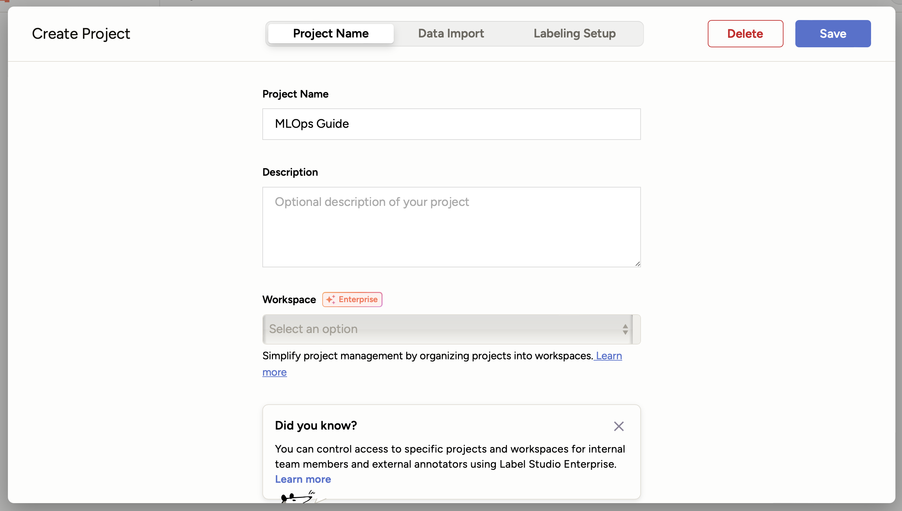
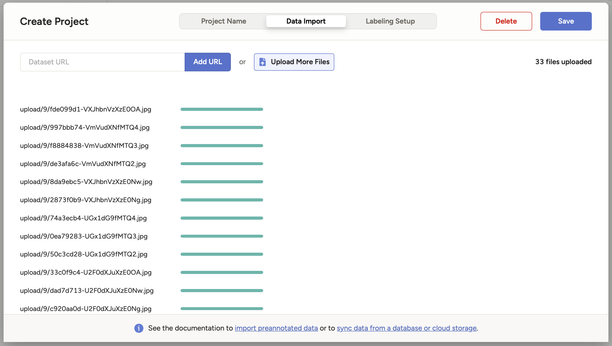

# Chapter 4.1 - Setup Label Studio

## Introduction

In the previous chapters, we successfully deployed and accessed our model on
Kubernetes, set up continuous deployment with a CI/CD pipeline, and trained the
model on a Kubernetes pod. Now, we will focus on labeling new data to further
improve our model's performance.

The quality of data is crucial for any machine learning model. The saying
*"garbage in, garbage out"* holds true: if the data fed into the model is of
poor quality, the predictions of the model will also be poor. Therefore, giving
careful attention to the data labeling process is essential to guarantee
high-quality, accurate data.

In Supervised Learning tasks, collecting and labeling data is usually not a
one-time task but an iterative process. Just as developing a machine learning
model involves multiple iterations of training and parameter adjustments, the
data collection and labeling process also requires continuous refinement. As new
data becomes available and the requirements of the model evolve, additional
rounds of data labeling and quality checks are necessary to maintain and improve
the model's performance.

[Label Studio](https://labelstud.io) is an open-source data labeling tool that
supports various data types, including text, images, audio, and video. In this
chapter, we will guide you through setting up Label Studio in your environment.
This includes installing the necessary dependencies, configuring the tool, and
preparing it for data labeling tasks.

In this chapter, you will learn how to:

1. Set up Label Studio to have a fully functional instance ready to label new
   data
2. Import supplemental data for labeling

The new data will be used in subsequent chapters to retrain and improve your
model.

The following diagram illustrates the control flow of the experiment at the end
of this chapter:


## Steps

### Download the Data

Before configuring Label Studio, you will need to download additional data used
for labeling.

```sh title="Execute the following command(s) in a terminal"
# Download the archive containing the extra data
wget https://github.com/swiss-ai-center/a-guide-to-mlops/archive/refs/heads/extra-data.zip -O extra-data.zip
```

The downloaded archive must be decompressed and renamed:

```sh title="Execute the following command(s) in a terminal"
# Extract the dataset
unzip extra-data.zip

# Rename to the folder to `extra-data`
mv a-guide-to-mlops-extra-data/ extra-data/

# Remove the archive and the directory
rm extra-data.zip
```

Finally, add the `extra-data` folder to the `.gitignore` file:

```sh title="Execute the following command(s) in a terminal"
# Add the `extra-data` folder to the `.gitignore` file
echo -e "\n# Label Studio\nextra-data/" >> .gitignore
```

Check the differences with Git to validate the changes:

```sh title="Execute the following command(s) in a terminal"
# Show the differences with Git
git diff .gitignore
```

The output should be similar to this:

```diff
diff --git a/.gitignore b/.gitignore
index dee3012..cbfa93b 100644
--- a/.gitignore
+++ b/.gitignore
@@ -11,6 +11,3 @@ dvc_plots

 # DVC will add new files after this line
 /model
+
+# Label Studio
+extra-data/
```

### Install Label Studio

Next, we will install Label Studio in our environment. Add the main
`label-studio` dependency to the `requirements.txt` file:

```txt title="requirements.txt" hl_lines="7"
tensorflow==2.17.0
matplotlib==3.9.2
pyyaml==6.0.2
dvc[gs]==3.53.2
bentoml==1.3.7
pillow==10.4.0
label-studio==1.13.1
```

Check the differences with Git to validate the changes:

```sh title="Execute the following command(s) in a terminal"
# Show the differences with Git
git diff requirements.txt
```

The output should be similar to this:

```diff
diff --git a/requirements.txt b/requirements.txt
index 4b8d3d9..d584cca 100644
--- a/requirements.txt
+++ b/requirements.txt
@@ -4,3 +4,4 @@ pyyaml==6.0.2
 dvc[gs]==3.53.2
 bentoml==1.3.7
 pillow==10.4.0
+label-studio==1.13.1
```

Install the package and update the freeze file.

!!! warning

    Prior to running any pip commands, it is crucial to ensure the virtual
    environment is activated to avoid potential conflicts with system-wide Python
    packages.

    To check its status, simply run `pip -V`. If the virtual environment is active,
    the output will show the path to the virtual environment's Python executable. If
    it is not, you can activate it with `source .venv/bin/activate`.

```sh title="Execute the following command(s) in a terminal"
# Install the dependencies
pip install --requirement requirements.txt

# Freeze the dependencies
pip freeze --local --all > requirements-freeze.txt
```

### Commit the changes to Git

Commit the changes to Git.

```sh title="Execute the following command(s) in a terminal"
# Add all the files
git add .

# Commit the changes
git commit -m "Add Label Studio"
```

### Start Label Studio

You can now start label studio with the following command:

```sh title="Execute the following command(s) in a terminal"
# Start Label Studio
label-studio start
```

Label Studio will start on <http://localhost:8080>. Open the URL in your browser
and sign up for an account.

!!! note

    The account creation is completely offline and local. It is not related to any
    service or enterprise offer from Label Studio. This is only done once to create
    an ID locally.

### Create a New Project

Once you have signed up, you can create a new project in Label Studio:

1. Click **Create Project** to create a project.
2. Give your project a name (ex: `MLOps Guide`).

    

3. Select the **Data Import** tab and click on the **Upload File** button.
   Select all the images from the `extra-data/extra_data` folder you downloaded
   earlier.

    !!! tip

        For WSL2 users, the Linux distribution is accessible through the
        `\\wsl.localhost\` address in the file explorer.

    

4. Select the **Labeling Setup** tab and choose **Image Classification** under
   the **Computer Vision** menu.

    

5. Under **Labeling Interface** select **Code** and paste the following
   configuration:

    ```xml
    <View>
        <Image name="image" value="$image"/>
        <Choices name="choice" toName="image">
            <Choice value="Earth" />
            <Choice value="Jupiter" />
            <Choice value="MakeMake" />
            <Choice value="Mars" />
            <Choice value="Mercury" />
            <Choice value="Moon" />
            <Choice value="Neptune" />
            <Choice value="Pluto" />
            <Choice value="Saturn" />
            <Choice value="Uranus" />
            <Choice value="Venus" />
        </Choices>
    </View>
    ```

    Here we simply define the choices for the image classification task.

    !!! info

        You can read more about the Label Studio configuration in the
        [official documentation](https://labelstud.io/guide/setup).

    The configuration should look like this:

    

6. Click **Save** to create the project.

## Summary

Congratulations! You have successfully set up Label Studio in your environment
and imported new data. You are now ready to start labeling your data!

## State of the labeling process

- [ ] Labeling of supplemental data needs to be systematic and uniform
- [ ] Labeling of supplemental data is time intensive
- [ ] Model needs to be retrained using higher-quality data

## Sources

- [_Label Studio Documentation_](https://labelstud.io/guide/)
