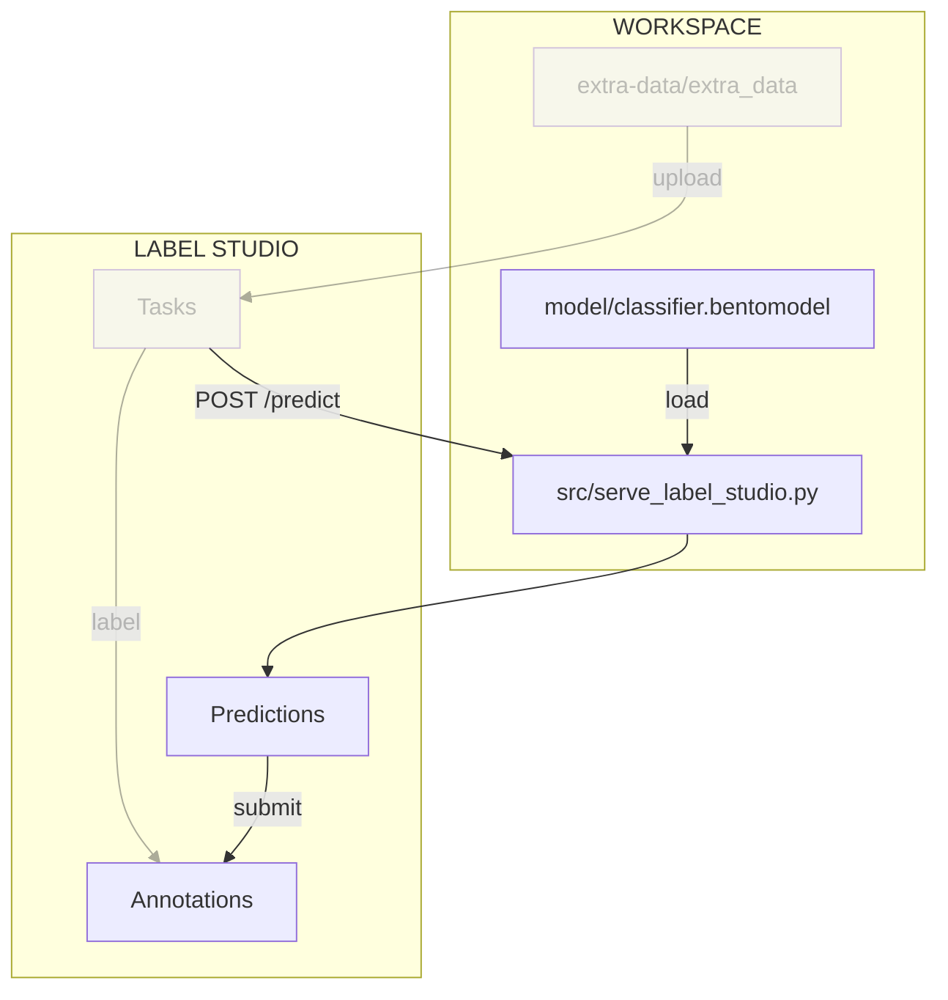
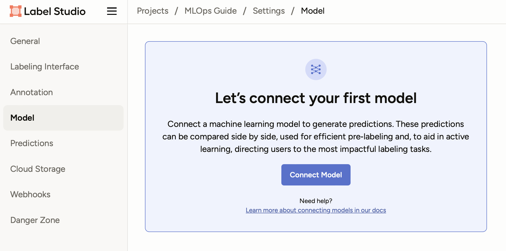
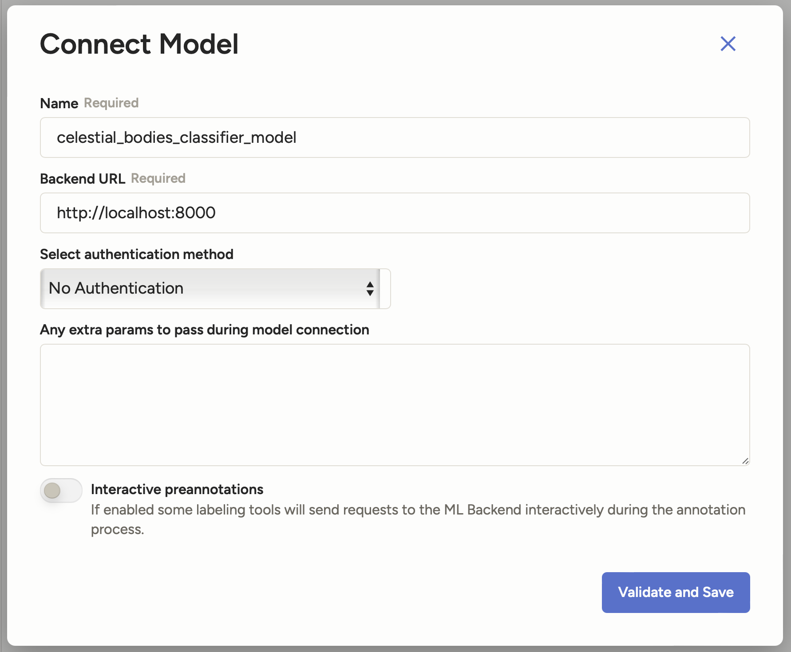
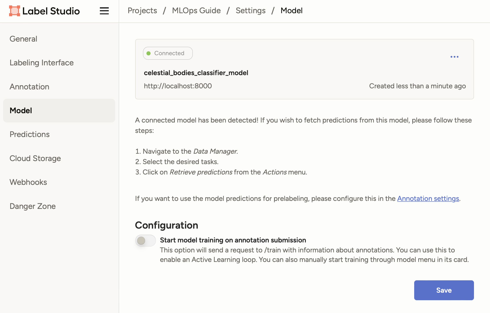
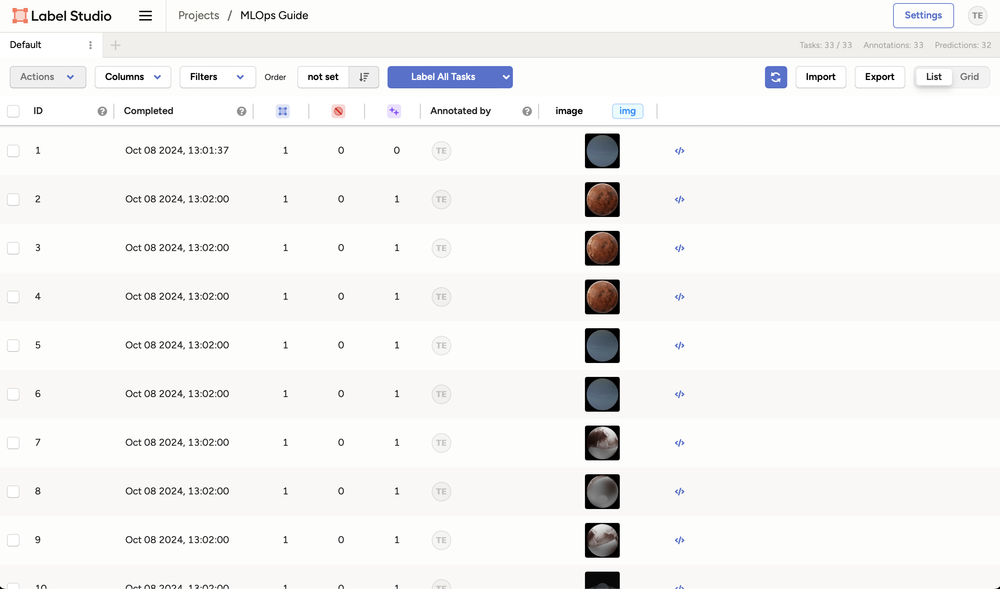

# Chapter 4.3 - Link the model to Label Studio

## Introduction

In this chapter, you will begin by creating an API for the model. Next, you will
link the model you trained in the previous chapters to Label Studio using this
API. This integration will enable the model to make predictions on the unlabeled
data within Label Studio, rendering the labeling process "AI assisted" and thus
making it significantly more efficient.

The following diagram illustrates the control flow of the experiment at the end
of this chapter:



## Steps

### Install FastAPI

Before adding the model to Label Studio, we need to create an API for the model.
Python has many packages for building web frameworks. In this guide we will use
[FastAPI](https://fastapi.tiangolo.com) for it's simplicity. Add the main
`fastapi[standard]` dependency to the `requirements.txt` file:

```txt title="requirements.txt" hl_lines="8"
tensorflow==2.17.0
matplotlib==3.9.2
pyyaml==6.0.2
dvc[gs]==3.60.1
bentoml==1.4.25
pillow==11.2.1
label-studio==1.20.0
fastapi[standard]==0.115.14
```

Check the differences with Git to validate the changes:

```sh title="Execute the following command(s) in a terminal"
# Show the differences with Git
git diff requirements.txt
```

The output should be similar to this:

```diff
diff --git a/requirements.txt b/requirements.txt
index 160d09c..1721a7f 100644
--- a/requirements.txt
+++ b/requirements.txt
@@ -5,3 +5,4 @@ dvc[gs]==3.60.1
 bentoml==1.4.25
 pillow==11.2.1
 label-studio==1.20.0
+fastapi[standard]==0.115.14
```

Install the package and update the freeze file.

!!! warning

    Prior to running any pip commands, it is crucial to ensure the virtual
    environment is activated to avoid potential conflicts with system-wide Python
    packages.

    To check its status, simply run `pip -V`. If the virtual environment is active,
    the output will show the path to the virtual environment's Python executable. If
    it is not, you can activate it with `source .venv/bin/activate`.

```sh title="Execute the following command(s) in a terminal"
# Install the dependencies
pip install --requirement requirements.txt

# Freeze the dependencies
pip freeze --local --all > requirements-freeze.txt
```

### Create the model API

Let's start building the API which will allow Label Studio to talk with our
model. Label Studio expects the following API endpoints:

- GET `/health` - To check if the model is running.
- POST `/setup` - To configure the model API. It is useful if we have multiple
  models and we want to pick the right one for the task.
- POST `/webhook` - To start jobs such as model training from the Label Studio
  UI to our API.
- POST `/predict` - To make predictions using the model.

Let's implement these endpoints.

Create a new file `src/serve_label_studio.py` and add the following code:

```py title="src/serve_label_studio.py"
from __future__ import annotations

import uuid
from pathlib import Path
from typing import Dict

import bentoml
from fastapi import FastAPI
from PIL import Image

# 1. Define constants
MODEL_VERSION = "v0.0.1"
DATA_FOLDER_PATH = Path("extra-data/extra_data")

# 2. Initialize FastAPI app
app = FastAPI()
# Load the BentoML model
bento_model = bentoml.keras.get("celestial_bodies_classifier_model")
preprocess = bento_model.custom_objects["preprocess"]
postprocess = bento_model.custom_objects["postprocess"]
model = bento_model.load_model()


# 3. Define API endpoints
@app.get("/health")
async def health():
    return {"status": "ok"}


@app.post("/setup")
async def setup(_: Dict):
    # Currently, we don't need to do anything with the setup
    # This is why we ignore the input data
    return {"model_version": MODEL_VERSION}


@app.post("/webhook")
async def webhook():
    # Currently, we don't need to do anything with the webhook
    # It is used to start training the model from the Label Studio UI
    # Refer to:
    # https://github.com/HumanSignal/label-studio-ml-backend/blob/master/label_studio_ml/api.py#L118
    return {"status": "Unknown event"}


@app.post("/predict")
async def predict(data: Dict):
    # For request and response types, refer to:
    # https://labelstud.io/guide/ml_create#3-Implement-prediction-logic
    task = data["tasks"][0]
    # This is a simplification to get the filename from the image id.
    # In a real-world scenario, you would store the image on S3
    # and fetch it here.
    filename = "".join(task["data"]["image"].split("-")[1:])
    image_path = DATA_FOLDER_PATH / filename
    image = Image.open(image_path)

    preprocessed_image = preprocess(image)
    prediction = model.predict(preprocessed_image)
    result = postprocess(prediction)
    prediction = result["prediction"]
    score = result["probabilities"][prediction]
    print(score, type(score))

    return {
        "results": [
            {
                "model_version": MODEL_VERSION,
                "score": score,
                "result": [
                    {
                        "value": {"choices": [prediction]},
                        "id": str(uuid.uuid4()),
                        "from_name": "choice",
                        "to_name": "image",
                        "type": "choices",
                    }
                ],
            }
        ],
    }
```

This file is structured in 3 parts:

1. Definition of some useful constants.
2. Creation of the FastAPI app and loads the model similarly to BentoML
    `src/serve.py`.
3. Definition the API endpoints required by Label Studio.

!!! note

    We do nothing with the `/setup` and `/webhook` endpoints as we do not need the
    functionality they offer. However, they are still required to exist for the
    model to work with Label Studio. If you would like to go further, please refer
    the [Label Studio ML integration documentation](https://labelstud.io/guide/ml).

### Check the changes

Check the changes with Git to ensure that all the necessary files are tracked:

```sh title="Execute the following command(s) in a terminal"
# Add all the files
git add .

# Check the changes
git status
```

The output should look like this:

```text
On branch main
Changes to be committed:
  (use "git restore --staged <file>..." to unstage)
        modified:   requirements-freeze.txt
        modified:   requirements.txt
        new file:   src/server_label_studio.py
```

### Commit the changes to Git

Commit the changes to Git:

```sh title="Execute the following command(s) in a terminal"
# Commit the changes
git commit -m "Add FastAPI integration to Label Studio"
```

### Run the model API

Run the model API by executing the following command:

```sh title="Execute the following command(s) in a terminal"
fastapi run src/serve_label_studio.py
```

The FastAPI server will start at <http://localhost:8000> and you can view the
documentation at <http://localhost:8000/docs>.

Make sure to keep the server running in the background for the next steps.

### Add the model to Label Studio

Make sure Label Studio is running at <http://localhost:8080>.

1. Click on the **Settings** button on the top right corner of the screen and
   select **Model** from the sidebar.

    

2. Click on the **Connect Model** button and enter the following details:

    - **Name**: `celestial_bodies_classifier_model`
    - **Backend URL**: `http://localhost:8000`

    It should look like this:

    

3. Click on **Validate and Save** to add the model.

You should now see your model with a status of `Connected`:



### Label with the model

Now that the model is connected, you can start labeling the data.

1. Click on your **project name** on the top navigation bar to go back to the
   project view.

    

2. Click on the **Label All Tasks** button to start labeling the data. This will
   resume the labeling process from where you left off.

    You should now see the image has been labeled automatically by the model:

    

3. Review the prediction and make any necessary corrections.

4. Click on the **Submit** button to save the annotation.

5. Continue labeling the data until you have labeled all the images.

And that's it! You can view the annotations in the project view:



!!! warning

    While AI-assisted labeling can significantly speed up the labeling process, it
    is important to be aware of its limitations. Human labelers might become overly
    reliant on the model's predictions and accept them without proper verification,
    especially when dealing with large datasets over extended periods. This can lead
    to inaccuracies in the labeled data.

    To mitigate this risk, consider implementing cross-labeling, where multiple
    labelers annotate the same data and discrepancies are reviewed. This ensures
    higher accuracy and reliability of the labeled data.

## Summary

Wow! You have successfully linked the model to Label Studio. You can now use the
model to make predictions on the data you have in Label Studio to speed up the
labeling process. In the next chapter, we will retrain the model using the new
data we have labeled.

!!! abstract "Take away"

    - **AI-assisted labeling creates a virtuous cycle**: Using your model to
      pre-label data speeds up annotation, which generates more labeled data to
      retrain the model, which improves pre-labeling quality. This feedback loop is
      central to continuous learning systems but requires careful monitoring to
      prevent error propagation.
    - **Model serving requires more than inference logic**: Building a
      production-ready model API means implementing health checks, configuration
      endpoints, and proper error handling, not just a `/predict` endpoint, to enable
      robust integration with downstream systems like Label Studio.
    - **BentoML's custom objects enable end-to-end integration**: Packaging
      preprocessing and postprocessing functions with the model means the serving
      layer automatically handles image transformation and probability decoding,
      eliminating the need to duplicate data processing logic between training and
      serving code.
    - **Automation bias is a real risk in AI-assisted workflows**: When human
      labelers see model predictions pre-filled, they may anchor to those suggestions
      and accept incorrect labels without proper scrutiny, especially under time
      pressure or with large datasets. Implementing cross-labeling and quality checks
      helps mitigate this risk.

## State of the labeling process

- [x] Labeling of supplemental data can be done systematically and uniformly
- [x] Labeling of supplemental data is accelerated with AI assistance
- [ ] Model needs to be retrained using higher-quality data

## Sources

- [_FastAPI_](https://fastapi.tiangolo.com)
- [_Label Studio_](https://labelstud.io)
- [_Label Studio ML Integration_](https://labelstud.io/guide/ml)
