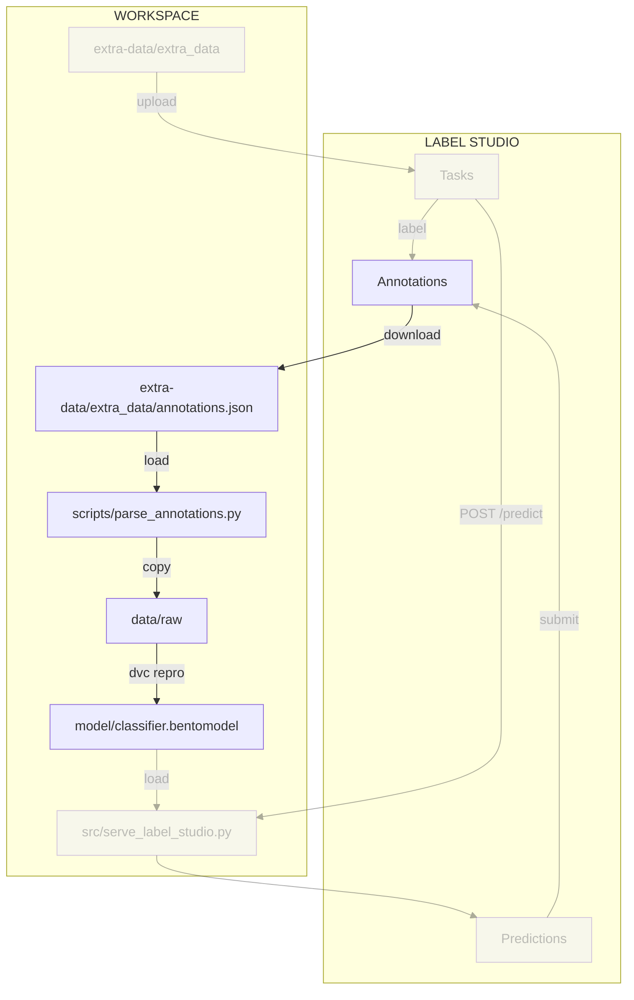

# Chapter 4.4 - Retrain the model from new data with DVC

## Introduction

In this chapter, we will retrain the model using the new data we labeled in the
previous chapter. We will download the annotations from Label Studio and use
them to retrain the model. We will then evaluate the new model to see if it has
improved.

The following diagram illustrates the control flow of the experiment at the end
of this chapter:



## Steps

### Download the annotations

Make sure Label Studio is running at <http://localhost:8080>.

1. In the project view, click on the **Export** button and select `JSON-MINI`.

    

2. Click on the **Export** button to download the annotations.

3. Rename the downloaded json file to `annotations.json`.

4. Move the file to your `a-guide-to-mlops` repository under the `extra-data/`
   folder.

    ```yaml hl_lines="4"
    .
    ├── extra-data/
    │   ├── README.md
    │   ├── annotations.json # (1)!
    │   ├── encode_decode.py
    │   └── extra_data/
    └── ...
    ```

    1. This is the annotations file we downloaded from Label Studio.

### Parse the annotations

Label Studio exports the annotations in a specific format. We need to parse
these annotations to extract the labels and the corresponding data.

For this, we will use a Python script. Create a new Python script called
`parse_annotations.py` in a new `scripts/` folder of your repository.

```py title="scripts/parse_annotations.py"
import json
import shutil
from pathlib import Path

# Constants
EXTRA_DATA_FOLDER_PATH = Path("extra-data/extra_data")
NEW_DATA_FOLDER_PATH = Path("data/raw")

# Read annotations and copy images to annotated folders
with open("extra-data/annotations.json") as f:
    annotations = json.load(f)

for annotation in annotations:
    # Here we perform the same manipulation as `src/serve_label_studio.py`
    # to retrieve the correct filename
    filename = "".join(annotation["image"].split("-")[1:])
    choice = annotation["choice"]

    source_path = EXTRA_DATA_FOLDER_PATH / filename
    # Note: Here we use the choice as the folder name, as
    #       this is how we organised the data
    dest_path = NEW_DATA_FOLDER_PATH / choice / filename

    print(f"Copying {source_path} -> {dest_path}")
    shutil.copy(source_path, dest_path)

```

The script reads the annotations from the `annotations.json` file and copies the
images to the corresponding folders in the `data/raw` directory.

You can run the script using the following command:

```sh title="Execute the following command(s) in a terminal"
python3.12 scripts/parse_annotations.py
```

The annotated images will be copied to the `data/raw` directory. The output
should look like this:

```text
Copying extra-data/extra_data/VXJhbnVzXzE0Ng.jpg -> data/raw/Uranus/VXJhbnVzXzE0Ng.jpg
Copying extra-data/extra_data/VmVudXNfMTQ4.jpg -> data/raw/Venus/VmVudXNfMTQ4.jpg
Copying extra-data/extra_data/VmVudXNfMTQ3.jpg -> data/raw/Venus/VmVudXNfMTQ3.jpg
Copying extra-data/extra_data/VmVudXNfMTQ2.jpg -> data/raw/Venus/VmVudXNfMTQ2.jpg
Copying extra-data/extra_data/VXJhbnVzXzE0OA.jpg -> data/raw/Uranus/VXJhbnVzXzE0OA.jpg
Copying extra-data/extra_data/VXJhbnVzXzE0Nw.jpg -> data/raw/Uranus/VXJhbnVzXzE0Nw.jpg
...
```

### Check the changes

Check the changes with Git to ensure that all the necessary files are tracked:

```sh title="Execute the following command(s) in a terminal"
# Add all the files
git add .

# Check the changes
git status
```

The output should look like this:

```text
On branch main
Changes to be committed:
  (use "git restore --staged <file>..." to unstage)
        new file:   scripts/parse_annotations.py
```

### Commit the changes to Git

Commit the changes to Git:

```sh title="Execute the following command(s) in a terminal"
# Commit the changes
git commit -m "Add annotation parser script"
```

### Retrain the model

Now that we have the new data, we can retrain the model. We will use DVC:

```sh title="Execute the following command(s) in a terminal"
dvc repro
```

And check the new model's performance:

```sh title="Execute the following command(s) in a terminal"
dvc plots diff --open
```


The plot shows the performance of the old (right) and new model (left). You can
see if the new model has improved.

### Commit and push the updated data

Once you want to share the new data, commit the changes and push to DVC and Git:

```sh title="Execute the following command(s) in a terminal"
# Upload the experiment data, model and cache to the remote bucket
dvc push

# Add all the files
git add .

# Commit the changes
git commit -m "Update the experiment data"

# Push the changes
git push
```

## Summary

In this chapter, we retrained the model using the new data we labeled in Label
Studio. We downloaded the annotations, parsed them, and retrained the model
using DVC. We then evaluated the new model to see if it has improved.

## State of the labeling process

- [x] Labeling of supplemental data can be done systematically and uniformly
- [x] Labeling of supplemental data is accelerated with AI assistance
- [x] Model is retrained with the supplemental data
