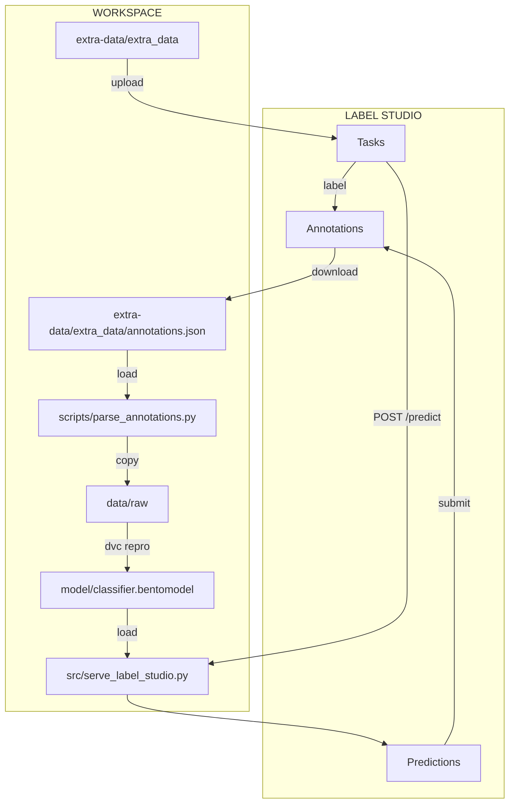

# Conclusion

Congratulations! You have successfully completed the fourth part of the guide.
In this part, you learned how to annotate the data using Label Studio using AI
assisted labeling. You finally retrained the model using the newly labeled data.

As you work with your data and model, you may find that certain labels need
refinement or that additional data points require annotation. You can
continuously improve the quality of your labeled dataset, to improve your model
accuracy and effectiveness over time. Based on the model performance feedback,
you can revisite and update the annotations to create a broader and more robust
training set that better meets the needs of your project.

This concludes the guide. We hope you enjoyed it and learned a lot. If you have
any questions or feedback, please feel free to reach out to us on
[GitHub](https://github.com/swiss-ai-center/a-guide-to-mlops).

The final part of the guide will cover cleaning up the resources and
environments you have generated. We strongly recommend to go through the
[Clean up](../clean-up.md) section to ensure the proper removal of the resources
and environments you have generated.

The following diagram illustrates the bricks you set up at the end of this part:

