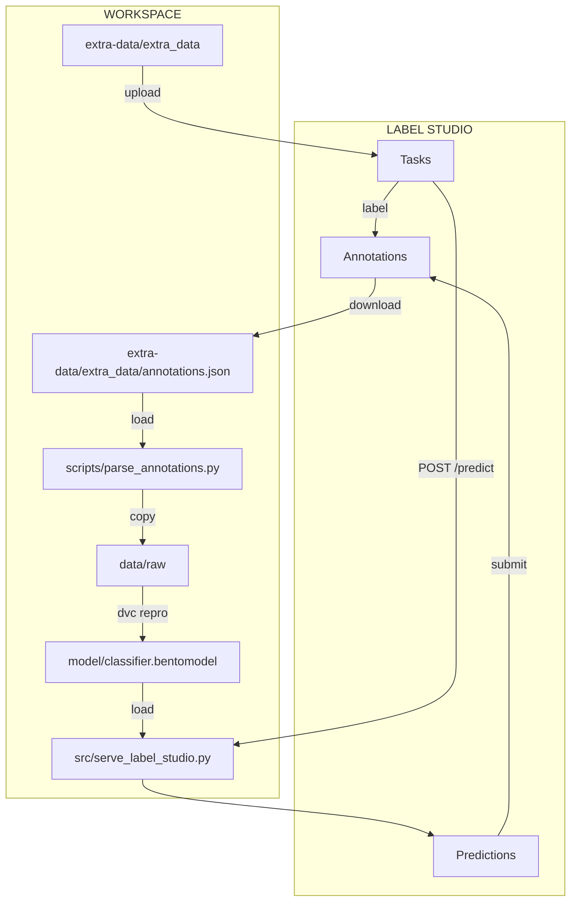

# Conclusion

Congratulations! You have successfully completed the fourth part of the guide.
In this part, you learned how to annotate the data using Label Studio using AI
assisted labeling. You finally retrained the model using the newly labeled data.

As you work with your data and model, you may find that certain labels need
refinement or that additional data points require annotation. You can
continuously improve the quality of your labeled dataset, to improve your model
accuracy and effectiveness over time. Based on the model performance feedback,
you can revisite and update the annotations to create a broader and more robust
training set that better meets the needs of your project.

This concludes the guide. We hope you enjoyed it and learned a lot. If you have
any questions or feedback, please feel free to reach out to us on
[GitHub](https://github.com/swiss-ai-center/a-guide-to-mlops).

The following diagram illustrates the bricks you set up at the end of this part:

```mermaid
flowchart TB
    extra_data -->|upload| labelStudioTasks
    labelStudioTasks -->|label| labelStudioAnnotations
    bento_model -->|load| fastapi
    labelStudioTasks -->|POST /predict| fastapi
    fastapi --> labelStudioPredictions
    labelStudioPredictions -->|submit| labelStudioAnnotations
    labelStudioAnnotations -->|download| extra_data_annotations
    extra_data_annotations --> |load| parse_annotations
    parse_annotations -->|copy| data_raw
    data_raw -->|dvc repro| bento_model

    subgraph workspaceGraph[WORKSPACE]
        extra_data[extra-data/extra_data]
        extra_data_annotations[extra-data/extra_data/annotations.json]
        bento_model[model/classifier.bentomodel]
        fastapi[src/serve_label_studio.py]
        parse_annotations[scripts/parse_annotations.py]
        data_raw[data/raw]
    end

    subgraph labelStudioGraph[LABEL STUDIO]
        labelStudioTasks[Tasks]
        labelStudioAnnotations[Annotations]
        labelStudioPredictions[Predictions]
    end
```

## Going further

!!! info "Scaling to cloud annotation"

    The workflow you just completed runs Label Studio locally. The same approach
    also works for collaborative team annotation in the cloud. Only three things
    change:

    - **Instance**: deploy Label Studio on a shared server, in a container, or use
      [Label Studio Cloud](https://labelstud.io/guide/label_studio_cloud).
    - **Data import**: upload from S3/GCS instead of your local disk.
    - **Model backend**: use a reachable URL for the FastAPI backend instead of
      `http://localhost:8000`.

    The XML labeling interface, export format, and DVC retraining steps stay the
    same.

## Next steps

**Clean up your resources**

Now that you've completed the guide, see the [Clean up guide](../clean-up.md)
for comprehensive instructions on removing all resources you created:

- Local Git repository and DVC cache
- Python virtual environment
- Cloud storage bucket (S3/GCS)
- Container registry and Docker images
- Kubernetes cluster and deployments
- CI/CD pipeline configurations
- Self-hosted runners (if configured)
- Label Studio installation and data

This is necessary to return to a clean state on your computer, avoid unnecessary
incurring costs, and address potential security concerns.

!!! warning

    Unlike previous parts where you could skip cleanup to continue, we
    **strongly recommend** completing the full cleanup after finishing Part 4 to
    avoid ongoing cloud costs (especially Kubernetes clusters) and potential
    security risks from exposed resources.
