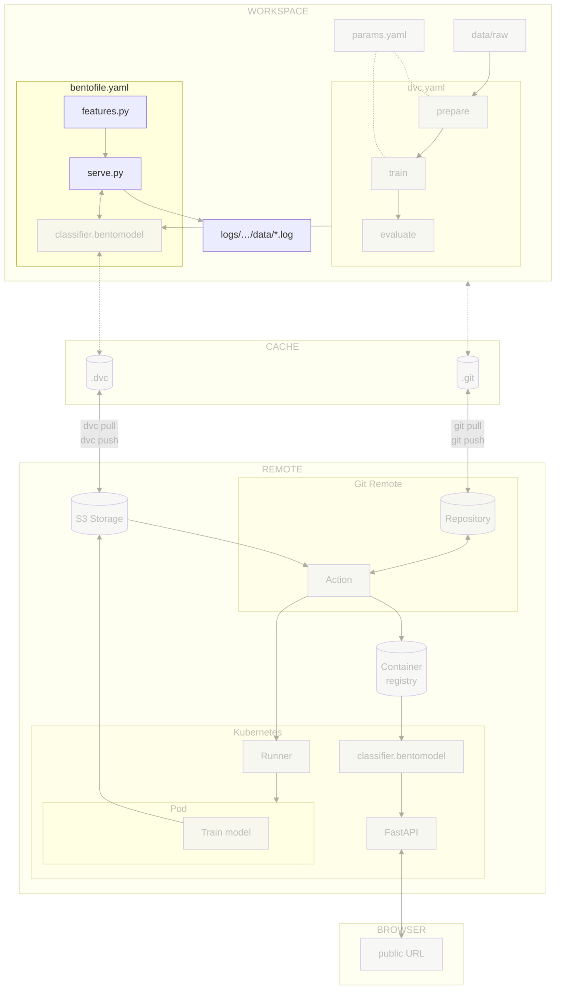

# Chapter 4.1 - Log predictions and features locally

## Introduction

Once a model is deployed, its predictions and performance can degrade silently
as the data it sees changes over time. In this chapter, you will use BentoML's
native monitoring to capture the predictions and the model features that
produced them in local log files.

Collecting prediction logs lets you spot drift early, before it affects users.
They are the raw material for monitoring.

In this chapter, you will learn how to:

1. Extract scalar features, embeddings, and prediction statistics
2. Enable BentoML's native monitoring and log features on each prediction
3. Run the service locally and verify that predictions are logged
4. Commit the changes to Git

The following diagram illustrates the control flow at the end of this chapter:



### What is drift?

ML models usually assume that future data looks like the data they were trained
on. When that assumption stops holding, model performance can drop silently.
That change is called _drift_.

For this classifier, there are three drift signals worth monitoring:

* _Data drift_ occurs when the inputs themselves change. Incoming images might
  come from a different instrument (Hubble, Juno, Cassini, or amateur telescopes),
  use a different processing pipeline (JPEG artifacts, resizing, or contrast
  stretching), or show different viewing geometry (crescent phases, ring glare, or
  overexposure). Scalar features such as `image_mean` or `image_std` catch coarse
  input changes.
* _Feature drift_ (also called _embedding drift_) is a more sensitive form of
  data drift. Instead of looking at raw pixels, you look at the vectors the model
  learns right before the final classification layer. Two images can have the same
  brightness and contrast but very different embeddings if one contains a storm
  pattern the model has never seen.
* _Prediction drift_ occurs when the distribution of predicted classes changes.
  This is not necessarily an error: the classifier may simply be reflecting new
  inputs, but a sudden shift can warn you that the model is now overconfident on
  unfamiliar examples. For instance, an outreach campaign might prompt users to
  submit far more Neptune images, or a mission announcement might cause a spike in
  Europa images. `confidence` and `entropy` help reveal such shifts.

Other kinds of drift exist, but they are harder to detect without extra
information. Concept drift happens when the relationship between inputs and
labels changes, such as a new storm on Jupiter altering what "Jupiter" looks
like. Model drift happens when the deployed model itself degrades, such as after
a bad weights upload.

This chapter focuses on _input data drift_, _feature drift_, and
_prediction drift_. To enable drift detection, we log scalar features from
incoming images, embeddings from the model's last hidden layer, and the
predicted class distribution through BentoML's native monitoring. These values
can later be compared against a reference dataset.

## Steps

### Update the experiment

This chapter focuses on **local prediction logging**. In this step you will
create `src/features.py`, enable BentoML's native monitoring in `src/serve.py`
and log the extracted features on each prediction, and add `features.py` to the
BentoML build manifest.

#### Create `src/features.py`

Create a new feature-extraction module with helper functions for scalar features
from the preprocessed image, an embedding from the model's last hidden layer,
and prediction-distribution statistics.

```py title="src/features.py"
from typing import Any

import numpy as np
import tensorflow as tf


def extract_scalar_features(preprocessed_image: np.ndarray) -> dict[str, float]:
    """Extract simple scalar features from the preprocessed image tensor.

    The tensor is the exact input the model sees (after preprocess), so these
    features can be reproduced for the reference dataset in Chapter 4.2.
    """
    pixels = np.asarray(preprocessed_image)
    return {
        "image_mean": float(np.mean(pixels)),
        "image_std": float(np.std(pixels)),
        "image_min": float(np.min(pixels)),
        "image_max": float(np.max(pixels)),
    }


def build_embedding_extractor(model: tf.keras.Model) -> tf.keras.Model:
    """Return a model that outputs the last hidden layer's activations."""
    return tf.keras.Model(
        inputs=model.inputs,
        outputs=model.layers[-2].output,
    )


def extract_embedding(
    embedding_extractor: tf.keras.Model,
    preprocessed_image: np.ndarray,
) -> list[float]:
    """Extract the embedding vector from the model's last hidden layer.

    The embedding captures the representation the classifier learned right before
    the final softmax decision. It is a much stronger drift signal than raw pixel
    statistics.

    The input is the exact 4D (B, H, W, C) tensor returned by preprocess. Errors
    are intentionally not caught here: the caller computes every feature up front
    and guards the whole monitoring block, so a failure skips the whole record
    rather than writing a partial one.
    """
    embedding = embedding_extractor.predict(preprocessed_image, verbose=0).squeeze()
    return embedding.tolist()


def extract_prediction_stats(prediction_result: dict[str, Any]) -> dict[str, Any]:
    """Extract prediction-distribution stats from the postprocess output."""
    probabilities = prediction_result.get("probabilities", {})
    if not probabilities:
        return {
            "predicted_label": prediction_result.get("prediction"),
            "confidence": 0.0,
            "entropy": 0.0,
        }

    probs = np.array(list(probabilities.values()), dtype=float)
    confidence = float(np.max(probs))
    # Shannon entropy (nats); the scale is irrelevant for drift detection.
    probs = probs[probs > 0]
    entropy = float(-np.sum(probs * np.log(probs)))

    return {
        "predicted_label": prediction_result["prediction"],
        "confidence": confidence,
        "entropy": entropy,
    }
```

Each record is one JSON object per line. It contains the columns you log through
`bentoml.monitor`, plus a `timestamp` and `request_id` that BentoML adds
automatically:

| Field | Type | Description |
|---|---|---|
| `image_mean` | float | Mean of preprocessed pixel values |
| `image_std` | float | Standard deviation of preprocessed pixel values |
| `image_min` | float | Minimum of preprocessed pixel values |
| `image_max` | float | Maximum of preprocessed pixel values |
| `confidence` | float | Maximum softmax probability |
| `entropy` | float | Shannon entropy of the probability distribution |
| `embedding` | `list[float]` | Vector from the model's last hidden layer |
| `predicted_label` | string | Class predicted by the model |
| `timestamp` | string (ISO 8601) | Time BentoML recorded the prediction |
| `request_id` | int | Request id BentoML assigns to correlate records |

!!! tip "Why these features?"

    Scalar image features are cheap and interpretable, but they only catch global
    input changes such as brightness or contrast shifts. The embedding vector from
    the model's last hidden layer is a much stronger drift signal because it
    captures the semantic representation the classifier actually uses. Prediction
    statistics (`predicted_label`, `confidence`, `entropy`) capture shifts in the
    model's outputs, which can reveal class-balance changes or growing model
    uncertainty. In the next chapter you will compare all of these features against
    a reference dataset built from `data/prepared/train`.

!!! info "Storing embeddings at scale"

    In this chapter we log embeddings directly through BentoML's monitoring because
    the experiment is small. In production, high-dimensional embeddings can quickly
    make log files large and slow to parse.

    If your embeddings are large or your request volume is high, consider storing
    them separately instead of inline:

    - Keep scalar features and prediction statistics in the monitoring log, but
      store embeddings as Parquet.
    - Use the `request_id` to link each monitoring record to its stored embedding.
    - For very large scale, use a feature store or vector database designed for
      embedding storage and retrieval.

    This keeps the prediction log small and fast while still allowing drift analysis
    on embeddings when needed.

#### Update `src/serve.py`

Enable BentoML's native monitoring in the `@bentoml.service` decorator, import
the feature extractors from `features.py`, build the embedding extractor in the
constructor, and add a `monitor` method that logs the extracted features after
each prediction with `bentoml.monitor`.

```py title="src/serve.py" hl_lines="10-28 36 47 50-70"
from __future__ import annotations
from bentoml.validators import ContentType
from pathlib import Path
from typing import Annotated
from PIL.Image import Image
from pydantic import Field
import bentoml
import json

from features import (
    build_embedding_extractor,
    extract_embedding,
    extract_prediction_stats,
    extract_scalar_features,
)

# Anchor monitoring output to the project root
LOG_PATH = Path(__file__).resolve().parent.parent / "logs"


@bentoml.service(
    name="celestial_bodies_classifier",
    monitoring={
        "enabled": True,
        "type": "default",
        "options": {"log_path": str(LOG_PATH)},
    },
)
class CelestialBodiesClassifierService:
    bento_model = bentoml.keras.get("celestial_bodies_classifier_model")

    def __init__(self) -> None:
        self.preprocess = self.bento_model.custom_objects["preprocess"]
        self.postprocess = self.bento_model.custom_objects["postprocess"]
        self.model = self.bento_model.load_model()
        self.embedding_extractor = build_embedding_extractor(self.model)

    @bentoml.api()
    def predict(
            self,
            image: Annotated[Image, ContentType("image/jpeg")] = Field(description="Planet image to analyze"),
    ) -> Annotated[str, ContentType("application/json")]:
        image = self.preprocess(image)

        predictions = self.model.predict(image)
        result = self.postprocess(predictions)
        self.monitor(image, result)
        return json.dumps(result)

    def monitor(self, preprocessed_image, prediction_result: dict) -> None:
        """Log extracted features for drift monitoring via BentoML's native monitor.

        Every value is computed before the monitoring context is opened, and the
        whole block is guarded: a failure logs to stdout and writes no record, so
        monitoring can never break a prediction nor emit a partial record.
        """
        try:
            scalar_features = extract_scalar_features(preprocessed_image)
            embedding = extract_embedding(self.embedding_extractor, preprocessed_image)
            stats = extract_prediction_stats(prediction_result)

            with bentoml.monitor("celestial_bodies_classifier") as mon:
                for name, value in scalar_features.items():
                    mon.log(value, name=name, role="feature", data_type="numerical")
                mon.log(stats["confidence"], name="confidence", role="feature", data_type="numerical")
                mon.log(stats["entropy"], name="entropy", role="feature", data_type="numerical")
                mon.log(embedding, name="embedding", role="feature", data_type="numerical_sequence")
                mon.log(stats["predicted_label"], name="predicted_label", role="prediction", data_type="categorical")
        except Exception as exc:
            print(f"[monitoring] Failed to log prediction: {exc}")
```

#### Update `src/bentofile.yaml`

Add `features.py` to the `include` list so the feature extractors are packaged
with the service.

```yaml title="src/bentofile.yaml" hl_lines="4"
service: 'serve:CelestialBodiesClassifierService'
include:
  - serve.py
  - features.py
python:
  packages:
    - "tensorflow==2.21.0"
    - "matplotlib==3.10.9"
    - "pillow==12.2.0"
docker:
    python_version: "3.13"
```

#### Update the .gitignore file

Monitoring buffers are runtime artifacts, not source code. Add `logs/` to
`.gitignore` so local monitoring logs are not committed:

```gitignore title=".gitignore" hl_lines="7-9"
## Python
.venv/

# Byte-compiled / optimized / DLL files
__pycache__/

## Monitoring buffers
logs/

## DVC

# DVC plots
dvc_plots

# DVC will add new files after this line
/mode
```

### Run the experiment

Start the BentoML service in one terminal, send a few test images from
`data/raw` in another, and inspect the resulting monitoring log.

```sh title="Execute the following command(s) in a terminal"
# Start the service
bentoml serve --working-dir ./src serve:CelestialBodiesClassifierService
```

```sh title="Execute the following command(s) in a second terminal"
# Send a few test images
for img in data/raw/Mercury/*.jpg; do
  curl -X POST -F "image=@$img" http://localhost:3000/predict
done
```

BentoML writes one file per worker. Inspect the first one:

```sh title="Execute the following command(s) in a second terminal"
cat logs/celestial_bodies_classifier/data/data.1.log
```

Each line should be a valid JSON object containing the expected fields:

```json
{"image_mean": ..., "image_std": ..., "image_min": ..., "image_max": ..., "confidence": ..., "entropy": ..., "embedding": [..., ...], "predicted_label": "...", "timestamp": "...", "request_id": ...}
```

Alongside the data, BentoML writes the column schema to
`logs/celestial_bodies_classifier/schema/schema.1.log`.

Finally, make sure the Bento still builds correctly:

```sh title="Execute the following command(s) in a terminal"
# Build the BentoML model artifact
bentoml build src
```

### Check the changes

Check the changes with Git to ensure that all the necessary files are tracked:

```sh title="Execute the following command(s) in a terminal"
# Add all the files
git add .

# Check the changes
git status
```

The output should look similar to this:

```text
On branch main
Changes to be committed:
  (use "git restore --staged <file>..." to unstage)
        modified:   .gitignore
        modified:   src/bentofile.yaml
        modified:   src/serve.py
        new file:   src/features.py
```

### Commit the changes to Git

Commit the changes:

```sh title="Execute the following command(s) in a terminal"
# Commit the changes
git commit -m "Add prediction logging using BentoML native monitoring"

# Push the changes
git push
```

## Summary

In this chapter, you have successfully:

1. Extracted scalar features, embeddings, and prediction statistics
2. Enabled BentoML's native monitoring and logged features on each prediction
3. Ran the service locally and verified that predictions are logged
4. Committed the changes to Git

You fixed some of the previous issues:

- [x] Model predictions can be monitored in production

!!! abstract "Take away"

    - **Production monitoring starts with logging**: Before drift detection or
      alerting, you need a durable log of predictions. BentoML's native monitoring
      writes append-only, JSON-per-line log files that are easy to inspect and parse.
    - **Log features the model actually sees**: Scalar features from the
      preprocessed image, the embedding vector from the model's last hidden layer, and
      statistics from the prediction distribution can all be reproduced for the
      reference dataset, which is essential for drift detection.
    - **Logging must never break a prediction**: Compute every feature first, then
      wrap the monitoring block in a try/except that prints a message and writes no
      record, so a full disk or permissions issue never affects users nor emits a
      partial row.
    - **Local-first keeps the feedback loop tight**: Writing monitoring logs to
      local files lets readers inspect and iterate quickly.

## State of the MLOps process

- [x] Model predictions can be monitored in production
- [ ] Data drift and concept drift are not automatically detected
- [ ] No automated alerts or dashboards are configured
- [ ] Drift signals do not trigger actionable retraining workflows
- [ ] Model cannot be rolled back to a previous version on degradation

Continue to the next chapters to address the remaining items.

## Sources

Highly inspired by:

- [_ML Monitoring_](https://www.evidentlyai.com/blog-category/ml-monitoring)
- [_Embedding drift detection_](https://www.evidentlyai.com/blog/embedding-drift-detection)
- [_Data drift detection for large datasets_](https://www.evidentlyai.com/blog/data-drift-detection-large-datasets)
- [_Monitoring and Data Collection_](https://docs.bentoml.com/en/latest/build-with-bentoml/observability/monitoring-and-data-collection.html)
