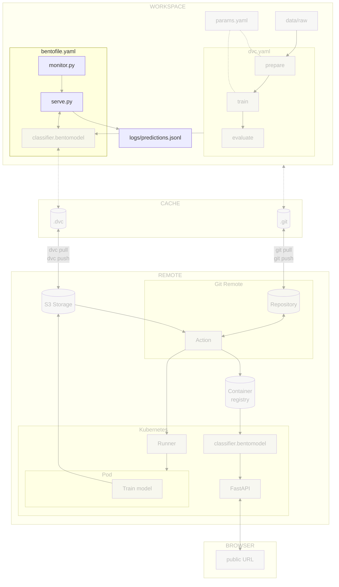

# Chapter 4.1 - Log predictions and features locally

## Introduction

Once a model is deployed, its predictions and performance can degrade silently
as the data it sees changes over time. This is called _drift_. In this chapter,
you will build a local logging pipeline that captures the predictions and the
model features that produced them.

By collecting prediction logs and performance metrics, you can detect degraded
model performance and serving issues before they affect users. This helps you
maintain model quality and establish the feedback signals needed for future
model updates.

In this chapter, you will learn how to:

1. Build a monitoring module that logs predictions locally
2. Extract scalar features, embeddings, and prediction statistics
3. Integrate the logger into the BentoML service
4. Run the service locally and verify that predictions are logged
5. Commit the changes to Git

The following diagram illustrates the control flow at the end of this chapter:



### What is drift?

ML practitioners usually distinguish many kinds of drift. For this classifier,
they look like this:

* _Data drift_ (also called _covariate shift_) occurs when the inputs themselves
  change. Incoming images might come from a different instrument (Hubble, Juno,
  Cassini, or amateur telescopes), use a different processing pipeline (JPEG
  artifacts, resizing, or contrast stretching), or show different viewing geometry
  (crescent phases, ring glare, or overexposure).
* _Feature drift_ (also called _embedding drift_ or _latent-space drift_) is a
  more sensitive form of data drift. Instead of looking at raw pixels, you look at
  the vectors the model learns right before the final classification layer. Two
  images can have the same brightness and contrast but very different embeddings
  if one contains a storm pattern the model has never seen.
* _Prediction drift_ occurs when the predicted class distribution shifts.
  Mission news, astronomical events, or seasonal observation patterns can cause
  spikes in certain classes, such as more Mars images during its closest approach
  to Earth (opposition) or more Europa images after a mission announcement.
* _Label drift_ occurs when the true distribution of classes changes, regardless
  of what the model predicts. For example, an outreach campaign might prompt users
  to submit far more Neptune images than usual, so the ground-truth labels become
  unbalanced even though the images themselves still look normal.
* _Concept drift_ occurs when the relationship between inputs and outputs
  changes. For example, if training images of Jupiter always show a prominent
  Great Red Spot, but newer images show the spot shrunk or obscured by a new
  storm, the model's idea of what Jupiter looks like is no longer accurate. This
  is often the hardest drift to detect.
* _Model drift_ occurs when the model's own behavior degrades over time, for
  example after a bad deployment, a corrupted weights file, or an unintended
  change to the preprocessing pipeline. The same Saturn image that once returned a
  confident prediction might now return low-confidence or inconsistent results.

This chapter focuses on _input data drift_, _feature drift_, and
_prediction drift_. To enable drift detection, we log scalar features from
incoming images, embeddings from the model's last hidden layer, and the
predicted class distribution to a durable JSONL file. These values can later be
compared against a reference dataset.

## Steps

### Update the experiment

This chapter focuses on **local prediction logging**. In this step you will
create `src/monitor.py`, update `src/serve.py` to call the logger, and add
`monitor.py` to the BentoML build manifest.

#### Create `src/monitor.py`

Create a new monitoring module with four plain functions. The module extracts
scalar features from the preprocessed image, extracts an embedding from the
model's last hidden layer, computes prediction-distribution statistics, and
appends a JSON line on every prediction.

```py title="src/monitor.py"
from datetime import datetime, timezone
import json
from pathlib import Path
from typing import Any, Optional

import numpy as np
import tensorflow as tf

# Anchor the log path to the project root
LOG_PATH = Path(__file__).resolve().parent.parent / "logs" / "predictions.jsonl"


def extract_scalar_features(preprocessed_image: np.ndarray) -> dict[str, float]:
    """Extract simple scalar features from the preprocessed image tensor.

    The tensor is the exact input the model sees (after preprocess), so these
    features can be reproduced for the reference dataset in Chapter 4.2.
    """
    image = np.asarray(preprocessed_image)
    # Remove the batch dimension added by preprocess.
    if image.ndim == 4:
        image = np.squeeze(image, axis=0)
    pixels = image.flatten()
    return {
        "image_mean": float(np.mean(pixels)),
        "image_std": float(np.std(pixels)),
        "image_min": float(np.min(pixels)),
        "image_max": float(np.max(pixels)),
    }


def build_embedding_extractor(model: tf.keras.Model) -> tf.keras.Model:
    """Return a model that outputs the last hidden layer's activations."""
    return tf.keras.Model(
        inputs=model.inputs,
        outputs=model.layers[-2].output,
    )


def extract_embedding(
    embedding_extractor: tf.keras.Model,
    preprocessed_image: np.ndarray,
) -> dict[str, Any]:
    """Extract the embedding vector from the model's last hidden layer.

    The embedding captures the representation the classifier learned right before
    the final softmax decision. It is a much stronger drift signal than raw pixel
    statistics.
    """
    if embedding_extractor is None:
        return {}

    image = np.asarray(preprocessed_image)
    # The embedding extractor expects a 4D batch (B, H, W, C).
    if image.ndim == 2:
        # Single grayscale image without channel dimension
        image = np.expand_dims(image, axis=-1)
    if image.ndim == 3:
        # Single image (H, W, C) without batch dimension
        image = np.expand_dims(image, axis=0)

    try:
        embedding = embedding_extractor.predict(image, verbose=0).squeeze()
        return {"embedding": embedding.tolist()}
    except Exception as exc:
        print(f"[monitoring] Failed to extract embedding: {exc}")
        return {}


def extract_prediction_stats(prediction_result: dict[str, Any]) -> dict[str, Any]:
    """Extract prediction-distribution stats from the postprocess output."""
    probabilities = prediction_result.get("probabilities", {})
    if not probabilities:
        return {
            "predicted_label": prediction_result.get("prediction"),
            "confidence": 0.0,
            "entropy": 0.0,
        }

    probs = np.array(list(probabilities.values()), dtype=float)
    confidence = float(np.max(probs))
    # Shannon entropy (nats); the scale is irrelevant for drift detection.
    probs = probs[probs > 0]
    entropy = float(-np.sum(probs * np.log(probs)))

    return {
        "predicted_label": prediction_result["prediction"],
        "confidence": confidence,
        "entropy": entropy,
    }


def log_prediction(
    preprocessed_image: np.ndarray,
    prediction_result: dict[str, Any],
    embedding_extractor: Optional[tf.keras.Model] = None,
    request_id: Optional[str] = None,
) -> None:
    """Append a single prediction record to the local JSONL log.

    Failures are swallowed so that logging can never break a prediction.
    """
    try:
        record = {
            "timestamp": datetime.now(timezone.utc).isoformat(),
            "request_id": request_id,
            **extract_scalar_features(preprocessed_image),
            **extract_embedding(embedding_extractor, preprocessed_image),
            **extract_prediction_stats(prediction_result),
        }

        LOG_PATH.parent.mkdir(parents=True, exist_ok=True)
        with open(LOG_PATH, "a", encoding="utf-8") as f:
            f.write(json.dumps(record, default=str) + "\n")
    except Exception as exc:
        print(f"[monitoring] Failed to log prediction: {exc}")
```

Each logged record contains:

| Field | Type | Description |
|---|---|---|
| `timestamp` | string (ISO 8601) | UTC time of the prediction |
| `request_id` | string | Optional correlation id |
| `image_mean` | float | Mean of preprocessed pixel values |
| `image_std` | float | Standard deviation of preprocessed pixel values |
| `image_min` | float | Minimum of preprocessed pixel values |
| `image_max` | float | Maximum of preprocessed pixel values |
| `embedding` | `list[float]` | Vector from the model's last hidden layer |
| `predicted_label` | string | Class predicted by the model |
| `confidence` | float | Maximum softmax probability |
| `entropy` | float | Shannon entropy of the probability distribution |

!!! tip "Why these features?"

    Scalar image features are cheap and interpretable, but they only catch global
    input changes such as brightness or contrast shifts. The embedding vector from
    the model's last hidden layer is a much stronger drift signal because it
    captures the semantic representation the classifier actually uses. Prediction
    statistics (`predicted_label`, `confidence`, `entropy`) capture shifts in the
    model's outputs, which can reveal class-balance changes or growing model
    uncertainty. In the next chapter you will compare all of these features against
    a reference dataset built from `data/prepared/train`.

!!! info "Storing embeddings at scale"

    In this chapter we store embeddings directly in the JSONL log because the
    experiment is small. In production, high-dimensional embeddings can quickly make
    log files large and slow to parse.

    If your embeddings are large or your request volume is high, consider storing
    them separately instead of inline:

    - Keep scalar features and prediction statistics in the JSONL log, but write
      embeddings to a columnar format such as Parquet or to object storage (S3, GCS,
      Azure Blob).
    - Use the `request_id` to link each JSONL record to its stored embedding.
    - For very large scale, use a feature store or vector database designed for
      embedding storage and retrieval.

    This keeps the prediction log small and fast while still allowing drift analysis
    on embeddings when needed.

#### Update `src/serve.py`

Import `build_embedding_extractor` and `log_prediction`, build the embedding
extractor in the service constructor, and call `log_prediction` after each
prediction.

```py title="src/serve.py" hl_lines="8-10 21 33-42"
from __future__ import annotations
from bentoml.validators import ContentType
from typing import Annotated
from PIL.Image import Image
from pydantic import Field
import bentoml
import json
import tensorflow as tf

from monitor import build_embedding_extractor, log_prediction


@bentoml.service(name="celestial_bodies_classifier")
class CelestialBodiesClassifierService:
    bento_model = bentoml.keras.get("celestial_bodies_classifier_model")

    def __init__(self) -> None:
        self.preprocess = self.bento_model.custom_objects["preprocess"]
        self.postprocess = self.bento_model.custom_objects["postprocess"]
        self.model = self.bento_model.load_model()
        self.embedding_extractor = build_embedding_extractor(self.model)

    @bentoml.api()
    def predict(
            self,
            image: Annotated[Image, ContentType("image/jpeg")] = Field(description="Planet image to analyze"),
    ) -> Annotated[str, ContentType("application/json")]:
        image = self.preprocess(image)

        predictions = self.model.predict(image)
        result = self.postprocess(predictions)

        log_prediction(
            preprocessed_image=image,
            prediction_result=result,
            embedding_extractor=self.embedding_extractor,
        )
        return json.dumps(result)
```

#### Update `src/bentofile.yaml`

Add `monitor.py` to the `include` list so the logger is packaged with the
service.

```yaml title="src/bentofile.yaml" hl_lines="4"
service: 'serve:CelestialBodiesClassifierService'
include:
  - serve.py
  - monitor.py
python:
  packages:
    - "tensorflow==2.21.0"
    - "matplotlib==3.10.9"
    - "pillow==12.2.0"
docker:
    python_version: "3.13"
```

#### Update the .gitignore file

Prediction logs are runtime artifacts, not source code. Add `logs/` to
`.gitignore` so local logs are not committed:

```gitignore title=".gitignore" hl_lines="7-9"
## Python
.venv/

# Byte-compiled / optimized / DLL files
__pycache__/

## Monitoring buffers
logs/

## DVC

# DVC plots
dvc_plots

# DVC will add new files after this line
/mode
```

### Run the experiment

Start the BentoML service locally and send a few test images. After each
request, check that a new line was appended to `logs/predictions.jsonl`.

```sh title="Execute the following command(s) in a terminal"
# Start the service (run in a separate terminal)
bentoml serve --working-dir ./src serve:CelestialBodiesClassifierService
```

Send a handful of existing images from `data/raw` to the local `/predict`
endpoint. This exercises the service with real inputs and triggers the
monitoring logger on each request.

```sh title="Execute the following command(s) in a second terminal"
# Send a few test images
for img in data/raw/Mercury/*.jpg; do
  curl -X POST -F "image=@$img" http://localhost:3000/predict
done

# Inspect the log file
cat logs/predictions.jsonl
```

Each line should be a valid JSON object containing the expected fields:

```json
{"timestamp": "...", "request_id": null, "image_mean": ..., "image_std": ..., "image_min": ..., "image_max": ..., "embedding": [..., ...], "predicted_label": "...", "confidence": ..., "entropy": ...}
```

Finally, make sure the Bento still builds correctly:

```sh title="Execute the following command(s) in a terminal"
# Build the BentoML model artifact
bentoml build src
```

### Check the changes

Check the changes with Git to ensure that all the necessary files are tracked:

```sh title="Execute the following command(s) in a terminal"
# Add all the files
git add .

# Check the changes
git status
```

The output should look similar to this:

```text
On branch main
Changes to be committed:
  (use "git restore --staged <file>..." to unstage)
        modified:   .gitignore
        modified:   src/bentofile.yaml
        modified:   src/serve.py
        new file:   src/monitor.py
```

### Commit the changes to Git

Commit the changes:

```sh title="Execute the following command(s) in a terminal"
# Commit the changes
git commit -m "Add local JSONL prediction logging"

# Push the changes
git push
```

## Summary

In this chapter, you have successfully:

1. Built a monitoring module that logs predictions locally
2. Extracted scalar features, embeddings, and prediction statistics
3. Integrated the logger into the BentoML service
4. Ran the service locally and verified that predictions are logged
5. Committed the changes to Git

!!! abstract "Take away"

    - **Production monitoring starts with logging**: Before drift detection or
      alerting, you need a durable, versioned log of predictions. JSONL is a simple,
      append-only format that is easy to inspect and parse.
    - **Log features the model actually sees**: Scalar features from the
      preprocessed image, the embedding vector from the model's last hidden layer, and
      statistics from the prediction distribution can all be reproduced for the
      reference dataset, which is essential for drift detection.
    - **Logging must never break a prediction**: Wrap the logging code in a
      try/except block and print failures to stderr so that a full disk or permissions
      issue does not affect users.
    - **Local-first keeps the feedback loop tight**: Writing logs to a local
      file lets readers inspect and iterate quickly.

## State of the MLOps process

- [x] Model predictions can be monitored in production
- [ ] Data drift and concept drift are not automatically detected
- [ ] No automated alerts or dashboards are configured
- [ ] Drift signals do not trigger actionable retraining workflows
- [ ] Model cannot be rolled back to a previous version on degradation

Continue to the next chapters to address the remaining items.

## Sources

Highly inspired by:

- [_ML Monitoring_](https://www.evidentlyai.com/blog-category/ml-monitoring)
- [_Embedding drift detection_](https://www.evidentlyai.com/blog/embedding-drift-detection)
- [_Data drift detection for large datasets_](https://www.evidentlyai.com/blog/data-drift-detection-large-datasets)
