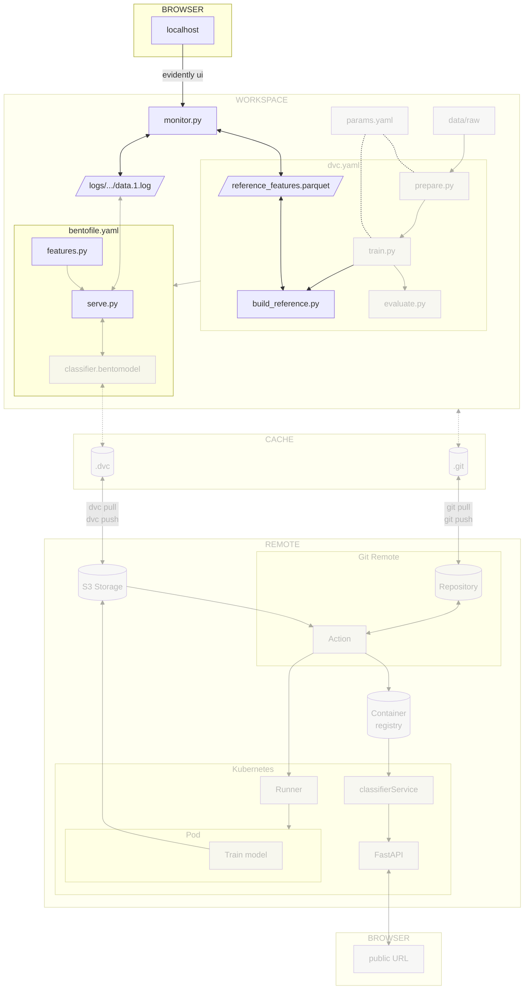
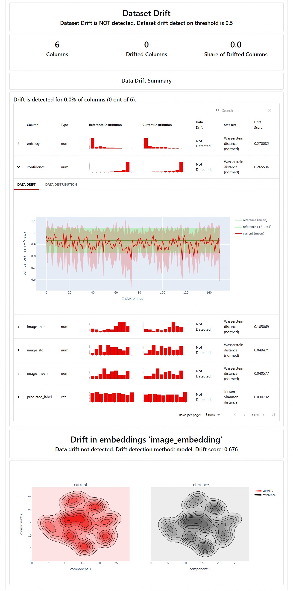
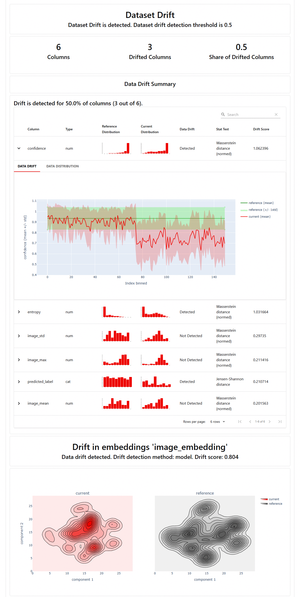
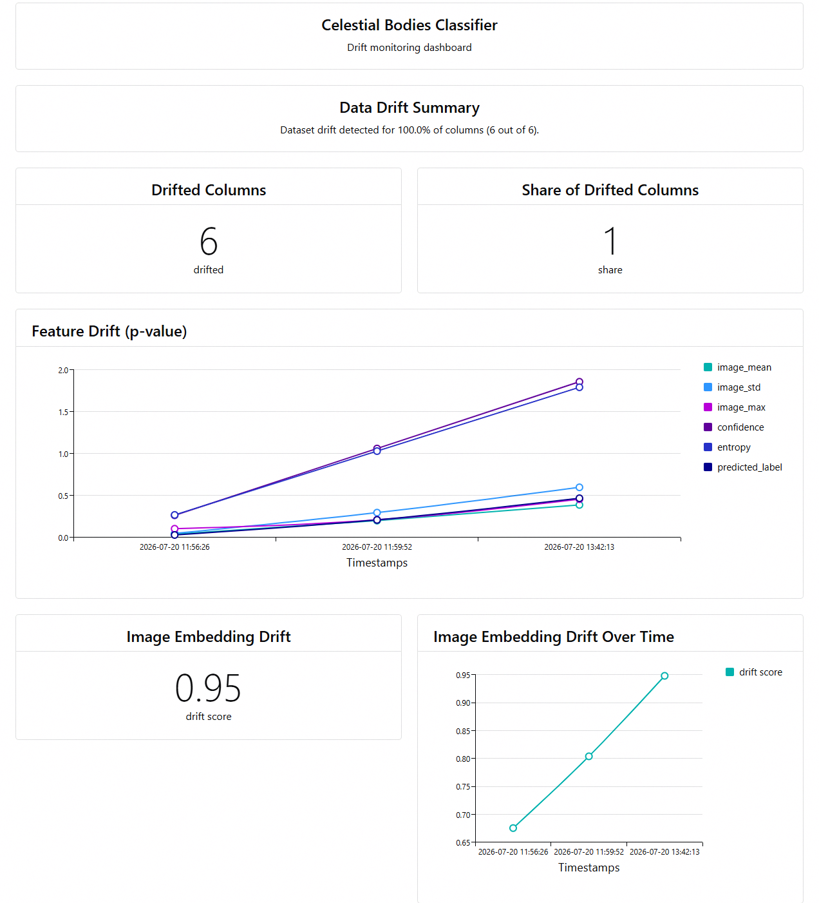

# Chapter 4.2 - Detect drift locally with Evidently AI

## Introduction

The purpose of this chapter is to detect drift by comparing production
predictions against a reference dataset built from the training data. BentoML's
native monitoring now gives you the _current_ distribution of image features,
embeddings, and predicted labels. To know whether that distribution has drifted,
you need a _reference_ distribution that represents the data the model was
trained on. The prepared training set is the natural choice because it is the
exact data the model saw during training.

You will use [Evidently AI](../tools.md) to generate an interactive HTML drift
report and a machine-readable JSON report.

In this chapter, you will learn how to:

1. Install Evidently AI
2. Build a reference dataset from the training data, including embeddings
3. Create a monitoring script that generates an Evidently drift report and
   dashboard
4. Wire the reference build into the DVC pipeline
5. Run the pipeline and generate the reference dataset
6. Commit the changes to DVC and Git
7. Generate production logs and inspect the drift dashboard

The following diagram illustrates the control flow at the end of this chapter:



## Steps

### Install Evidently AI

Add `evidently` to the project requirements. `evidently` brings `pyarrow`
transitively, so Parquet support is available without an extra dependency.

```txt title="requirements.txt" hl_lines="8"
tensorflow==2.21.0
matplotlib==3.11.0
scikit-learn==1.9.0
pyyaml==6.0.3
dvc[gs]==3.67.1
bentoml==1.4.39
pillow==12.3.0
evidently==0.7.21
```

Check the differences with Git to validate the changes:

```sh title="Execute the following command(s) in a terminal"
# Show the differences with Git
git diff requirements.txt
```

The output should be similar to this:

```diff
diff --git a/requirements.txt b/requirements.txt
index 71d9e04..6501b50 100644
--- a/requirements.txt
+++ b/requirements.txt
@@ -5,3 +5,4 @@ pyyaml==6.0.3
 dvc[gs]==3.67.1
 bentoml==1.4.39
 pillow==12.3.0
+evidently==0.7.21
```

Install the package and update the freeze file.

!!! warning

    Prior to running any pip commands, it is crucial to ensure the virtual
    environment is activated to avoid potential conflicts with system-wide Python
    packages.

    To check its status, simply run which python. If the virtual environment is
    active, the output will show the path to the virtual environment's Python
    executable. If it is not, you can activate it with source .venv/bin/activate.

=== ":simple-python: Using pip"

    ```sh title="Execute the following command(s) in a terminal"
    # Install the dependencies
    pip install -r requirements.txt

    # Freeze the dependencies
    pip freeze --local --all > requirements-freeze.txt
    ```

=== ":simple-uv: Using uv"

    ```sh title="Execute the following command(s) in a terminal"
    # Install the dependencies
    uv pip install -r requirements.txt

    # Freeze the dependencies
    uv pip freeze > requirements-freeze.txt
    ```

### Update the experiment

In this step you will create `src/build_reference.py`, create `src/monitor.py`,
and add a new `build_reference` stage to `dvc.yaml`.

#### Create `src/build_reference.py`

This script loads the prepared training set and the saved BentoML model, runs
every training image through the model, and stores the resulting scalar
features, embeddings, and predictions in a Parquet file.

```py title="src/build_reference.py"
import sys
from pathlib import Path

import bentoml
import pandas as pd
import tensorflow as tf

from features import (
    build_embedding_extractor,
    extract_prediction_stats,
    extract_scalar_features,
)


def main() -> None:
    if len(sys.argv) != 4:
        print("Arguments error. Usage:\n")
        print(
            "\tpython3 build_reference.py <prepared-dataset-folder> <model-folder> <output-parquet>\n"
        )
        exit(1)

    prepared_dataset_folder = Path(sys.argv[1])
    model_folder = Path(sys.argv[2])
    output_parquet = Path(sys.argv[3])

    # Load training set
    ds_train = tf.data.Dataset.load(str(prepared_dataset_folder / "train"))

    # Import the model to the local BentoML store
    try:
        bentoml.models.import_model(
            f"{model_folder.absolute()}/celestial_bodies_classifier_model.bentomodel"
        )
    except bentoml.exceptions.BentoMLException:
        print("Model already exists in the model store - skipping import.")

    bento_model = bentoml.keras.get("celestial_bodies_classifier_model")
    postprocess = bento_model.custom_objects["postprocess"]
    model = bentoml.keras.load_model("celestial_bodies_classifier_model")

    # Build the embedding extractor without calling the model first.
    feature_extractor = build_embedding_extractor(model)

    records = []
    for images, labels in ds_train:
        # Predict on the whole batch, then process each example individually.
        logits = model.predict(images, verbose=0)
        embeddings = feature_extractor.predict(images, verbose=0)
        for i in range(images.shape[0]):
            image_batch = images[i : i + 1]
            result = postprocess(logits[i : i + 1])
            embedding = embeddings[i]
            prediction_stats = extract_prediction_stats(result)
            record = {
                **extract_scalar_features(image_batch),
                "predicted_label": prediction_stats["predicted_label"],
                "confidence": prediction_stats["confidence"],
                "entropy": prediction_stats["entropy"],
                **{f"emb_{j}": float(embedding[j]) for j in range(embedding.shape[0])},
            }
            records.append(record)

    df = pd.DataFrame(records)
    output_parquet.parent.mkdir(parents=True, exist_ok=True)
    df.to_parquet(output_parquet, index=False)

    print(f"\nReference dataset saved at {output_parquet.absolute()}")
    print(f"Rows: {len(df)}")
    print(df.head())


if __name__ == "__main__":
    main()

```

The reference dataset contains one row per training image:

| Column | Type | Description |
|---|---|---|
| `image_mean` | float | Mean of preprocessed pixel values |
| `image_std` | float | Standard deviation of preprocessed pixel values |
| `image_min` | float | Minimum of preprocessed pixel values |
| `image_max` | float | Maximum of preprocessed pixel values |
| `emb_0` ... `emb_n` | float | Individual dimensions of the embedding vector |
| `predicted_label` | string | Model prediction on the training image |
| `confidence` | float | Maximum softmax probability |
| `entropy` | float | Prediction entropy |
| `true_label` | string | Ground-truth label from `data/prepared/train` |

#### Create `src/monitor.py`

This script loads the reference dataset and the production prediction log,
builds an Evidently drift report, and writes:

* a snapshot to `monitoring/workspace` for the Evidently UI,
* `monitoring/report.html` for a quick full report view without starting the UI,
* `monitoring/report.json` for programmatic drift scores.

```py title="src/monitor.py"
import sys
from pathlib import Path

import pandas as pd
from evidently import DataDefinition, Dataset, Report
from evidently.metrics import EmbeddingsDrift
from evidently.metrics.embeddings import ModelDriftMethod
from evidently.presets import DataDriftPreset
from evidently.sdk.models import PanelMetric
from evidently.sdk.panels import counter_panel, line_plot_panel, text_panel
from evidently.ui.workspace import Workspace

# Resolve everything against the project root (the directory above src/) so the
# script works no matter which directory it is launched from. serve.py anchors
# the monitoring log_path to this same location.
PROJECT_ROOT = Path(__file__).resolve().parent.parent

REFERENCE_PATH = PROJECT_ROOT / "data/reference_features.parquet"
# BentoML native monitoring writes rotating JSONL files to
# <log_path>/<monitor_name>/data/*.log; log_path is set in serve.py.
MONITOR_NAME = "celestial_bodies_classifier"
LOG_DIR = PROJECT_ROOT / "logs" / MONITOR_NAME / "data"
WORKSPACE_PATH = PROJECT_ROOT / "monitoring/workspace"
REPORT_PATH = PROJECT_ROOT / "monitoring"
PROJECT_NAME = "celestial-bodies-classifier"

# Features monitored for drift.
# image_min is excluded: black background makes it zero-variance (no drift signal)
SCALAR_COLUMNS = [
    "image_mean",
    "image_std",
    "image_max",
    "confidence",
    "entropy",
]
CATEGORICAL_COLUMNS = ["predicted_label"]
EMBEDDING_NAME = "image_embedding"
DRIFT_COLUMNS = SCALAR_COLUMNS + CATEGORICAL_COLUMNS

# Drift detection thresholds and methods.
DRIFT_SHARE_THRESHOLD = 0.5
NUM_DRIFT_METHOD = "wasserstein"
NUM_DRIFT_THRESHOLD = 0.3
CAT_DRIFT_METHOD = "jensenshannon"
CAT_DRIFT_THRESHOLD = 0.1
EMBEDDING_DRIFT_THRESHOLD = 0.7


def expand_embedding_column(df: pd.DataFrame) -> pd.DataFrame:
    """Unpack a list-valued embedding column into one column per dimension.

    Evidently's embedding drift metric expects embeddings as separate columns.
    """
    if "embedding" not in df.columns:
        return df

    df = df.dropna(subset=["embedding"]).copy()
    if df.empty:
        return df.drop(columns=["embedding"])

    embedding_dim = len(df["embedding"].iloc[0])
    emb_columns = [f"emb_{i}" for i in range(embedding_dim)]
    emb_df = pd.DataFrame(df["embedding"].tolist(), columns=emb_columns, index=df.index)
    return pd.concat([df.drop(columns=["embedding"]), emb_df], axis=1)


def get_or_create_project(workspace: Workspace, name: str):
    """Return an existing project by name or create a new one."""
    for project in workspace.search_project(name):
        if project.name == name:
            return project
    return workspace.create_project(
        name=name,
        description="Drift monitoring for the celestial bodies classifier",
    )


def drop_constant_embedding_columns(
    reference_df: pd.DataFrame,
    current_df: pd.DataFrame,
    emb_columns: list[str],
) -> list[str]:
    """Drop embedding dimensions that are constant in both reference and current.

    ReLU activations often produce exact zeros for some neurons, which gives
    those embedding columns zero variance. Evidently's internal correlation
    calculations divide by the standard deviation and emit noisy
    ``RuntimeWarning`` messages for constant columns. Since a constant column
    carries no information, dropping it is safe and does not change the drift
    signal.
    """
    constant = [
        col
        for col in emb_columns
        if col in reference_df.columns
        and col in current_df.columns
        and reference_df[col].std() == 0
        and current_df[col].std() == 0
    ]

    if constant:
        print(
            f"[info] Dropping {len(constant)} embedding dimension(s) that are "
            "constant zero in both reference and current data: "
            f"{', '.join(constant[:5])}{'...' if len(constant) > 5 else ''}."
        )
        reference_df.drop(columns=constant, inplace=True)
        current_df.drop(columns=constant, inplace=True)

    return [c for c in emb_columns if c not in constant]


def generate_report(
    reference_path: Path,
    log_dir: Path,
    output_dir: Path,
):
    """Build an Evidently drift report from a reference dataset and log files."""
    reference_df = pd.read_parquet(reference_path)
    # Drop any columns that are not part of the drift feature set.
    reference_df = reference_df.drop(columns=["true_label"], errors="ignore")

    log_files = sorted(log_dir.glob("*.log"))
    if not log_files:
        raise FileNotFoundError(f"No log files found in {log_dir}")

    current_df = pd.concat(
        [pd.read_json(f, lines=True) for f in log_files],
        ignore_index=True,
    )
    if current_df.empty:
        raise ValueError(
            f"Log files in {log_dir} contain no rows. "
            "Run the service and make some predictions first."
        )

    current_df = current_df.drop(
        columns=["timestamp", "request_id", "date", "trace_id"],
        errors="ignore",
    )
    current_df = expand_embedding_column(current_df)

    if current_df.empty:
        raise ValueError(
            "Current prediction data is empty after dropping missing embeddings."
        )

    emb_columns = [c for c in reference_df.columns if c.startswith("emb_")]
    emb_columns = drop_constant_embedding_columns(reference_df, current_df, emb_columns)

    data_definition = DataDefinition(
        numerical_columns=SCALAR_COLUMNS,
        categorical_columns=CATEGORICAL_COLUMNS,
        embeddings={EMBEDDING_NAME: emb_columns},
    )

    reference_data = Dataset.from_pandas(reference_df, data_definition=data_definition)
    current_data = Dataset.from_pandas(current_df, data_definition=data_definition)

    report = Report(
        [
            DataDriftPreset(
                columns=DRIFT_COLUMNS,
                drift_share=DRIFT_SHARE_THRESHOLD,
                num_method=NUM_DRIFT_METHOD,
                num_threshold=NUM_DRIFT_THRESHOLD,
                cat_method=CAT_DRIFT_METHOD,
                cat_threshold=CAT_DRIFT_THRESHOLD,
            ),
            EmbeddingsDrift(
                embeddings_name=EMBEDDING_NAME,
                drift_method=ModelDriftMethod(threshold=EMBEDDING_DRIFT_THRESHOLD),
            ),
        ]
    )
    snapshot = report.run(current_data=current_data, reference_data=reference_data)

    output_dir.mkdir(parents=True, exist_ok=True)
    snapshot.save_html(str(output_dir / "report.html"))
    snapshot.save_json(str(output_dir / "report.json"))

    return snapshot


def drift_summary(snapshot) -> str:
    """Return a short human-readable drift summary from the snapshot."""
    for metric in snapshot.dict().get("metrics", []):
        if metric.get("metric_name", "").startswith("DriftedColumnsCount"):
            value = metric.get("value", {})
            count = value.get("count", 0)
            share = value.get("share", 0)
            return (
                f"Dataset drift detected for {share:.1%} of columns "
                f"({int(count)} out of {len(DRIFT_COLUMNS)})."
            )
    return "No drift summary available."


def build_dashboard(project, snapshot) -> None:
    """Populate the Evidently project dashboard with monitoring panels."""
    project.dashboard.clear_dashboard()
    tab = "Drift"

    project.dashboard.add_panel(
        text_panel(
            title="Celestial Bodies Classifier",
            description="Drift monitoring dashboard",
        ),
        tab=tab,
    )
    project.dashboard.add_panel(
        text_panel(
            title="Data Drift Summary",
            description=drift_summary(snapshot),
        ),
        tab=tab,
    )
    project.dashboard.add_panel(
        counter_panel(
            title="Drifted Columns",
            size="half",
            values=[
                PanelMetric(
                    legend="drifted",
                    metric="DriftedColumnsCount",
                    metric_labels={"value_type": "count"},
                ),
            ],
            aggregation="last",
        ),
        tab=tab,
    )
    project.dashboard.add_panel(
        counter_panel(
            title="Share of Drifted Columns",
            size="half",
            values=[
                PanelMetric(
                    legend="share",
                    metric="DriftedColumnsCount",
                    metric_labels={"value_type": "share"},
                ),
            ],
            aggregation="last",
        ),
        tab=tab,
    )
    project.dashboard.add_panel(
        line_plot_panel(
            title="Feature Drift (p-value)",
            values=[
                PanelMetric(
                    legend=col,
                    metric="ValueDrift",
                    metric_labels={"column": col},
                )
                for col in DRIFT_COLUMNS
            ],
        ),
        tab=tab,
    )
    project.dashboard.add_panel(
        counter_panel(
            title="Image Embedding Drift",
            size="half",
            values=[
                PanelMetric(
                    legend="drift score",
                    metric="EmbeddingsDrift",
                    metric_labels={"embeddings_name": EMBEDDING_NAME},
                ),
            ],
            aggregation="last",
        ),
        tab=tab,
    )
    project.dashboard.add_panel(
        line_plot_panel(
            title="Image Embedding Drift Over Time",
            size="half",
            values=[
                PanelMetric(
                    legend="drift score",
                    metric="EmbeddingsDrift",
                    metric_labels={"embeddings_name": EMBEDDING_NAME},
                ),
            ],
        ),
        tab=tab,
    )


def main() -> None:
    if not REFERENCE_PATH.exists():
        print(
            f"Reference dataset not found at {REFERENCE_PATH}. "
            "Run build_reference.py first."
        )
        sys.exit(1)

    if not LOG_DIR.exists():
        print(
            f"Prediction log directory not found at {LOG_DIR}. "
            "Run the service and make some predictions first."
        )
        sys.exit(1)

    if not list(LOG_DIR.glob("*.log")):
        print(
            f"Prediction log directory {LOG_DIR} exists but contains no *.log files. "
            "Run the service and make some predictions first."
        )
        sys.exit(1)

    snapshot = generate_report(REFERENCE_PATH, LOG_DIR, REPORT_PATH)

    WORKSPACE_PATH.mkdir(parents=True, exist_ok=True)
    workspace = Workspace.create(str(WORKSPACE_PATH))
    project = get_or_create_project(workspace, PROJECT_NAME)
    workspace.add_run(project.id, snapshot, include_data=False)
    build_dashboard(project, snapshot)

    print(f"\nSnapshot added to workspace: {WORKSPACE_PATH.absolute()}")
    print(f"Project: {project.name} (ID: {project.id})")

    # Print a concise drift summary from the JSON output
    report_data = snapshot.dict()
    for metric in report_data.get("metrics", []):
        metric_name = metric.get("metric_name", "")
        if "Drift" in metric_name:
            value = metric.get("value", {})
            print(f"{metric_name}: value={value}")


if __name__ == "__main__":
    main()
```

The script does the following:

* Prepare the datasets: drop columns that are not part of the drift feature set
  (`true_label` from the reference, `timestamp`, `request_id`, `date`, and
  `trace_id` from the current data) and unpack the `embedding` list into one
  column per dimension.

* Map column roles: scalar features and prediction statistics are numerical,
  `predicted_label` is categorical, and the embedding dimensions form the
  `image_embedding` group.

* Configure drift detection: `DataDriftPreset` checks scalar and categorical
  columns, and `EmbeddingsDrift` checks the embedding group. Thresholds and
  methods are constants at the top of the script and are written into
  `monitoring/report.json`.

* Persist snapshots: `Workspace.create` opens the existing workspace or creates
  a new one, so every run keeps its history in `monitoring/workspace`.

#### Add the build reference stage

Add a `build_reference` stage after `evaluate` so the reference dataset is
rebuilt whenever the training data, model, or reference script changes:

```sh title="Execute the following command(s) in a terminal"
dvc stage add -n build_reference \
    -d data/prepared -d model \
    -d src/build_reference.py -d src/features.py \
    -o data/reference_features.parquet \
    python3.13 src/build_reference.py data/prepared model data/reference_features.parquet
```

The resulting `dvc.yaml` now contains the new stage:

```yaml title="dvc.yaml" hl_lines="33-42"
stages:
  prepare:
    cmd: python3.13 src/prepare.py data/raw data/prepared
    deps:
    - data/raw
    - src/prepare.py
    - src/utils/seed.py
    params:
    - prepare
    outs:
    - data/prepared
  train:
    cmd: python3.13 src/train.py data/prepared model
    deps:
    - data/prepared
    - src/train.py
    - src/utils/seed.py
    params:
    - train
    outs:
    - model
  evaluate:
    cmd: python3.13 src/evaluate.py model data/prepared
    deps:
    - model
    - src/evaluate.py
    metrics:
    - evaluation/metrics.json
    plots:
    - evaluation/plots/confusion_matrix.png
    - evaluation/plots/pred_preview.png
    - evaluation/plots/training_history.png
  build_reference:
    cmd: python3.13 src/build_reference.py data/prepared model
      data/reference_features.parquet
    deps:
    - data/prepared
    - model
    - src/build_reference.py
    - src/features.py
    outs:
    - data/reference_features.parquet
```

### Visualize the pipeline

After updating `dvc.yaml`, run `dvc dag` to inspect the pipeline.

```sh title="Execute the following command(s) in a terminal"
# Display the Directed Acyclic Graph of the pipeline
dvc dag
```

```text
          +--------------+
          | data/raw.dvc |
          +--------------+
                  *
                  *
                  *
             +---------+
             | prepare |
             +---------+
           ***         ***
          *               *
        **                 ***
  +-------+                   *
  | train |**                 *
  +-------+  ***              *
      *         *****         *
      *              ***      *
      *                 ***   *
+----------+         +-----------------+
| evaluate |         | build_reference |
+----------+         +-----------------+
```

You can see that `build_reference` depends on the prepared training data and the
saved model, but not on the `evaluate` stage. This is intentional: the reference
dataset must represent the distribution the model was trained on, regardless of
whether the evaluation metrics have been computed.

### Generate the reference dataset

Run the DVC pipeline to produce the reference dataset from the prepared training
data and the saved model:

```sh title="Execute the following command(s) in a terminal"
# Run all experiment stages (including build_reference)
dvc repro
```

This creates `data/reference_features.parquet`, which is tracked by DVC and
represents the exact distribution the model was trained on.

### Update the .gitignore file

The monitoring workspace, JSON report, and logs are generated artifacts. Add
`logs/` and `monitoring/` to `.gitignore` so they are not committed. The
reference dataset is a DVC pipeline output, so DVC will add it to
`data/.gitignore` automatically when you run `dvc repro`:

```gitignore title=".gitignore" hl_lines="9"
## Python
.venv/

# Byte-compiled / optimized / DLL files
__pycache__/

## Monitoring
logs/
monitoring/

## DVC

# DVC plots
dvc_plots

# DVC will add new files after this line
/model
```

### Check the changes

Check the changes with Git to ensure that all the necessary files are tracked:

```sh title="Execute the following command(s) in a terminal"
# Add all the files
git add .

# Check the changes
git status
```

The output should look similar to this:

```text
On branch main
Changes to be committed:
  (use "git restore --staged <file>..." to unstage)
        modified:   .gitignore
        modified:   data/.gitignore
        modified:   dvc.lock
        modified:   dvc.yaml
        modified:   requirements-freeze.txt
        modified:   requirements.txt
        new file:   src/build_reference.py
        new file:   src/monitor.py
```

### Commit the changes to DVC and Git

Commit the changes to DVC and Git:

```sh title="Execute the following command(s) in a terminal"
# Upload the reference features and DVC cache to the remote bucket
dvc push

# Commit the changes
git commit -m "Add Evidently drift reference dataset and monitoring script"

# Push the changes
git push
```

### Run the experiment

Generate production logs by running the service and sending images in two
phases. The first phase uses in-distribution images; the second phase uses
images from classes the model has never seen.

#### Download additional inference data

Download the archive containing the additional images used for inference:

```sh title="Execute the following command(s) in a terminal"
# Download the archive containing the extra data
curl -L -o extra-data.zip https://github.com/swiss-ai-center/a-guide-to-mlops/archive/refs/heads/extra-data.zip
```

Extract the archive and rename the folder:

```sh title="Execute the following command(s) in a terminal"
# Extract the dataset
unzip extra-data.zip

# Rename to the folder to `extra-data`
mv a-guide-to-mlops-extra-data/ extra-data/

# Remove the archive and the directory
rm extra-data.zip
```

The extracted `extra-data/` folder contains two sub-folders:

- `extra/`: 1000 in-distribution images, 100 for each existing class. These
  images were not used during training but are genuine inference examples.
- `extra-classes/`: 1000 images of 4 additional dwarf planets from classes the
  model has never seen. Because the classifier has no unknown class, it can only
  misclassify them to known classes.

| Ceres  | Eris | Haumea | Makemake |
| ------------- | ------------- | ------------- | ------------- |
|  |  |  |  |

Ceres, Eris, and Makemake look similar to the Moon and Mercury, and even the
more ellipsoid-shaped Haumea shares their texture and aspect. None of them are
obvious outliers and as such this makes them a realistic drift scenario.

The folder also contains its own `.gitignore`, so its content is ignored
automatically.

#### Start the local service

Start the BentoML service locally. It will serve the `/predict` endpoint and
write monitoring logs for every request.

```sh title="Execute the following command(s) in a separate terminal"
# Start the service (run in a separate terminal)
bentoml serve --working-dir ./src serve:CelestialBodiesClassifierService
```

#### Phase 1 - In-distribution images

Send the images from `extra-data/extra/*.jpg`. These images belong to the same
classes as the training data and should not trigger a drift alert.

```sh title="Execute the following command(s) in a terminal"
# Send in-distribution images
for img in extra-data/extra/*.jpg; do
  curl -X POST -F "image=@$img" http://localhost:3000/predict
done
```

The service writes JSONL monitoring log files to
`logs/celestial_bodies_classifier/data/`. These logs act as the production data
that `monitor.py` will compare against the reference dataset.

```sh title="Execute the following command(s) in a terminal"
# Inspect the monitoring records
cat logs/celestial_bodies_classifier/data/data.1.log
```

Generate the first drift snapshot and push it to the local workspace:

```sh title="Execute the following command(s) in a terminal"
# Generate the first Evidently snapshot
python src/monitor.py
```

`python src/monitor.py` writes two files: `monitoring/report.html` for the
interactive, human-readable report and `monitoring/report.json` for the
machine-readable metrics.

Open the HTML report in a browser: the scalar, categorical, and embedding drift
scores should generally stay below the configured thresholds, because these
images come from the same distribution the model was trained on.

{ loading=lazy }

The embedding plot projects the high-dimensional image embeddings onto a 2-D
plane. Because these images are in-distribution, their points should sit within
or close to the reference clusters, with no clear separation.

#### Phase 2 - Out-of-distribution images

Send the images from `extra-data/extra-classes/*.jpg`. These images come from
classes the model has never seen, so they should produce a stronger drift
signal.

```sh title="Execute the following command(s) in a terminal"
# Send out-of-distribution images
for img in extra-data/extra-classes/*.jpg; do
  curl -X POST -F "image=@$img" http://localhost:3000/predict
done
```

Generate the second drift snapshot:

```sh title="Execute the following command(s) in a terminal"
# Generate the second Evidently snapshot
python src/monitor.py
```

The second snapshot also writes `monitoring/report.html` and
`monitoring/report.json`. In the HTML report, the embedding drift,
predicted-label distribution, `confidence`, and `entropy` should all show a
stronger signal than in phase 1. The embedding plot now shows a clearer picture:
the out-of-distribution images form clusters that sit away from the reference
data, making the drift visible in 2-D.

{ loading=lazy }

!!! note "Confidence and entropy"

    The drift report includes two statistics derived from the softmax output:

    - **Confidence**: the maximum softmax probability. It tells you how strongly
      the model favors its top prediction. A value near 1 means the model is very sure
      of one class, while a lower value means the probability mass is spread across
      several classes.
    - **Entropy**: how spread out the full probability distribution is. Low
      entropy means a peaked distribution, while high entropy means the model is
      unsure among many classes.

    For in-distribution images the model usually assigns high probability to the
    correct class, so confidence is high and entropy is low. For the dwarf-planet
    images the model has no correct class, but because they resemble Mercury and the
    Moon it may still assign high probability to one of those classes. This means
    the model can be confidently wrong, which is why monitoring only confidence is
    risky.

    Confidence and entropy are related but not identical. Combining them with
    predicted labels and embeddings gives a much more robust drift signal than any
    single metric.

#### Open the Evidently UI

Start the Evidently UI service over the workspace:

```sh title="Execute the following command(s) in a terminal"
# Serve the local workspace
evidently ui --workspace monitoring/workspace --port 8000
```

Open `http://localhost:8000` in a browser and select the
`celestial-bodies-classifier` project.

{ loading=lazy }

The **Dashboard** tab shows the monitoring panels and the trend across the two
snapshots: the first should show low drift, and the second should show higher
drift after the out-of-distribution images arrived. You can also open individual
HTML reports from the **Reports** tab.

## Summary

In this chapter, you have successfully:

1. Installed Evidently AI
2. Built a reference dataset from the training data, including embeddings
3. Created a monitoring script that generates an Evidently drift snapshot
4. Added embedding drift detection with a model-based detector
5. Wired the reference build into the DVC pipeline
6. Run the pipeline and generated the reference dataset
7. Committed the changes to DVC and Git
8. Generated production logs for in-distribution and out-of-distribution images
   and pushed snapshots to a local Evidently workspace
9. Ran the Evidently UI locally and inspected the dashboard

You fixed some of the previous issues:

- [x] Data drift and concept drift can be detected automatically

!!! abstract "Take away"

    - **A reference dataset makes drift concrete**: Without a reference, you
      cannot tell whether a spike in `image_mean` or `predicted_label` is normal or a
      sign of decay. The training set is the natural reference because it is the
      distribution the model learned from.
    - **Reuse the same features for reference and production**: The feature
      extraction module from the last chapter is reused in `build_reference.py`, so
      both datasets share the exact same scalar feature definitions. Embeddings are
      extracted from the same last hidden layer in both the service and the reference
      script.
    - **Evidently workspaces keep history**: Pushing snapshots to a workspace
      instead of overwriting a single HTML file lets you compare reports over time.
      The local workspace is the same concept you will move to the cloud in the next
      chapter.
    - **Embedding drift catches semantic shifts that pixel statistics miss**: A
      new storm on Jupiter or a different telescope's processing pipeline may not
      change `image_mean`, but it will change the model's internal representation.
    - **DVC keeps the reference reproducible**: Adding `build_reference` as a
      DVC stage ensures the reference dataset is rebuilt whenever the training data or
      model changes.

## State of the MLOps process

- [x] Model predictions can be monitored in production
- [x] Data drift and concept drift are monitored
- [ ] No automated reports or dashboard are configured
- [ ] Drift signals do not trigger actionable alerts
- [ ] Drift alerts do not lead to a reviewed decision

Continue to the next chapters to address the remaining items.

## Sources

Highly inspired by:

- [_Embedding drift detection_](https://www.evidentlyai.com/blog/embedding-drift-detection)
- [_Customize data drift metrics_ - docs.evidentlyai.com](https://docs.evidentlyai.com/metrics/customize_data_drift)
