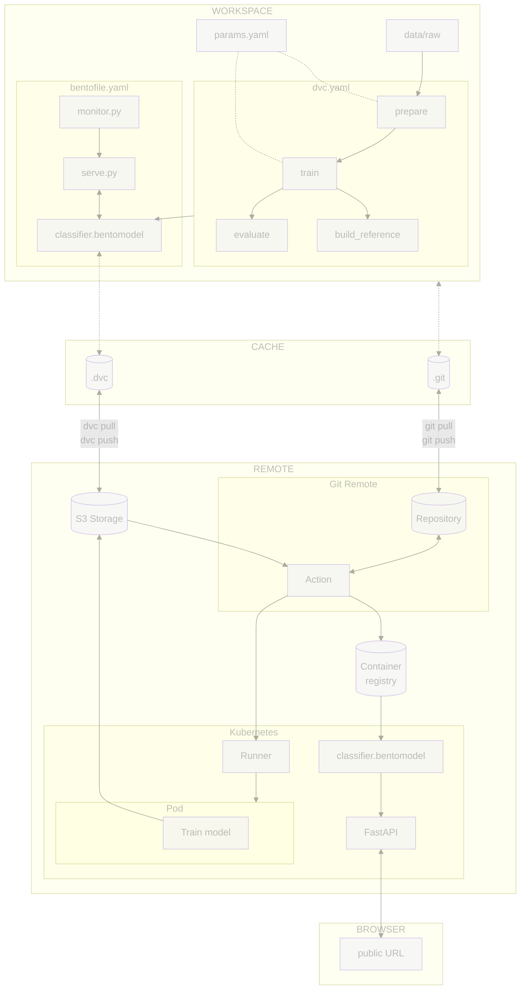

# Chapter 4.3 - Deploy and access the monitoring on Kubernetes

## Introduction

In the previous chapter you built a local prediction log and pushed an Evidently
snapshot to a local workspace. To make monitoring useful in production, those
artifacts need to leave your laptop: logs must survive pod restarts, the
dashboard must be reachable by the team, and drift must be checked automatically
rather than on demand.

This chapter moves the monitoring stack into the cloud. You will batch
prediction logs to object storage, deploy the Evidently UI service on Kubernetes
with an S3-backed workspace, and generate drift reports from a GitHub Actions
workflow. The same `generate_report` function from Chapter 4.2 is reused; only
the workspace changes from local to remote.

In this chapter, you will learn how to:

1. Upload prediction logs from the BentoML service to S3 in batches
2. Reuse `src/detect_drift.py` so the report generation stays portable
3. Create a monitoring script that pulls logs and the reference dataset from
   storage
4. Push drift snapshots to a remote Evidently workspace
5. Deploy the Evidently UI service on Kubernetes
6. Schedule drift reports with a GitHub Actions workflow
7. Access the dashboard and the JSON drift summary
8. Commit the changes to Git

The following diagram illustrates the control flow at the end of this chapter:



## Steps

### Upload prediction logs to S3 in batches

The BentoML service still writes predictions to a local JSONL file inside the
pod. To make those logs durable, you will add a small sidecar container to the
model pod. The sidecar uploads the file to S3 every 15 minutes and then
truncates it.

A sidecar is a good fit here:

* It keeps the model service unchanged.
* It demonstrates batching without adding streaming infrastructure.
* It shares a local volume with the model container, so no extra network API is
  needed between them.

The sidecar will:

1. Read the local `logs/predictions.jsonl` file.
2. Append its contents to a date-keyed object in S3
   (`s3://<bucket>/logs/year=YYYY/month=MM/day=DD/predictions.jsonl`).
3. Truncate the local file so it is not uploaded twice.

#### Create `src/upload_logs.py`

Create a small upload script. It uses `boto3` and expects the bucket name and
prefix through environment variables.

```py title="src/upload_logs.py"
import os
import sys
import time
from datetime import datetime, timezone
from pathlib import Path

import boto3

LOG_PATH = Path(os.environ.get("PREDICTION_LOG_PATH", "logs/predictions.jsonl"))
S3_BUCKET = os.environ.get("PREDICTION_LOG_BUCKET")
S3_PREFIX = os.environ.get("PREDICTION_LOG_PREFIX", "logs")
UPLOAD_INTERVAL_SECONDS = int(os.environ.get("UPLOAD_INTERVAL_SECONDS", "900"))


def upload_once() -> None:
    if not S3_BUCKET:
        print("PREDICTION_LOG_BUCKET environment variable is required")
        sys.exit(1)

    if not LOG_PATH.exists() or LOG_PATH.stat().st_size == 0:
        print("No local log to upload")
        return

    s3 = boto3.client("s3")

    now = datetime.now(timezone.utc)
    key = (
        f"{S3_PREFIX}/"
        f"year={now.year}/"
        f"month={now.month:02d}/"
        f"day={now.day:02d}/"
        f"predictions-{now.isoformat()}.jsonl"
    )

    s3.upload_file(str(LOG_PATH), S3_BUCKET, key)
    print(f"Uploaded {LOG_PATH} to s3://{S3_BUCKET}/{key}")

    # Truncate the local file after a successful upload
    LOG_PATH.write_text("")


def run() -> None:
    while True:
        try:
            upload_once()
        except Exception as exc:
            print(f"[upload_logs] Failed to upload logs: {exc}")
        time.sleep(UPLOAD_INTERVAL_SECONDS)


if __name__ == "__main__":
    run()
```

The script is intentionally simple: it does not retry failed uploads or rotate
files. Those features can be added later when the log volume grows.

#### Build the upload-logs sidecar image

The sidecar only needs Python and `boto3`. Create a small Dockerfile for it.

```dockerfile title="monitoring/upload-logs.Dockerfile"
FROM python:3.13-slim

WORKDIR /app

RUN pip install --no-cache-dir boto3==1.37.38

COPY src/upload_logs.py ./src/upload_logs.py

CMD ["python", "src/upload_logs.py"]
```

Build and publish the image using the same container registry as the model
service.

```sh title="Execute the following command(s) in a terminal"
# Build the sidecar image
docker build -f monitoring/upload-logs.Dockerfile -t celestial-bodies-upload-logs:latest .

# Tag the image for the remote registry
docker tag celestial-bodies-upload-logs:latest \
  $GCP_CONTAINER_REGISTRY_HOST/celestial-bodies-upload-logs:latest

# Push the image
docker push $GCP_CONTAINER_REGISTRY_HOST/celestial-bodies-upload-logs:latest
```

#### Update `kubernetes/deployment.yaml`

Add a shared `emptyDir` volume, the `PREDICTION_LOG_PATH` environment variable,
and the upload sidecar to the model deployment.

```yaml title="kubernetes/deployment.yaml" hl_lines="18-23 29-34 36-55"
apiVersion: apps/v1
kind: Deployment
metadata:
  name: celestial-bodies-classifier-deployment
  labels:
    app: celestial-bodies-classifier
spec:
  replicas: 1
  selector:
    matchLabels:
      app: celestial-bodies-classifier
  template:
    metadata:
      labels:
        app: celestial-bodies-classifier
    spec:
      containers:
      - name: celestial-bodies-classifier
        image: <docker_image>
        env:
        - name: PREDICTION_LOG_PATH
          value: /app/logs/predictions.jsonl
        volumeMounts:
        - name: prediction-logs
          mountPath: /app/logs
      - name: log-upload
        image: <upload_logs_image>
        command:
        - python
        - src/upload_logs.py
        env:
        - name: PREDICTION_LOG_PATH
          value: /app/logs/predictions.jsonl
        - name: PREDICTION_LOG_BUCKET
          value: "<s3_bucket_name>"
        - name: PREDICTION_LOG_PREFIX
          value: "logs"
        - name: UPLOAD_INTERVAL_SECONDS
          value: "900"
        - name: AWS_ACCESS_KEY_ID
          valueFrom:
            secretKeyRef:
              name: monitoring-s3-credentials
              key: aws_access_key_id
        - name: AWS_SECRET_ACCESS_KEY
          valueFrom:
            secretKeyRef:
              name: monitoring-s3-credentials
              key: aws_secret_access_key
        volumeMounts:
        - name: prediction-logs
          mountPath: /app/logs
      volumes:
      - name: prediction-logs
        emptyDir: {}
```

Replace `<upload_logs_image>` with the upload-logs image you built, and
`<s3_bucket_name>` with the name of the S3 bucket used for monitoring artifacts.

If your cluster uses workload identity instead of static credentials, remove the
`AWS_ACCESS_KEY_ID` and `AWS_SECRET_ACCESS_KEY` references and annotate the
service account instead.

Create the secret for static credentials:

```sh title="Execute the following command(s) in a terminal"
kubectl create secret generic monitoring-s3-credentials \
  --from-literal=aws_access_key_id="$AWS_ACCESS_KEY_ID" \
  --from-literal=aws_secret_access_key="$AWS_SECRET_ACCESS_KEY"
```

### Reuse `src/detect_drift.py`

Chapter 4.2 already created `src/detect_drift.py`. The report generation is
wrapped in a reusable `generate_report` function that returns the Evidently
snapshot, so the cloud monitoring job can import it without copying the logic.

No changes are needed in this file for the GitHub Actions workflow.

### Create the monitoring workflow

The monitoring job runs in GitHub Actions instead of the cluster. It downloads
the latest logs from S3, pulls the reference dataset from the DVC remote,
generates the Evidently snapshot, pushes it to the remote workspace, and uploads
a JSON drift summary to S3 for alerting.

#### Update `requirements.txt`

Add `boto3` so the monitoring job can read logs and write the JSON summary.

```txt title="requirements.txt" hl_lines="7"
tensorflow==2.21.0
matplotlib==3.10.9
pyyaml==6.0.3
dvc[gs]==3.67.1
bentoml==1.4.39
pillow==12.2.0
evidently==0.7.21
boto3==1.37.38
```

Freeze the dependencies again after editing `requirements.txt`:

```sh title="Execute the following command(s) in a terminal"
# Install the dependencies
pip install --requirement requirements.txt

# Freeze the dependencies
pip freeze --local --all > requirements-freeze.txt
```

#### Create `src/monitor_cloud.py`

This script downloads the inputs from S3 and the DVC remote, calls
`generate_report` from `src/detect_drift.py`, pushes the snapshot to the remote
Evidently workspace, and uploads the JSON report to S3.

```py title="src/monitor_cloud.py"
import os
import shutil
import sys
import tempfile
from pathlib import Path

import boto3
from evidently.ui.workspace import RemoteWorkspace

import detect_drift

S3_BUCKET = os.environ.get("PREDICTION_LOG_BUCKET")
S3_PREFIX = os.environ.get("PREDICTION_LOG_PREFIX", "logs")
REFERENCE_KEY = os.environ.get("REFERENCE_KEY", "data/reference_features.parquet")
OUTPUT_JSON_KEY = os.environ.get("OUTPUT_JSON_KEY", "monitoring/report.json")
EVIDENTLY_UI_URL = os.environ.get("EVIDENTLY_UI_URL")
PROJECT_NAME = os.environ.get("EVIDENTLY_PROJECT_NAME", "celestial-bodies-classifier")


def download_latest_logs(bucket: str, prefix: str, dest: Path) -> None:
    """Download all objects under a prefix and concatenate them into one JSONL file."""
    s3 = boto3.client("s3")
    response = s3.list_objects_v2(Bucket=bucket, Prefix=prefix)
    objects = response.get("Contents", [])

    if not objects:
        print(f"No log objects found under s3://{bucket}/{prefix}")
        sys.exit(1)

    dest.parent.mkdir(parents=True, exist_ok=True)
    with open(dest, "wb") as out:
        for obj in sorted(objects, key=lambda x: x["LastModified"]):
            s3.download_fileobj(bucket, obj["Key"], out)


def pull_reference_dataset(dest: Path) -> None:
    """Pull the DVC-tracked reference dataset and copy it to a temporary path."""
    dest.parent.mkdir(parents=True, exist_ok=True)
    exit_code = os.system(f"dvc pull {REFERENCE_KEY}")
    if exit_code != 0:
        print(f"dvc pull {REFERENCE_KEY} failed")
        sys.exit(1)
    if not Path(REFERENCE_KEY).exists():
        print(f"Reference dataset not found at {REFERENCE_KEY} after dvc pull")
        sys.exit(1)
    shutil.copy(REFERENCE_KEY, dest)


def get_or_create_project(workspace, name: str):
    """Return an existing project by name or create a new one."""
    for project in workspace.search_project(name):
        if project.name == name:
            return project
    return workspace.create_project(
        name=name,
        description="Drift monitoring for the celestial bodies classifier",
    )


def upload_file(bucket: str, key: str, path: Path) -> None:
    """Upload a local file to S3."""
    s3 = boto3.client("s3")
    s3.upload_file(str(path), bucket, key)
    print(f"Uploaded {path} to s3://{bucket}/{key}")


def main() -> None:
    if not S3_BUCKET:
        print("PREDICTION_LOG_BUCKET environment variable is required")
        sys.exit(1)
    if not EVIDENTLY_UI_URL:
        print("EVIDENTLY_UI_URL environment variable is required")
        sys.exit(1)

    with tempfile.TemporaryDirectory() as tmp:
        tmp_path = Path(tmp)
        log_path = tmp_path / "predictions.jsonl"
        reference_path = tmp_path / "reference_features.parquet"

        download_latest_logs(S3_BUCKET, S3_PREFIX, log_path)
        pull_reference_dataset(reference_path)

        snapshot = detect_drift.generate_report(
            reference_path, log_path, tmp_path
        )

        workspace = RemoteWorkspace(EVIDENTLY_UI_URL)
        project = get_or_create_project(workspace, PROJECT_NAME)
        workspace.add_run(project.id, snapshot, include_data=False)
        print(f"Snapshot added to project {project.name} (ID: {project.id})")

        upload_file(S3_BUCKET, OUTPUT_JSON_KEY, tmp_path / "report.json")


if __name__ == "__main__":
    main()
```

`include_data=False` tells Evidently to store only the aggregated snapshot, not
the raw reference or current datasets. This keeps the workspace small and avoids
duplicating data that is already in S3.

#### Create `.github/workflows/monitor.yaml`

Create a workflow that runs the monitoring job on a schedule and on demand. It
reuses the same cloud credentials and Python environment as the main MLOps
pipeline.

```yaml title=".github/workflows/monitor.yaml"
name: Monitor drift

on:
  # Run every hour
  schedule:
    - cron: "0 * * * *"
  # Allow manual runs from the Actions tab
  workflow_dispatch:

jobs:
  drift-report:
    runs-on: ubuntu-latest
    steps:
      - name: Checkout repository
        uses: actions/checkout@v6
      - name: Setup Python
        uses: actions/setup-python@v6
        with:
          python-version: '3.13'
          cache: pip
      - name: Install dependencies
        run: pip install --requirement requirements-freeze.txt
      - name: Login to Google Cloud
        uses: google-github-actions/auth@v3
        with:
          credentials_json: '${{ secrets.GOOGLE_SERVICE_ACCOUNT_KEY }}'
      - name: Pull reference dataset
        run: dvc pull data/reference_features.parquet
      - name: Run drift report
        env:
          PREDICTION_LOG_BUCKET: ${{ secrets.PREDICTION_LOG_BUCKET }}
          PREDICTION_LOG_PREFIX: ${{ secrets.PREDICTION_LOG_PREFIX }}
          EVIDENTLY_UI_URL: ${{ secrets.EVIDENTLY_UI_URL }}
          AWS_ACCESS_KEY_ID: ${{ secrets.AWS_ACCESS_KEY_ID }}
          AWS_SECRET_ACCESS_KEY: ${{ secrets.AWS_SECRET_ACCESS_KEY }}
        run: python src/monitor_cloud.py
```

Store the required secrets in the repository settings under
**Secrets and variables > Actions**:

- `PREDICTION_LOG_BUCKET`: the S3 bucket that receives the prediction logs
- `PREDICTION_LOG_PREFIX`: the S3 prefix for logs (default `logs`)
- `EVIDENTLY_UI_URL`: the public URL of the Evidently UI service, for example
  `http://<load-balancer-ip>:8000`
- `AWS_ACCESS_KEY_ID` and `AWS_SECRET_ACCESS_KEY`: credentials for the S3 bucket
  that holds the logs and the JSON report

The workflow authenticates to Google Cloud so that `dvc pull` can download the
DVC-tracked reference dataset.

#### Create the Evidently UI image

You only need to build the Evidently UI service image here. The upload-logs
sidecar image was built earlier, and the report generation runs in GitHub
Actions, so the monitoring Docker image and CronJob from the previous approach
are no longer needed.

`monitoring/ui.Dockerfile` is minimal because the UI service only needs the
`evidently` package and S3 credentials.

```dockerfile title="monitoring/ui.Dockerfile"
FROM python:3.13-slim

WORKDIR /app

RUN pip install --no-cache-dir evidently==0.7.21

EXPOSE 8000

CMD ["sh", "-c", "evidently ui --host 0.0.0.0 --workspace s3://${S3_BUCKET}/evidently-workspace --port 8000"]
```

#### Create Kubernetes manifests

Create a deployment and service for the Evidently UI service. The UI reads and
writes snapshots from `s3://<bucket>/evidently-workspace` using `fsspec`.

```yaml title="kubernetes/evidently-ui-deployment.yaml"
apiVersion: apps/v1
kind: Deployment
metadata:
  name: evidently-ui
  labels:
    app: evidently-ui
spec:
  replicas: 1
  selector:
    matchLabels:
      app: evidently-ui
  template:
    metadata:
      labels:
        app: evidently-ui
    spec:
      containers:
      - name: evidently-ui
        image: <evidently_ui_image>
        ports:
        - containerPort: 8000
        env:
        - name: S3_BUCKET
          value: "<s3_bucket_name>"
        - name: FSSPEC_S3_KEY
          valueFrom:
            secretKeyRef:
              name: monitoring-s3-credentials
              key: aws_access_key_id
        - name: FSSPEC_S3_SECRET
          valueFrom:
            secretKeyRef:
              name: monitoring-s3-credentials
              key: aws_secret_access_key
```

```yaml title="kubernetes/evidently-ui-service.yaml"
apiVersion: v1
kind: Service
metadata:
  name: evidently-ui
spec:
  type: LoadBalancer
  ports:
    - name: http
      port: 80
      targetPort: 8000
      protocol: TCP
  selector:
    app: evidently-ui
```

If your DVC remote is Google Cloud Storage, the workflow already uses the Google
Cloud service account. The Evidently UI service and the sidecar still need S3
credentials for the monitoring bucket.

### Deploy the Evidently UI service

Build and publish the UI image using the same container registry as the model
service.

```sh title="Execute the following command(s) in a terminal"
# Build the UI image
docker build -f monitoring/ui.Dockerfile -t celestial-bodies-evidently-ui:latest .

# Tag the image for the remote registry
docker tag celestial-bodies-evidently-ui:latest \
  $GCP_CONTAINER_REGISTRY_HOST/celestial-bodies-evidently-ui:latest

# Push the image
docker push $GCP_CONTAINER_REGISTRY_HOST/celestial-bodies-evidently-ui:latest
```

Replace the placeholders in the Kubernetes manifests:

```sh title="Execute the following command(s) in a terminal"
export UPLOAD_LOGS_IMAGE=$GCP_CONTAINER_REGISTRY_HOST/celestial-bodies-upload-logs:latest
export EVIDENTLY_UI_IMAGE=$GCP_CONTAINER_REGISTRY_HOST/celestial-bodies-evidently-ui:latest
export S3_BUCKET=<s3_bucket_name>

sed -i "s|<upload_logs_image>|$UPLOAD_LOGS_IMAGE|g" \
  kubernetes/deployment.yaml

sed -i "s|<evidently_ui_image>|$EVIDENTLY_UI_IMAGE|g" \
  kubernetes/evidently-ui-deployment.yaml

sed -i "s|<s3_bucket_name>|$S3_BUCKET|g" \
  kubernetes/deployment.yaml \
  kubernetes/evidently-ui-deployment.yaml
```

Apply the UI manifests:

```sh title="Execute the following command(s) in a terminal"
kubectl apply -f kubernetes/evidently-ui-deployment.yaml
kubectl apply -f kubernetes/evidently-ui-service.yaml
```

Verify that the UI pod is running:

```sh title="Execute the following command(s) in a terminal"
kubectl get pods -l app=evidently-ui
```

Get the external IP of the Evidently UI service and save it as a GitHub secret:

```sh title="Execute the following command(s) in a terminal"
kubectl get service evidently-ui
```

Store the URL (`http://<load-balancer-ip>:8000`) as the `EVIDENTLY_UI_URL`
secret in the repository settings.

### Run the monitoring workflow

Trigger the workflow manually from the **Actions** tab by selecting the
**Monitor drift** workflow and clicking **Run workflow**. This avoids waiting
for the hourly schedule.

Open `http://<load-balancer-ip>/` in a browser, select the
`celestial-bodies-classifier` project, and inspect the latest drift report. New
snapshots appear every time the workflow runs.

Download the JSON drift summary from S3:

```sh title="Execute the following command(s) in a terminal"
aws s3 cp s3://<s3_bucket_name>/monitoring/report.json - | python -m json.tool
```

You should see the same drift metrics as in the local report from Chapter 4.2,
now refreshed automatically from production logs.

### Check the changes

Check the changes with Git to ensure that all the necessary files are tracked:

```sh title="Execute the following command(s) in a terminal"
# Add all the files
git add .

# Check the changes
git status
```

The output should look similar to this:

```text
On branch main
Changes to be committed:
  (use "git restore --staged <file>..." to unstage)
        modified:   kubernetes/deployment.yaml
        modified:   requirements-freeze.txt
        modified:   requirements.txt
        new file:   .github/workflows/monitor.yaml
        new file:   kubernetes/evidently-ui-deployment.yaml
        new file:   kubernetes/evidently-ui-service.yaml
        new file:   monitoring/ui.Dockerfile
        new file:   monitoring/upload-logs.Dockerfile
        new file:   src/monitor_cloud.py
        new file:   src/upload_logs.py
```

### Commit the changes to Git

Commit the changes:

```sh title="Execute the following command(s) in a terminal"
# Commit the changes
git commit -m "Deploy Evidently monitoring UI on Kubernetes and run reports from GitHub Actions"

# Push the changes
git push
```

## Summary

In this chapter, you have successfully:

1. Uploaded prediction logs from the BentoML service to S3 in batches
2. Reused `src/detect_drift.py` so the report generation stays portable
3. Created a monitoring job that pulls logs and the reference dataset from
   storage
4. Pushed drift snapshots to a remote Evidently workspace
5. Deployed the Evidently UI service on Kubernetes
6. Scheduled drift reports with a GitHub Actions workflow
7. Accessed the dashboard and the JSON drift summary
8. Committed the changes to Git

You fixed some of the previous issues:

- [x] Automated alerts and dashboards are configured

!!! abstract "Take away"

    - **Batching is cheaper and simpler than streaming for this workload**:
      Uploading a JSONL file every 15 minutes avoids the operational complexity of a
      streaming pipeline while still keeping logs durable.
    - **The Evidently UI service is the dashboard**: instead of serving a static
      HTML file with a custom web server, you run Evidently's own UI and push
      snapshots to it. This gives history, trending, and the native dashboard
      experience.
    - **GitHub Actions is a good fit for batch monitoring jobs**: a scheduled
      workflow runs on demand or on a cron schedule, pulls fresh data, pushes a
      snapshot, and exits. It reuses the same secrets and runner infrastructure as the
      rest of the CI/CD pipeline.
    - **The reference dataset stays under DVC**: every report uses the same
      distribution the model was trained on, even when the report runs in a workflow.
    - **Keep a machine-readable summary in object storage**: uploading `report.json`
      to S3 makes it easy for alerting tools to read the latest drift scores without
      depending on the UI service.

## State of the MLOps process

- [x] Model predictions can be monitored in production
- [x] Data drift and concept drift can be detected automatically
- [x] Automated alerts and dashboards are configured
- [ ] Drift signals do not trigger actionable retraining workflows
- [ ] Model cannot be rolled back to a previous version on degradation

Continue to the next chapters to address the remaining items.

## Sources

Highly inspired by:

- [_Evidently AI Documentation_](https://docs.evidentlyai.com/)
- [_Boto3 S3 upload documentation_](https://boto3.amazonaws.com/v1/documentation/api/latest/guide/s3-uploading-files.html)
