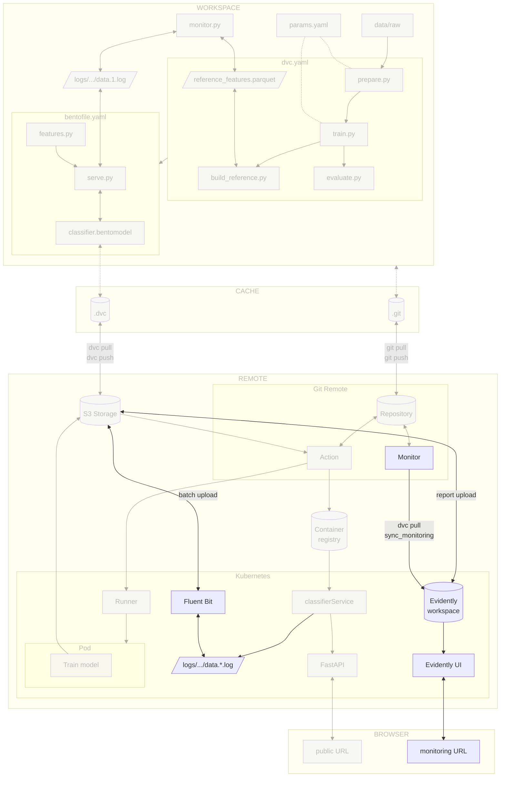

# Chapter 4.3 - Deploy and access the monitoring on Kubernetes

## Introduction

In the previous chapters you logged predictions with BentoML's native monitoring
and generated a local drift report with Evidently AI. This chapter moves that
stack into the cloud using [Fluent Bit](../tools.md), the de facto log shipper
in Kubernetes. A Fluent Bit sidecar tails the local monitoring files, buffers
them, and uploads them to a storage bucket in batches. You will deploy the
Evidently UI service on Kubernetes and expose it through a LoadBalancer so the
monitoring dashboard and drift reports are available from a public URL. A
scheduled GitHub Actions workflow refreshes the drift report from the logs in
the bucket.

In this chapter, you will learn how to:

1. Ship BentoML monitoring logs to a storage bucket with a Fluent Bit sidecar
2. Deploy the Evidently UI service on Kubernetes
3. Create a monitoring job that pulls logs from the storage bucket and pushes
   Evidently snapshots to the UI workspace
4. Schedule the monitoring job with a GitHub Actions workflow
5. Access the cloud-hosted dashboard and the drift reports
6. Commit the changes to Git

The following diagram illustrates the control flow at the end of this chapter:



## Steps

### Upload prediction logs to a storage bucket in batches

The classifier service writes monitoring records to local files inside the pod.
To make those logs durable, you will add a Fluent Bit sidecar to the model pod.
Fluent Bit tails the local log files, buffers them in memory and on disk, and
uploads them to the storage bucket when a batch reaches a configured size or
age.

!!! note "Why a sidecar?"

    A sidecar is a helper container that runs alongside the main application
    container in the same pod. It keeps the model service unchanged, moves network
    I/O out of the inference path, and shares a local volume with the model
    container. Fluent Bit also batches small records into larger objects, which is
    cheaper and faster than per-request uploads.

#### Create the Fluent Bit configuration

Fluent Bit needs two pieces of configuration: an input that tails the BentoML
log files, and an output that uploads batches to the storage bucket. The tail
path matches the directory where BentoML writes monitoring logs inside the
container (`/home/bentoml/bento/logs`). Fluent Bit's S3 output plugin can talk
to Google Cloud Storage through its S3-compatible API.

Create a ConfigMap with a minimal `fluent-bit.conf`:

```yaml title="kubernetes/fluent-bit-config.yaml"
apiVersion: v1
kind: ConfigMap
metadata:
  name: fluent-bit-config
data:
  fluent-bit.conf: |
    [SERVICE]
        Flush         1
        Log_Level     info
        Daemon        off
        HTTP_Server   Off
        Parsers_File  /fluent-bit/etc/parsers.conf

    [INPUT]
        Name              tail
        Path              /home/bentoml/bento/logs/celestial_bodies_classifier/data/*.log
        Tag               bentoml.logs
        Parser            json
        Refresh_Interval  5
        Mem_Buf_Limit     50MB

    [OUTPUT]
        Name              s3
        Match             bentoml.logs
        bucket            ${GCP_BUCKET_NAME}
        region            ${GCP_BUCKET_LOCATION}
        endpoint          https://storage.googleapis.com
        total_file_size   10M
        upload_timeout    10m
        s3_key_format     /logs/$TAG[0]/%Y/%m/%d/%H%M.log
        store_dir         /tmp/fluent-bit-s3
        send_content_md5  on
        retry_limit       1
  parsers.conf: |
    [PARSER]
        Name   json
        Format json
        Time_Key timestamp
```

A few notes on this configuration:

* The `json` parser is defined in our custom `parsers.conf` and registered
  through `Parsers_File` in the `[SERVICE]` block. We provide our own parser
  because the ConfigMap is mounted at `/fluent-bit/etc/`, replacing the image's
  default parsers file, and because we use the `timestamp` field from BentoML
  records as the log time.
* The `s3` output plugin creates objects under `gs://$GCP_BUCKET_NAME/logs/`.
* The `total_file_size` and `upload_timeout` options control when Fluent Bit
  uploads a batch. A new object is created when the buffer reaches 10 MB or after
  10 minutes, whichever comes first. Increase these values for fewer, larger
  objects or decrease them if you need fresher logs for drift reports.
* The `bucket`, `region`, and `endpoint` options point to Google Cloud Storage
  through its S3-compatible API.
* The `store_dir` path is used for local buffering and upload state. This guide
  mounts an `emptyDir` volume at `/tmp/fluent-bit-s3` in the Fluent Bit sidecar.
* The `retry_limit` is set to `1` to avoid duplicate uploads when Google Cloud
  Storage's S3-compatible API does not acknowledge a request.

!!! note "Environment variable expansion"

    The `${GCP_BUCKET_NAME}` and `${GCP_BUCKET_LOCATION}` variables are expanded by
    Fluent Bit from the sidecar container's environment, which is configured in
    `kubernetes/deployment.yaml`. No manual substitution in the ConfigMap is needed.

#### Create GCS HMAC credentials for Fluent Bit

Fluent Bit's S3 output plugin talks to storage backends through the S3 protocol,
which authenticates with an access key ID and a secret access key. It does not
use the Google Cloud service-account credentials that the rest of this guide
relies on. Google Cloud Storage supports S3-style access through HMAC keys (a
key pair that lets S3-compatible clients access your buckets).

That is why you must create HMAC keys for Fluent Bit and expose them as
`AWS_ACCESS_KEY_ID` and `AWS_SECRET_ACCESS_KEY` in the sidecar container. The
Python code and the Evidently UI service continue to use native Google Cloud
authentication.

Create the HMAC keys in the Google Cloud Console under
**Cloud Storage > Settings > Interoperability**. Click on
**Create a key for a service account** and select the Google service account, or
use the command line with `gcloud storage hmac create`. Export the keys as
environment variables:

```sh title="Execute the following command(s) in a terminal"
# Export the GCS HMAC keys
export GCS_HMAC_ACCESS_KEY_ID=<my_hmac_access_key_id>
export GCS_HMAC_SECRET_ACCESS_KEY=<my_hmac_secret_key_id>
```

Then create the secret:

```sh title="Execute the following command(s) in a terminal"
kubectl create secret generic monitoring-gcs-credentials \
  --from-literal=gcs_access_key_id="$GCS_HMAC_ACCESS_KEY_ID" \
  --from-literal=gcs_secret_access_key="$GCS_HMAC_SECRET_ACCESS_KEY"
```

#### Update `kubernetes/deployment.yaml`

Add a shared `emptyDir` volume for the logs, mount it into the BentoML
container, and add the Fluent Bit sidecar with the ConfigMap mounted as its
configuration.

```yaml title="kubernetes/deployment.yaml" hl_lines="17-26 30-65"
apiVersion: apps/v1
kind: Deployment
metadata:
  name: celestial-bodies-classifier-deployment
  labels:
    app: celestial-bodies-classifier
spec:
  replicas: 1
  selector:
    matchLabels:
      app: celestial-bodies-classifier
  template:
    metadata:
      labels:
        app: celestial-bodies-classifier
    spec:
      initContainers:
      - name: init-log-dir
        image: busybox:1.36
        command:
        - sh
        - -c
        - mkdir -p /home/bentoml/bento/logs/celestial_bodies_classifier && chmod 777 /home/bentoml/bento/logs/celestial_bodies_classifier
        volumeMounts:
        - name: prediction-logs
          mountPath: /home/bentoml/bento/logs
      containers:
      - name: celestial-bodies-classifier
        image: <docker_image>
        volumeMounts:
        - name: prediction-logs
          mountPath: /home/bentoml/bento/logs
      - name: fluent-bit
        image: fluent/fluent-bit:5.0.8
        env:
        - name: GCP_BUCKET_NAME
          value: "<gcp_bucket_name>"
        - name: GCP_BUCKET_LOCATION
          value: "<gcp_bucket_location>"
        - name: AWS_ACCESS_KEY_ID
          valueFrom:
            secretKeyRef:
              name: monitoring-gcs-credentials
              key: gcs_access_key_id
        - name: AWS_SECRET_ACCESS_KEY
          valueFrom:
            secretKeyRef:
              name: monitoring-gcs-credentials
              key: gcs_secret_access_key
        volumeMounts:
        - name: prediction-logs
          mountPath: /home/bentoml/bento/logs
          readOnly: true
        - name: fluent-bit-config
          mountPath: /fluent-bit/etc/
        - name: fluent-bit-tmp
          mountPath: /tmp/fluent-bit-s3
      volumes:
      - name: prediction-logs
        emptyDir: {}
      - name: fluent-bit-config
        configMap:
          name: fluent-bit-config
      - name: fluent-bit-tmp
        emptyDir: {}
```

The YAML above makes three things happen:

* A shared `emptyDir` volume named `prediction-logs` is mounted at
  `/home/bentoml/bento/logs` in both the classifier and Fluent Bit containers, so
  both see the same files.
* The `init-log-dir` init container pre-creates
  `/home/bentoml/bento/logs/celestial_bodies_classifier/` and makes it
  world-writable (`chmod 777`). BentoML only creates the `data/` subdirectory on
  the first prediction, and the classifier and Fluent Bit containers run as
  different users.
* The classifier writes monitoring logs to
  `/home/bentoml/bento/logs/celestial_bodies_classifier/data/`.

Replace the placeholders in the Kubernetes deployment manifest. Make sure
`GCP_BUCKET_NAME` and `GCP_BUCKET_LOCATION` are still exported in your terminal:

```sh title="Execute the following command(s) in a terminal"
# Replace the placeholders with the actual bucket name and location
sed -i "s|<gcp_bucket_name>|$GCP_BUCKET_NAME|g" kubernetes/deployment.yaml
sed -i "s|<gcp_bucket_location>|$GCP_BUCKET_LOCATION|g" kubernetes/deployment.yaml
```

The `<docker_image>` placeholder should already have been set in a previous
chapter. If it was overwritten, replace it again before applying the manifest:

```sh title="Execute the following command(s) in a terminal"
# Replace the placeholder with the actual Docker image
sed -i "s|<docker_image>|$GCP_CONTAINER_REGISTRY_HOST/celestial-bodies-classifier:latest|g" kubernetes/deployment.yaml
```

#### Deploy the model with the Fluent Bit sidecar

Apply the Fluent Bit configuration first, then the model deployment:

```sh title="Execute the following command(s) in a terminal"
# Apply the Fluent Bit ConfigMap
kubectl apply -f kubernetes/fluent-bit-config.yaml

# Apply the model deployment (now with the Fluent Bit sidecar)
kubectl apply -f kubernetes/deployment.yaml
```

Verify that the model pod is running:

```sh title="Execute the following command(s) in a terminal"
kubectl get pods -l app=celestial-bodies-classifier
```

The output should show `2/2` under `READY`, because the pod now contains both
the model container and the Fluent Bit sidecar.

#### Send test inference data

Send some inference traffic so BentoML creates the monitoring log directory and
Fluent Bit has files to ship.

Find the external IP of the exposed model service:

```sh title="Execute the following command(s) in a terminal"
# Get the external IP of the model service
kubectl get service celestial-bodies-classifier-service
```

Then send new images to the `/predict` endpoint. Replace `<EXTERNAL-IP>` with
the value from the previous command:

```sh title="Execute the following command(s) in a terminal"
# Send new images to the deployed model
for img in extra-data/extra_data/*.jpg; do
    curl -X POST -F "image=@$img" http://<EXTERNAL-IP>:80/predict
done
```

Check the Fluent Bit sidecar logs to confirm it started tailing the files and is
uploading to the storage bucket:

```sh title="Execute the following command(s) in a terminal"
kubectl logs -l app=celestial-bodies-classifier -c fluent-bit
```

The output should be similar to:

```text
[2026/07/07 12:38:03.131] [ info] [input:tail:tail.0] inotify_fs_add(): inode=924127 watch_fd=1 name=/home/bentoml/bento/logs/celestial_bodies_classifier/data/data.1.log
[2026/07/07 12:39:04.130] [ info] [output:s3:s3.0] Running upload timer callback (cb_s3_upload)..
```

Open the [Cloud Storage](https://console.cloud.google.com/storage/browser) on
the Google cloud interface and click on your bucket to check the logs are indeed
uploaded after a few minutes.

### Deploy the Evidently UI service

Fluent Bit is now shipping logs to the storage bucket. Next, deploy the
Evidently UI service, which serves the drift dashboard from a
storage-bucket-backed workspace.

#### Create the Evidently UI image

`docker/ui.Dockerfile` is minimal because the UI service only needs the
`evidently` package, `gcsfs` for the storage-bucket-backed workspace, and Google
Cloud credentials.

```dockerfile title="docker/ui.Dockerfile"
FROM python:3.13-slim

WORKDIR /app

RUN pip install --no-cache-dir evidently==0.7.21 gcsfs==2026.6.0

EXPOSE 8000

CMD ["sh", "-c", "evidently ui --host 0.0.0.0 --workspace gs://${GCP_BUCKET_NAME}/evidently-workspace --port 8000"]
```

#### Build and publish the UI image

!!! note

    For the Evidently UI image storage, we use the GitHub Container Registry because
    of its close integration with our existing GitHub environment. This keeps
    infrastructure-related images separate from the model images stored in Google
    Cloud Container Registry. However, you could also use the Google Cloud Container
    Registry if you prefer.

Build and publish the UI image to the GitHub Container Registry. Since we use
the GitHub Container Registry, replace `<my_username>` and
`<my_repository_name>` with your own GitHub username and repository name.

```sh title="Execute the following command(s) in a terminal"
# Build the UI image
docker build --platform=linux/amd64 -f docker/ui.Dockerfile --tag ghcr.io/<my_username>/<my_repository_name>/celestial-bodies-evidently-ui:latest .

# Push the image
docker push ghcr.io/<my_username>/<my_repository_name>/celestial-bodies-evidently-ui:latest
```

!!! tip

    See
    [Chapter 3.7 - Authenticate with the GitHub Container Registry](../part-3-serve-and-deploy/chapter-37-use-a-self-hosted-runner-for-the-cicd-pipeline.md#authenticate-with-the-github-container-registry)
    if you need to authenticate with the GitHub Container Registry.

#### Create Kubernetes manifests

Create a deployment and service for the Evidently UI service. The UI reads
snapshots from `gs://$GCP_BUCKET_NAME/evidently-workspace`.

```yaml title="kubernetes/evidently-ui-deployment.yaml"
apiVersion: apps/v1
kind: Deployment
metadata:
  name: evidently-ui
  labels:
    app: evidently-ui
spec:
  replicas: 1
  selector:
    matchLabels:
      app: evidently-ui
  template:
    metadata:
      labels:
        app: evidently-ui
    spec:
      imagePullSecrets:
      - name: ghcr-pull-secret
      containers:
      - name: evidently-ui
        image: <evidently_ui_image>
        ports:
        - containerPort: 8000
        env:
        - name: GCP_BUCKET_NAME
          value: "<gcp_bucket_name>"
```

Replace the placeholders in the Kubernetes manifest with the GitHub Container
Registry path and the bucket name:

```sh title="Execute the following command(s) in a terminal"
export EVIDENTLY_UI_IMAGE=ghcr.io/<my_username>/<my_repository_name>/celestial-bodies-evidently-ui:latest

sed -i "s|<evidently_ui_image>|$EVIDENTLY_UI_IMAGE|g" \
  kubernetes/evidently-ui-deployment.yaml

sed -i "s|<gcp_bucket_name>|$GCP_BUCKET_NAME|g" \
  kubernetes/evidently-ui-deployment.yaml
```

Then create the service that exposes the UI:

```yaml title="kubernetes/evidently-ui-service.yaml"
apiVersion: v1
kind: Service
metadata:
  name: evidently-ui
spec:
  type: LoadBalancer
  ports:
    - name: http
      port: 80
      targetPort: 8000
      protocol: TCP
  selector:
    app: evidently-ui
```

The Evidently UI service uses the Service Account to access Google Cloud
Storage. The `roles/storage.admin` role granted in
[Chapter 3.4](../part-3-serve-and-deploy/chapter-34-build-and-publish-the-model-with-bentoml-and-docker-with-the-cicd-pipeline.md#set-up-access-to-the-container-registry-of-the-cloud-provider)
there is sufficient for the monitoring bucket as well.

The Evidently UI service only needs read access to the workspace, because it
reads snapshots and workspace metadata for display.

#### Apply the UI manifests

Apply the UI manifests:

```sh title="Execute the following command(s) in a terminal"
kubectl apply -f kubernetes/evidently-ui-deployment.yaml
kubectl apply -f kubernetes/evidently-ui-service.yaml
```

Verify that the UI pod is running:

```sh title="Execute the following command(s) in a terminal"
kubectl get pods -l app=evidently-ui
```

Get the external IP of the Evidently UI service:

```sh title="Execute the following command(s) in a terminal"
kubectl get service evidently-ui
```

The output should be similar to:

```text
NAME           TYPE           CLUSTER-IP       EXTERNAL-IP     PORT(S)        AGE
evidently-ui   LoadBalancer   34.118.234.235   34.158.20.138   80:31710/TCP   7m58s
```

Save the URL (`http://<EXTERNAL-IP>`) so you can open the dashboard after the
first snapshot is pushed.

!!! note "Evidently UI reads the workspace at startup"

    The Evidently UI service loads the workspace metadata when it starts and does
    not watch the storage bucket for new snapshots. Snapshots added by the
    monitoring workflow will not appear in the dashboard until the UI pod is
    restarted. The workflow in the next section handles this automatically; if you
    run the script locally, run `kubectl rollout restart deployment/evidently-ui`
    afterwards.

### Add storage bucket CI/CD secrets

Add the storage bucket secrets so the CI/CD pipeline can read prediction logs,
write drift reports, and push Evidently snapshots to the workspace.

Create the following new secrets by going to the **Settings** section from the
top header of your GitHub repository. Select **Secrets and variables > Actions**
and select **New repository secret**:

- `GCP_BUCKET_NAME`: The name of the Google Cloud Storage bucket that receives
  the prediction logs, the JSON report, and the Evidently workspace
- `GCP_BUCKET_LOCATION`: The location of the Google Cloud Storage bucket (for
  example `europe-west6`)

Save the secrets by selecting **Add secret**.

### Link logs to the Evidently UI

Fluent Bit is now shipping logs to the storage bucket and the Evidently UI
service is reading snapshots from a storage-bucket-backed workspace. This
section creates the Python script (`src/sync_monitoring.py`) that generates the
snapshots. A GitHub Actions workflow will schedule it later in this chapter.

The script will:

- download the latest production logs from the storage bucket
- compare them against the DVC-tracked reference dataset
- generate a drift report
- push the snapshot to the Evidently workspace
- upload the HTML and JSON reports back to the storage bucket

#### Update `requirements.txt`

Add `gcsfs` so the monitoring script can read logs, write Evidently snapshots
and reports to the storage-bucket-backed workspace, and so the Evidently UI
service can read from the same workspace.

```txt title="requirements.txt" hl_lines="9"
matplotlib==3.10.9
scikit-learn==1.9.0
tensorflow==2.21.0
pyyaml==6.0.3
dvc[gs]==3.67.1
bentoml==1.4.39
pillow==12.2.0
evidently==0.7.21
gcsfs==2026.6.0
```

Freeze the dependencies again after editing `requirements.txt`:

=== ":simple-python: Using pip"

    ```sh title="Execute the following command(s) in a terminal"
    # Install the dependencies
    pip install -r requirements.txt

    # Freeze the dependencies
    pip freeze --local --all > requirements-freeze.txt
    ```

=== ":simple-uv: Using uv"

    ```sh title="Execute the following command(s) in a terminal"
    # Install the dependencies
    uv pip install -r requirements.txt

    # Freeze the dependencies
    uv pip freeze > requirements-freeze.txt
    ```

#### Create `src/sync_monitoring.py`

This script:

* Downloads the latest prediction logs from the storage bucket
* Calls `generate_report` from `src/monitor.py` to build the Evidently snapshot
* Writes the snapshot to the storage-bucket-backed Evidently workspace

```py title="src/sync_monitoring.py"
import os
import sys
import tempfile
from datetime import datetime, timedelta, timezone
from pathlib import Path

from google.cloud import storage
from evidently.ui.workspace import Workspace

from monitor import build_dashboard, generate_report, get_or_create_project

BUCKET_NAME = os.environ.get("GCP_BUCKET_NAME")
LOG_PREFIX = "logs/bentoml"
PROJECT_NAME = os.environ.get("EVIDENTLY_PROJECT_NAME", "celestial-bodies-classifier")
WORKSPACE_PREFIX = os.environ.get("EVIDENTLY_WORKSPACE_PREFIX", "evidently-workspace")
LOG_CUTOFF_HOURS = int(os.environ.get("LOG_CUTOFF_HOURS", "24"))
# Keep LOG_CUTOFF_HOURS in sync with the monitoring workflow schedule. If the
# workflow runs once a day, a 24-hour lookback covers one run's worth of logs.


def download_latest_logs(bucket_name: str, prefix: str, dest: Path) -> None:
    """Download log objects from the last N hours into a directory of log files."""
    client = storage.Client()
    bucket = client.bucket(bucket_name)
    cutoff = datetime.now(timezone.utc) - timedelta(hours=LOG_CUTOFF_HOURS)
    blobs = [
        blob for blob in bucket.list_blobs(prefix=prefix) if blob.updated >= cutoff
    ]

    if not blobs:
        print(
            f"No log objects found under gs://{bucket_name}/{prefix} "
            f"in the last {LOG_CUTOFF_HOURS} hours"
        )
        sys.exit(1)

    dest.mkdir(parents=True, exist_ok=True)
    for i, blob in enumerate(sorted(blobs, key=lambda b: b.updated)):
        out_path = dest / f"data.{i + 1}.log"
        blob.download_to_filename(out_path)


def main() -> None:
    if not BUCKET_NAME:
        print("GCP_BUCKET_NAME environment variable is required")
        sys.exit(1)

    reference_path = Path("data/reference_features.parquet")
    if not reference_path.exists():
        print(f"Reference dataset not found at {reference_path}. Run dvc pull first.")
        sys.exit(1)

    output_dir = Path("monitoring")
    output_dir.mkdir(parents=True, exist_ok=True)

    with tempfile.TemporaryDirectory() as tmp:
        log_dir = Path(tmp) / "logs" / "celestial_bodies_classifier" / "data"
        download_latest_logs(BUCKET_NAME, LOG_PREFIX, log_dir)
        snapshot = generate_report(reference_path, log_dir, output_dir)

    workspace = Workspace.create(f"gs://{BUCKET_NAME}/{WORKSPACE_PREFIX}")
    project = get_or_create_project(workspace, PROJECT_NAME)
    workspace.add_run(project.id, snapshot, include_data=False)
    build_dashboard(project, snapshot)
    print(f"Snapshot added to project {project.name} (ID: {project.id})")


if __name__ == "__main__":
    main()
```

The snapshot is written to the same storage-bucket workspace the Evidently UI
service reads from, so the UI can display it immediately. `include_data=False`
tells Evidently to store only the aggregated snapshot, not the raw reference or
current datasets. This keeps the workspace small and avoids duplicating data
that is already in the storage bucket.

### Create the monitoring workflow

Create a GitHub Actions workflow that runs `src/sync_monitoring.py` on a
schedule and on demand. It pulls the reference dataset, runs the script with
`PYTHONPATH=src`, uploads the reports to the storage bucket, and restarts the
Evidently UI deployment.

```yaml title=".github/workflows/monitor.yaml"
name: Monitor drift

on:
  # Run every 24 hours
  schedule:
    - cron: "0 0 * * *"
  # Allow manual runs from the Actions tab
  workflow_dispatch:

jobs:
  drift-report:
    runs-on: ubuntu-latest
    steps:
      - name: Checkout repository
        uses: actions/checkout@v6
      - name: Setup Python
        uses: actions/setup-python@v6
        with:
          python-version: '3.13'
          cache: pip
      - name: Install dependencies
        run: pip install -r requirements-freeze.txt
      - name: Login to Google Cloud
        uses: google-github-actions/auth@v3
        with:
          credentials_json: '${{ secrets.GOOGLE_SERVICE_ACCOUNT_KEY }}'
      - name: Pull reference dataset
        run: dvc pull data/reference_features.parquet
      - name: Run drift report
        env:
          PYTHONPATH: src  # Let sync_monitoring.py import monitor.py
          GCP_BUCKET_NAME: ${{ secrets.GCP_BUCKET_NAME }}
        run: python src/sync_monitoring.py
      - name: Upload drift reports
        run: |
          gcloud storage cp monitoring/report.html gs://${{ secrets.GCP_BUCKET_NAME }}/monitoring/report.html
          gcloud storage cp monitoring/report.json gs://${{ secrets.GCP_BUCKET_NAME }}/monitoring/report.json
      - name: Get Google Cloud's Kubernetes credentials
        uses: google-github-actions/get-gke-credentials@v3
        with:
          cluster_name: ${{ secrets.GCP_K8S_CLUSTER_NAME }}
          location: ${{ secrets.GCP_K8S_CLUSTER_ZONE }}
      - name: Restart Evidently UI
        run: kubectl rollout restart deployment/evidently-ui
```

!!! warning "Align schedule and log lookback"

    The workflow schedule (`0 0 * * *`, once per day) and `LOG_CUTOFF_HOURS` (24
    hours) cover the same time window. If you change one, change the other so each
    workflow run processes the logs accumulated since the last run.

!!! note

    The `ubuntu-latest` runner image already includes the `gcloud` CLI, so the
    workflow only needs `google-github-actions/auth@v3` to authenticate it. See the
    [official GitHub runner images](https://github.com/actions/runner-images#software-and-image-support)
    for the pre-installed software list. Self-hosted runners, like the ones used in
    [Chapter 3.8](../part-3-serve-and-deploy/chapter-38-train-the-model-on-a-kubernetes-pod.md),
    require an explicit `setup-gcloud` step.

The workflow authenticates to Google Cloud so that `dvc pull` can download the
DVC-tracked reference dataset and so that `google-cloud-storage` and `gcsfs` can
read and write the monitoring bucket. The Fluent Bit sidecar still needs HMAC
keys for the same bucket, because it uses the S3-compatible API.

### Run the monitoring workflow

Trigger the workflow manually from the **Actions** tab by selecting the
**Monitor drift** workflow and clicking **Run workflow**. This avoids waiting
for the daily schedule.

Open `http://<load-balancer-ip>/` in a browser, select the
`celestial-bodies-classifier` project, and inspect the latest drift report. The
workflow restarts the Evidently UI deployment after each run so that new
snapshots are loaded automatically.

Open the [Cloud Storage](https://console.cloud.google.com/storage/browser) on
the Google cloud interface and click on your bucket to view the generated
`monitoring/report.html` and `monitoring/report.json` files.

You should see the same drift metrics as in the local report from the previous
chapter, now refreshed automatically from production logs.

### Check the changes

Check the changes with Git to ensure that all the necessary files are tracked:

```sh title="Execute the following command(s) in a terminal"
# Add all the files
git add .

# Check the changes
git status
```

The output should look similar to this:

```text
On branch main
Changes to be committed:
    (use "git restore --staged <file>..." to unstage)
        new file:   .github/workflows/monitor.yaml
        new file:   docker/ui.Dockerfile
        modified:   kubernetes/deployment.yaml
        new file:   kubernetes/evidently-ui-deployment.yaml
        new file:   kubernetes/evidently-ui-service.yaml
        new file:   kubernetes/fluent-bit-config.yaml
        modified:   requirements-freeze.txt
        modified:   requirements.txt
        new file:   src/sync_monitoring.py
```

### Commit the changes to Git

Commit the changes:

```sh title="Execute the following command(s) in a terminal"
# Commit the changes
git commit -m "Deploy Evidently UI and Fluent Bit log shipping on Kubernetes"

# Push the changes
git push
```

## Summary

In this chapter, you have successfully:

1. Shipped BentoML monitoring logs to a storage bucket with a Fluent Bit sidecar
2. Configured Fluent Bit to tail local files and batch-upload to the storage
   bucket through the S3-compatible API
3. Reused `src/monitor.py` so the report generation stays portable
4. Created a monitoring job that pulls logs from storage, generates a drift
   report, pushes snapshots to a remote Evidently workspace, and uploads the
   reports to the storage bucket
5. Deployed the Evidently UI service on Kubernetes
6. Scheduled drift reports with a GitHub Actions workflow
7. Accessed the dashboard and the drift reports
8. Committed the changes to Git

You fixed some of the previous issues:

- [x] Automated reports and dashboard are configured

!!! abstract "Take away"

    - **Let Fluent Bit handle log shipping**: BentoML writes to local files; a
      Fluent Bit sidecar tails, buffers, and batch-uploads them to Google Cloud
      Storage. This keeps inference fast and resilient to retries or backpressure.
    - **Batch uploads are cost-effective**: Aggregating many small records into
      larger objects avoids rate limits and reduces API costs compared to per-request
      uploads.
    - **The Evidently UI service is the dashboard**: instead of serving a static
      HTML file with a custom web server, you run Evidently's own UI and push
      snapshots to it. This gives history, trending, and the native dashboard
      experience.
    - **GitHub Actions is a good fit for batch monitoring jobs**: a scheduled
      workflow runs on demand or on a cron schedule, pulls fresh data, pushes a
      snapshot, and exits. It reuses the same secrets and runner infrastructure as the
      rest of the CI/CD pipeline.
    - **The reference dataset stays under DVC**: every report uses the same
      distribution the model was trained on, even when the report runs in a workflow.
    - **Keep machine-readable and human-readable summaries in object storage**:
      uploading `report.json` and `report.html` to the storage bucket makes it easy
      for alerting tools and humans to read the latest drift scores without depending
      on the UI service.

## State of the MLOps process

- [x] Model predictions can be monitored in production
- [x] Data drift and concept drift are monitored
- [x] Automated reports and dashboard are configured
- [ ] Drift signals do not trigger actionable alerts
- [ ] Drift alerts do not lead to a reviewed decision

Continue to the next chapters to address the remaining items.

## Sources

Highly inspired by:

- [_Evidently AI Documentation_](https://docs.evidentlyai.com/)
- [_Fluent Bit Documentation_](https://docs.fluentbit.io/)
- [_Google Cloud Storage HMAC keys documentation_](https://cloud.google.com/storage/docs/authentication/hmackeys)
