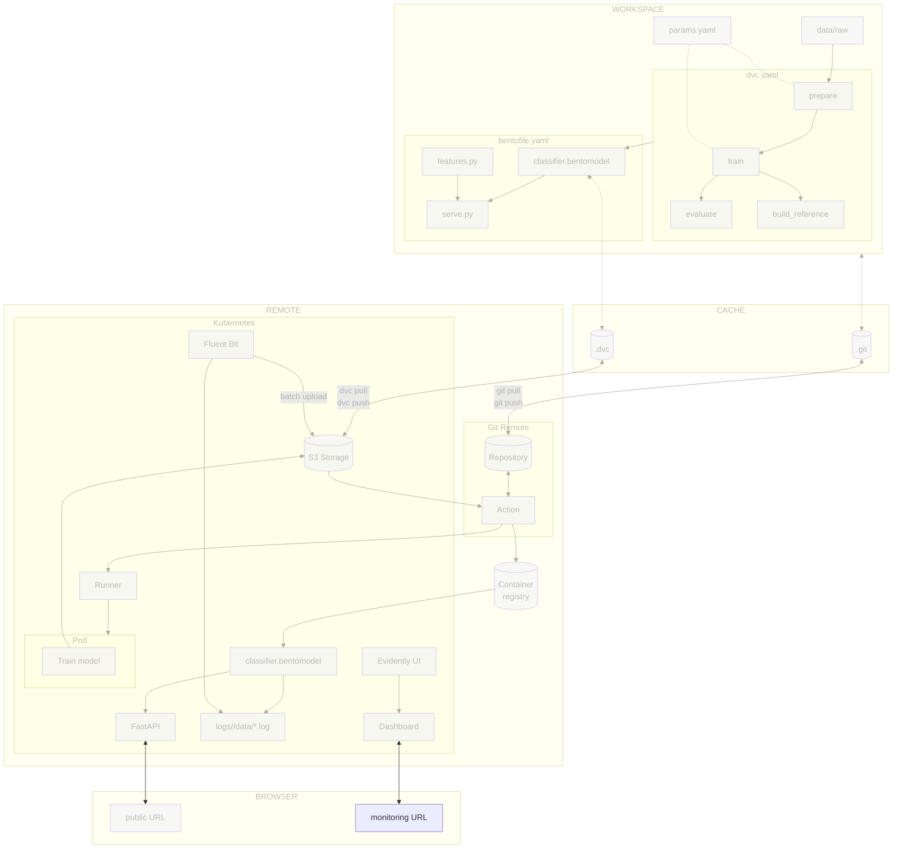

# Chapter 4.3 - Deploy and access the monitoring on Kubernetes

## Introduction

In the previous chapters you logged predictions with BentoML's native monitoring
and generated a local drift report with Evidently AI. This chapter moves that
stack into the cloud using Fluent Bit, the de facto log shipper in Kubernetes. A
Fluent Bit sidecar tails the local monitoring files, buffers them, and uploads
them to S3 in batches. A scheduled GitHub Actions workflow refreshes the drift
report from the logs in S3.

In this chapter, you will learn how to:

1. Ship BentoML monitoring logs to S3 with a Fluent Bit sidecar
2. Create a monitoring job that pulls logs from S3 and pushes Evidently
   snapshots
3. Deploy the Evidently UI service on Kubernetes
4. Access the dashboard and the JSON drift summary
5. Commit the changes to Git

The following diagram illustrates the control flow at the end of this chapter:



## Steps

### Upload prediction logs to S3 in batches

The BentoML service writes monitoring records to local files inside the pod. To
make those logs durable, you will add a Fluent Bit sidecar to the model pod.
Fluent Bit tails the local log files, buffers them in memory and on disk, and
uploads them to S3 when a batch reaches a configured size or age.

!!! note "Why a sidecar?"

    A sidecar is a helper container that runs alongside the main application
    container in the same pod. It keeps the model service unchanged, moves network
    I/O out of the inference path, and shares a local volume with the model
    container. Fluent Bit also batches small records into larger S3 objects, which
    is cheaper and faster than per-request uploads.

#### Fluent Bit configuration

Fluent Bit needs two pieces of configuration: an input that tails the BentoML
log files, and an output that uploads batches to S3.

Create a ConfigMap with a minimal `fluent-bit.conf`:

```yaml title="kubernetes/fluent-bit-config.yaml"
apiVersion: v1
kind: ConfigMap
metadata:
  name: fluent-bit-config
data:
  fluent-bit.conf: |
    [SERVICE]
        Flush        1
        Log_Level    info
        Daemon       off
        HTTP_Server  Off

    [INPUT]
        Name              tail
        Path              /app/logs/celestial_bodies_classifier/data/*.log
        Tag               bentoml.logs
        Parser            json
        Refresh_Interval  5
        Mem_Buf_Limit     50MB

    [OUTPUT]
        Name              s3
        Match             bentoml.logs
        bucket            ${S3_BUCKET}
        region            ${AWS_REGION}
        total_file_size   10M
        upload_timeout    10m
        s3_key_format     /logs/$TAG[0]/$UUID.log
        store_dir         /tmp/fluent-bit-s3
```

The `s3` output plugin creates S3 objects under `s3://<bucket>/logs/`. The
`total_file_size` and `upload_timeout` options control batching: Fluent Bit
flushes a file to S3 when it reaches 10 MB or after 10 minutes, whichever comes
first. Adjust these values based on your traffic volume.

The `store_dir` path is used for local buffering and upload state. It should be
on writable local disk; an `emptyDir` volume is fine.

#### Update `kubernetes/deployment.yaml`

Add a shared `emptyDir` volume for the logs, mount it into the BentoML
container, and add the Fluent Bit sidecar with the ConfigMap mounted as its
configuration.

```yaml title="kubernetes/deployment.yaml" hl_lines="16-21 24-76"
apiVersion: apps/v1
kind: Deployment
metadata:
  name: celestial-bodies-classifier-deployment
  labels:
    app: celestial-bodies-classifier
spec:
  replicas: 1
  selector:
    matchLabels:
      app: celestial-bodies-classifier
  template:
    metadata:
      labels:
        app: celestial-bodies-classifier
    spec:
      containers:
      - name: celestial-bodies-classifier
        image: <docker_image>
        workingDir: /app
        volumeMounts:
        - name: prediction-logs
          mountPath: /app/logs
      - name: fluent-bit
        image: fluent/fluent-bit:5.0.8
        env:
        - name: S3_BUCKET
          value: "<s3_bucket_name>"
        - name: AWS_REGION
          value: "<s3_region>"
        - name: AWS_ACCESS_KEY_ID
          valueFrom:
            secretKeyRef:
              name: monitoring-s3-credentials
              key: aws_access_key_id
        - name: AWS_SECRET_ACCESS_KEY
          valueFrom:
            secretKeyRef:
              name: monitoring-s3-credentials
              key: aws_secret_access_key
        volumeMounts:
        - name: prediction-logs
          mountPath: /app/logs
          readOnly: true
        - name: fluent-bit-config
          mountPath: /fluent-bit/etc/
        - name: fluent-bit-tmp
          mountPath: /tmp/fluent-bit-s3
      volumes:
      - name: prediction-logs
        emptyDir: {}
      - name: fluent-bit-config
        configMap:
          name: fluent-bit-config
      - name: fluent-bit-tmp
        emptyDir: {}
```

Replace `<s3_bucket_name>` and `<s3_region>` with the S3 bucket and region used
for monitoring artifacts.

The BentoML container writes to `logs/` relative to its working directory. By
setting `workingDir: /app` and mounting the shared volume at `/app/logs`, both
containers see the same files.

If your cluster uses workload identity (for example, IRSA on EKS or Workload
Identity on GKE for S3-compatible storage), remove the `AWS_ACCESS_KEY_ID`/
`AWS_SECRET_ACCESS_KEY` references and annotate the service account instead.

Create the secret for static credentials:

```sh title="Execute the following command(s) in a terminal"
kubectl create secret generic monitoring-s3-credentials \
  --from-literal=aws_access_key_id="$AWS_ACCESS_KEY_ID" \
  --from-literal=aws_secret_access_key="$AWS_SECRET_ACCESS_KEY"
```

#### Deploy the model with the Fluent Bit sidecar

Replace the placeholders in the Kubernetes deployment manifest:

```sh title="Execute the following command(s) in a terminal"
export S3_BUCKET=<s3_bucket_name>

sed -i "s|<docker_image>|$GCP_CONTAINER_REGISTRY_HOST/celestial-bodies-classifier:latest|g" \
  kubernetes/deployment.yaml

sed -i "s|<s3_bucket_name>|$S3_BUCKET|g" \
  kubernetes/deployment.yaml
```

Apply the model deployment (now with the Fluent Bit sidecar):

```sh title="Execute the following command(s) in a terminal"
kubectl apply -f kubernetes/deployment.yaml
```

Verify that the model pod is running:

```sh title="Execute the following command(s) in a terminal"
kubectl get pods -l app=celestial-bodies-classifier
```

### Deploy the Evidently UI service

The Evidently UI service is a separate pod that reads snapshots from an
S3-backed workspace and serves the dashboard. Deploy it after the model is
shipping logs, because the monitoring script you will write next pushes
snapshots to the same workspace.

#### Create the Evidently UI image

You only need to build the Evidently UI service image here. The report
generation runs in GitHub Actions, so the monitoring Docker image and CronJob
from the previous approach are no longer needed.

`monitoring/ui.Dockerfile` is minimal because the UI service only needs the
`evidently` package, `s3fs` for the S3-backed workspace, and S3 credentials.

```dockerfile title="monitoring/ui.Dockerfile"
FROM python:3.13-slim

WORKDIR /app

RUN pip install --no-cache-dir evidently==0.7.21 s3fs==2025.1.0

EXPOSE 8000

CMD ["sh", "-c", "evidently ui --host 0.0.0.0 --workspace s3://${S3_BUCKET}/evidently-workspace --port 8000"]
```

#### Create Kubernetes manifests

Create a deployment and service for the Evidently UI service. The UI reads and
writes snapshots from `s3://<bucket>/evidently-workspace` using `fsspec`.

```yaml title="kubernetes/evidently-ui-deployment.yaml"
apiVersion: apps/v1
kind: Deployment
metadata:
  name: evidently-ui
  labels:
    app: evidently-ui
spec:
  replicas: 1
  selector:
    matchLabels:
      app: evidently-ui
  template:
    metadata:
      labels:
        app: evidently-ui
    spec:
      containers:
      - name: evidently-ui
        image: <evidently_ui_image>
        ports:
        - containerPort: 8000
        env:
        - name: S3_BUCKET
          value: "<s3_bucket_name>"
        - name: FSSPEC_S3_KEY
          valueFrom:
            secretKeyRef:
              name: monitoring-s3-credentials
              key: aws_access_key_id
        - name: FSSPEC_S3_SECRET
          valueFrom:
            secretKeyRef:
              name: monitoring-s3-credentials
              key: aws_secret_access_key
```

```yaml title="kubernetes/evidently-ui-service.yaml"
apiVersion: v1
kind: Service
metadata:
  name: evidently-ui
spec:
  type: LoadBalancer
  ports:
    - name: http
      port: 80
      targetPort: 8000
      protocol: TCP
  selector:
    app: evidently-ui
```

#### Build and publish the UI image

Build and publish the UI image using the same container registry as the model
service.

```sh title="Execute the following command(s) in a terminal"
# Build the UI image
docker build -f monitoring/ui.Dockerfile -t celestial-bodies-evidently-ui:latest .

# Tag the image for the remote registry
docker tag celestial-bodies-evidently-ui:latest \
  $GCP_CONTAINER_REGISTRY_HOST/celestial-bodies-evidently-ui:latest

# Push the image
docker push $GCP_CONTAINER_REGISTRY_HOST/celestial-bodies-evidently-ui:latest
```

Replace the placeholders in the Kubernetes manifests:

```sh title="Execute the following command(s) in a terminal"
export EVIDENTLY_UI_IMAGE=$GCP_CONTAINER_REGISTRY_HOST/celestial-bodies-evidently-ui:latest
export S3_BUCKET=<s3_bucket_name>

sed -i "s|<evidently_ui_image>|$EVIDENTLY_UI_IMAGE|g" \
  kubernetes/evidently-ui-deployment.yaml

sed -i "s|<s3_bucket_name>|$S3_BUCKET|g" \
  kubernetes/evidently-ui-deployment.yaml
```

Apply the UI manifests:

```sh title="Execute the following command(s) in a terminal"
kubectl apply -f kubernetes/evidently-ui-deployment.yaml
kubectl apply -f kubernetes/evidently-ui-service.yaml
```

Verify that the UI pod is running:

```sh title="Execute the following command(s) in a terminal"
kubectl get pods -l app=evidently-ui
```

Get the external IP of the Evidently UI service and save it as a GitHub secret:

```sh title="Execute the following command(s) in a terminal"
kubectl get service evidently-ui
```

Store the URL (`http://<load-balancer-ip>:8000`) as the `EVIDENTLY_UI_URL`
secret in the repository settings.

### Link logs to the Evidently UI

Now that Fluent Bit ships logs to S3 and the Evidently UI service reads from an
S3-backed workspace, create the script that connects the two. It downloads the
latest logs from S3, pulls the reference dataset from the DVC remote, generates
an Evidently snapshot, and pushes it to the workspace.

#### Update `requirements.txt`

Add `boto3` so the monitoring job can read logs and write the JSON summary, and
`s3fs` so Evidently can write the workspace directly to S3.

```txt title="requirements.txt" hl_lines="7-8"
tensorflow==2.21.0
matplotlib==3.10.9
pyyaml==6.0.3
dvc[gs]==3.67.1
bentoml==1.4.39
pillow==12.2.0
evidently==0.7.21
boto3==1.37.38
s3fs==2025.1.0
```

Freeze the dependencies again after editing `requirements.txt`:

```sh title="Execute the following command(s) in a terminal"
# Install the dependencies
pip install --requirement requirements.txt

# Freeze the dependencies
pip freeze --local --all > requirements-freeze.txt
```

#### Create `src/monitor_cloud.py`

This script downloads the inputs from S3 and the DVC remote, calls
`generate_report` from `src/monitor_drift.py`, writes the snapshot directly to
the S3-backed Evidently workspace, and uploads the JSON report to S3.

```py title="src/monitor_cloud.py"
import os
import shutil
import subprocess
import sys
import tempfile
from datetime import datetime, timedelta, timezone
from pathlib import Path

import boto3
from evidently.ui.workspace import Workspace

import monitor_drift

S3_BUCKET = os.environ.get("PREDICTION_LOG_BUCKET")
S3_PREFIX = os.environ.get("PREDICTION_LOG_PREFIX", "logs")
REFERENCE_KEY = os.environ.get("REFERENCE_KEY", "data/reference_features.parquet")
OUTPUT_JSON_KEY = os.environ.get("OUTPUT_JSON_KEY", "monitoring/report.json")
PROJECT_NAME = os.environ.get("EVIDENTLY_PROJECT_NAME", "celestial-bodies-classifier")
WORKSPACE_PREFIX = os.environ.get("EVIDENTLY_WORKSPACE_PREFIX", "evidently-workspace")
LOG_CUTOFF_HOURS = int(os.environ.get("LOG_CUTOFF_HOURS", "24"))


def download_latest_logs(bucket: str, prefix: str, dest: Path) -> None:
    """Download log objects from the last N hours into a directory of log files."""
    s3 = boto3.client("s3")
    paginator = s3.get_paginator("list_objects_v2")
    cutoff = datetime.now(timezone.utc) - timedelta(hours=LOG_CUTOFF_HOURS)
    objects = [
        obj
        for page in paginator.paginate(Bucket=bucket, Prefix=prefix)
        for obj in page.get("Contents", [])
        if obj["LastModified"] >= cutoff
    ]

    if not objects:
        print(
            f"No log objects found under s3://{bucket}/{prefix} "
            f"in the last {LOG_CUTOFF_HOURS} hours"
        )
        sys.exit(1)

    dest.mkdir(parents=True, exist_ok=True)
    for i, obj in enumerate(sorted(objects, key=lambda x: x["LastModified"])):
        out_path = dest / f"data.{i + 1}.log"
        with open(out_path, "wb") as out:
            s3.download_fileobj(bucket, obj["Key"], out)


def pull_reference_dataset(dest: Path) -> None:
    """Pull the DVC-tracked reference dataset and copy it to a temporary path."""
    dest.parent.mkdir(parents=True, exist_ok=True)
    subprocess.run(["dvc", "pull", REFERENCE_KEY], check=True)
    if not Path(REFERENCE_KEY).exists():
        print(f"Reference dataset not found at {REFERENCE_KEY} after dvc pull")
        sys.exit(1)
    shutil.copy(REFERENCE_KEY, dest)


def get_or_create_project(workspace, name: str):
    """Return an existing project by name or create a new one."""
    for project in workspace.search_project(name):
        if project.name == name:
            return project
    return workspace.create_project(
        name=name,
        description="Drift monitoring for the celestial bodies classifier",
    )


def upload_file(bucket: str, key: str, path: Path) -> None:
    """Upload a local file to S3."""
    s3 = boto3.client("s3")
    s3.upload_file(str(path), bucket, key)
    print(f"Uploaded {path} to s3://{bucket}/{key}")


def main() -> None:
    if not S3_BUCKET:
        print("PREDICTION_LOG_BUCKET environment variable is required")
        sys.exit(1)

    with tempfile.TemporaryDirectory() as tmp:
        tmp_path = Path(tmp)
        log_dir = tmp_path / "logs" / "celestial_bodies_classifier" / "data"
        reference_path = tmp_path / "reference_features.parquet"

        download_latest_logs(S3_BUCKET, S3_PREFIX, log_dir)
        pull_reference_dataset(reference_path)

        snapshot = monitor_drift.generate_report(
            reference_path, log_dir, tmp_path
        )

        workspace = Workspace.create(f"s3://{S3_BUCKET}/{WORKSPACE_PREFIX}")
        project = get_or_create_project(workspace, PROJECT_NAME)
        workspace.add_run(project.id, snapshot, include_data=False)
        print(f"Snapshot added to project {project.name} (ID: {project.id})")

        upload_file(S3_BUCKET, OUTPUT_JSON_KEY, tmp_path / "report.json")


if __name__ == "__main__":
    main()
```

`Workspace.create("s3://...")` uses `fsspec` under the hood, so the snapshot is
written straight to the same S3 prefix the Evidently UI service reads from. No
extra HTTP call to the UI pod is needed. `include_data=False` tells Evidently to
store only the aggregated snapshot, not the raw reference or current datasets.
This keeps the workspace small and avoids duplicating data that is already in
S3.

The `download_latest_logs` function downloads every log object under the prefix
that was modified in the last `LOG_CUTOFF_HOURS` hours into a directory of
`.log` files. Fluent Bit uploads timestamped objects as batches close, so
`monitor_drift.generate_report` can read them all together.

### Create the monitoring workflow

Create a GitHub Actions workflow that runs `src/monitor_cloud.py` on a schedule
and on demand. It reuses the same cloud credentials and Python environment as
the main MLOps pipeline.

```yaml title=".github/workflows/monitor.yaml"
name: Monitor drift

on:
  # Run every hour
  schedule:
    - cron: "0 * * * *"
  # Allow manual runs from the Actions tab
  workflow_dispatch:

jobs:
  drift-report:
    runs-on: ubuntu-latest
    steps:
      - name: Checkout repository
        uses: actions/checkout@v6
      - name: Setup Python
        uses: actions/setup-python@v6
        with:
          python-version: '3.13'
          cache: pip
      - name: Install dependencies
        run: pip install --requirement requirements-freeze.txt
      - name: Login to Google Cloud
        uses: google-github-actions/auth@v3
        with:
          credentials_json: '${{ secrets.GOOGLE_SERVICE_ACCOUNT_KEY }}'
      - name: Run drift report
        env:
          PREDICTION_LOG_BUCKET: ${{ secrets.PREDICTION_LOG_BUCKET }}
          PREDICTION_LOG_PREFIX: ${{ secrets.PREDICTION_LOG_PREFIX }}
          FSSPEC_S3_KEY: ${{ secrets.AWS_ACCESS_KEY_ID }}
          FSSPEC_S3_SECRET: ${{ secrets.AWS_SECRET_ACCESS_KEY }}
        run: python src/monitor_cloud.py
```

Store the required secrets in the repository settings under
**Secrets and variables > Actions**:

- `PREDICTION_LOG_BUCKET`: the S3 bucket that receives the prediction logs
- `PREDICTION_LOG_PREFIX`: the S3 prefix for logs (default `logs`)
- `AWS_ACCESS_KEY_ID` and `AWS_SECRET_ACCESS_KEY`: credentials for the S3 bucket
  that holds the logs, the JSON report, and the Evidently workspace

The workflow maps the AWS credentials to `FSSPEC_S3_KEY` and `FSSPEC_S3_SECRET`
so Evidently can write the snapshot directly to the S3 workspace. It
authenticates to Google Cloud so that `dvc pull` can download the DVC-tracked
reference dataset.

If your DVC remote is Google Cloud Storage, the workflow already uses the Google
Cloud service account. The Evidently UI service and the Fluent Bit sidecar still
need S3 credentials for the monitoring bucket.

### Run the monitoring workflow

Trigger the workflow manually from the **Actions** tab by selecting the
**Monitor drift** workflow and clicking **Run workflow**. This avoids waiting
for the hourly schedule.

Open `http://<load-balancer-ip>/` in a browser, select the
`celestial-bodies-classifier` project, and inspect the latest drift report. New
snapshots appear every time the workflow runs.

Download the JSON drift summary from S3:

```sh title="Execute the following command(s) in a terminal"
aws s3 cp s3://<s3_bucket_name>/monitoring/report.json - | python -m json.tool
```

You should see the same drift metrics as in the local report from the previous
chapter, now refreshed automatically from production logs.

### Check the changes

Check the changes with Git to ensure that all the necessary files are tracked:

```sh title="Execute the following command(s) in a terminal"
# Add all the files
git add .

# Check the changes
git status
```

The output should look similar to this:

```text
On branch main
Changes to be committed:
  (use "git restore --staged <file>..." to unstage)
        modified:   kubernetes/deployment.yaml
        modified:   requirements-freeze.txt
        modified:   requirements.txt
        new file:   .github/workflows/monitor.yaml
        new file:   kubernetes/evidently-ui-deployment.yaml
        new file:   kubernetes/evidently-ui-service.yaml
        new file:   kubernetes/fluent-bit-config.yaml
        new file:   monitoring/ui.Dockerfile
        new file:   src/monitor_cloud.py
```

### Commit the changes to Git

Commit the changes:

```sh title="Execute the following command(s) in a terminal"
# Commit the changes
git commit -m "Deploy Evidently monitoring UI on Kubernetes and ship logs with Fluent Bit"

# Push the changes
git push
```
## Summary

In this chapter, you have successfully:

1. Shipped BentoML monitoring logs to S3 with a Fluent Bit sidecar
2. Configured Fluent Bit to tail local files and batch-upload to S3
3. Reused `src/monitor_drift.py` so the report generation stays portable
4. Created a monitoring job that pulls logs and the reference dataset from
   storage
5. Pushed drift snapshots to a remote Evidently workspace
6. Deployed the Evidently UI service on Kubernetes
7. Scheduled drift reports with a GitHub Actions workflow
8. Accessed the dashboard and the JSON drift summary
9. Committed the changes to Git

You fixed some of the previous issues:

- [x] Automated alerts and dashboards are configured

!!! abstract "Take away"

    - **Let Fluent Bit handle log shipping**: BentoML writes to local files; a
      Fluent Bit sidecar tails, buffers, and batch-uploads them to S3. This keeps
      inference fast and resilient to S3 retries or backpressure.
    - **Batch uploads are cost-effective**: Aggregating many small records into
      larger S3 objects avoids rate limits and reduces API costs compared to
      per-request uploads.
    - **The Evidently UI service is the dashboard**: instead of serving a static
      HTML file with a custom web server, you run Evidently's own UI and push
      snapshots to it. This gives history, trending, and the native dashboard
      experience.
    - **GitHub Actions is a good fit for batch monitoring jobs**: a scheduled
      workflow runs on demand or on a cron schedule, pulls fresh data, pushes a
      snapshot, and exits. It reuses the same secrets and runner infrastructure as the
      rest of the CI/CD pipeline.
    - **The reference dataset stays under DVC**: every report uses the same
      distribution the model was trained on, even when the report runs in a workflow.
    - **Keep a machine-readable summary in object storage**: uploading `report.json`
      to S3 makes it easy for alerting tools to read the latest drift scores without
      depending on the UI service.

## State of the MLOps process

- [x] Model predictions can be monitored in production
- [x] Data drift and concept drift can be detected automatically
- [x] Automated alerts and dashboards are configured
- [ ] Drift signals do not trigger actionable retraining workflows
- [ ] Model cannot be rolled back to a previous version on degradation

Continue to the next chapters to address the remaining items.

## Sources

Highly inspired by:

- [_Evidently AI Documentation_](https://docs.evidentlyai.com/)
- [_Fluent Bit Documentation_](https://docs.fluentbit.io/)
- [_Boto3 S3 upload documentation_](https://boto3.amazonaws.com/v1/documentation/api/latest/guide/s3-uploading-files.html)
