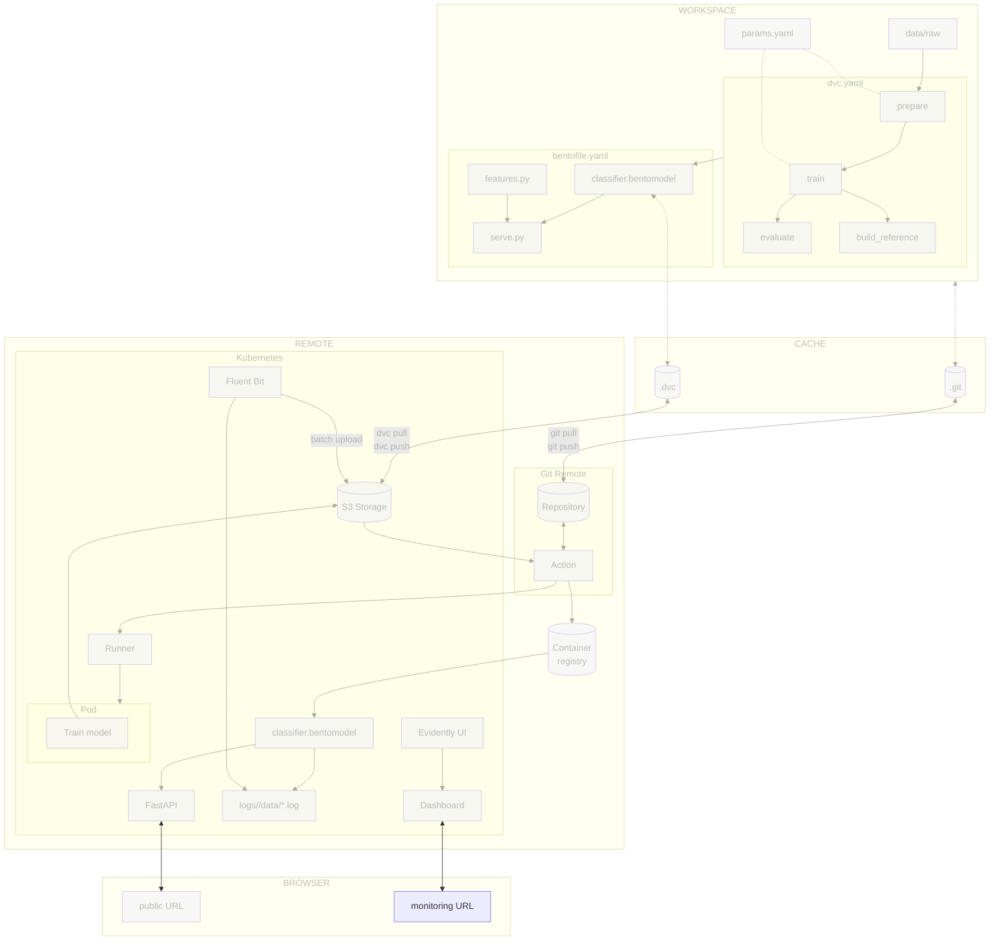

# Chapter 4.3 - Deploy and access the monitoring on Kubernetes

## Introduction

In the previous chapters you logged predictions with BentoML's native monitoring
and generated a local drift report with Evidently AI. This chapter moves that
stack into the cloud using Fluent Bit, the de facto log shipper in Kubernetes. A
Fluent Bit sidecar tails the local monitoring files, buffers them, and uploads
them to a storage bucket in batches. A scheduled GitHub Actions workflow
refreshes the drift report from the logs in the bucket.

In this chapter, you will learn how to:

1. Ship BentoML monitoring logs to a storage bucket with a Fluent Bit sidecar
2. Deploy the Evidently UI service on Kubernetes
3. Create a monitoring job that pulls logs from the storage bucket and pushes
   Evidently snapshots to the UI workspace
4. Schedule the monitoring job with a GitHub Actions workflow
5. Access the dashboard and the JSON drift summary
6. Commit the changes to Git

The following diagram illustrates the control flow at the end of this chapter:



## Steps

### Upload prediction logs to a storage bucket in batches

The BentoML service writes monitoring records to local files inside the pod. To
make those logs durable, you will add a Fluent Bit sidecar to the model pod.
Fluent Bit tails the local log files, buffers them in memory and on disk, and
uploads them to the storage bucket when a batch reaches a configured size or
age.

!!! note "Why a sidecar?"

    A sidecar is a helper container that runs alongside the main application
    container in the same pod. It keeps the model service unchanged, moves network
    I/O out of the inference path, and shares a local volume with the model
    container. Fluent Bit also batches small records into larger objects, which is
    cheaper and faster than per-request uploads.

#### Fluent Bit configuration

Fluent Bit needs two pieces of configuration: an input that tails the BentoML
log files, and an output that uploads batches to the storage bucket. Fluent
Bit's S3 output plugin can talk to Google Cloud Storage through its
S3-compatible API.

Create a ConfigMap with a minimal `fluent-bit.conf`:

```yaml title="kubernetes/fluent-bit-config.yaml"
apiVersion: v1
kind: ConfigMap
metadata:
  name: fluent-bit-config
data:
  fluent-bit.conf: |
    [SERVICE]
        Flush        1
        Log_Level    info
        Daemon       off
        HTTP_Server  Off

    [INPUT]
        Name              tail
        Path              /app/logs/celestial_bodies_classifier/data/*.log
        Tag               bentoml.logs
        Parser            json
        Refresh_Interval  5
        Mem_Buf_Limit     50MB

    [OUTPUT]
        Name              s3
        Match             bentoml.logs
        bucket            ${GCP_BUCKET_NAME}
        region            ${GCP_BUCKET_LOCATION}
        endpoint          https://storage.googleapis.com
        total_file_size   10M
        upload_timeout    10m
        s3_key_format     /logs/$TAG[0]/$UUID.log
        store_dir         /tmp/fluent-bit-s3
```

Here, the following should be noted:

* The `s3` output plugin creates objects under `gs://$GCP_BUCKET_NAME/logs/`.
* The `bucket`, `region`, and `endpoint` options point to the storage backend.
  `bucket` is set to `${GCP_BUCKET_NAME}`, `region` corresponds to the bucket
  location (`${GCP_BUCKET_LOCATION}`), and `endpoint` points to the Google Cloud
  Storage S3-compatible API.
* The `store_dir` path is used for local buffering and upload state. This guide
  mounts an `emptyDir` volume at `/tmp/fluent-bit-s3` in the Fluent Bit sidecar.

!!! note "Environment variable expansion"

    The `${GCP_BUCKET_NAME}` and `${GCP_BUCKET_LOCATION}` variables are expanded by
    Fluent Bit from the sidecar container's environment, which is configured in
    `kubernetes/deployment.yaml`. No manual substitution in the ConfigMap is needed.

#### Update `kubernetes/deployment.yaml`

Add a shared `emptyDir` volume for the logs, mount it into the BentoML
container, and add the Fluent Bit sidecar with the ConfigMap mounted as its
configuration.

```yaml title="kubernetes/deployment.yaml" hl_lines="20-56"
apiVersion: apps/v1
kind: Deployment
metadata:
  name: celestial-bodies-classifier-deployment
  labels:
    app: celestial-bodies-classifier
spec:
  replicas: 1
  selector:
    matchLabels:
      app: celestial-bodies-classifier
  template:
    metadata:
      labels:
        app: celestial-bodies-classifier
    spec:
      containers:
      - name: celestial-bodies-classifier
        image: <docker_image>
        workingDir: /app
        volumeMounts:
        - name: prediction-logs
          mountPath: /app/logs
      - name: fluent-bit
        image: fluent/fluent-bit:5.0.8
        env:
        - name: GCP_BUCKET_NAME
          value: "<gcp_bucket_name>"
        - name: GCP_BUCKET_LOCATION
          value: "<gcp_bucket_location>"
        - name: AWS_ACCESS_KEY_ID
          valueFrom:
            secretKeyRef:
              name: monitoring-gcs-credentials
              key: gcs_access_key_id
        - name: AWS_SECRET_ACCESS_KEY
          valueFrom:
            secretKeyRef:
              name: monitoring-gcs-credentials
              key: gcs_secret_access_key
        volumeMounts:
        - name: prediction-logs
          mountPath: /app/logs
          readOnly: true
        - name: fluent-bit-config
          mountPath: /fluent-bit/etc/
        - name: fluent-bit-tmp
          mountPath: /tmp/fluent-bit-s3
      volumes:
      - name: prediction-logs
        emptyDir: {}
      - name: fluent-bit-config
        configMap:
          name: fluent-bit-config
      - name: fluent-bit-tmp
        emptyDir: {}
```

The BentoML container writes to `logs/` relative to its working directory. By
setting `workingDir: /app` and mounting the shared volume at `/app/logs`, both
containers see the same files.

Replace the placeholders in the Kubernetes deployment manifest:

```sh title="Execute the following command(s) in a terminal"
# Replace the placeholder with the actual bucket name and location
sed -i "s|<gcp_bucket_name>|$GCP_BUCKET_NAME|g" kubernetes/deployment.yaml
sed -i "s|<gcp_bucket_location>|$GCP_BUCKET_LOCATION|g" kubernetes/deployment.yaml
```

!!! info "Model image placeholder"

    The `<docker_image>` placeholder is replaced automatically by the CI/CD pipeline
    from Chapter 3.6 on every deploy. If it has not been replaced yet, run the
    following command before applying the manifest:

    ```sh title="Execute the following command(s) in a terminal"
    # Replace the placeholder with the actual Docker image
    sed -i "s|<docker_image>|$GCP_CONTAINER_REGISTRY_HOST/celestial-bodies-classifier:latest|g" kubernetes/deployment.yaml
    ```

!!! note "Why HMAC keys for Fluent Bit?"

    Fluent Bit's S3 output plugin requires S3-style credentials, so you must create
    HMAC keys for the storage bucket. The environment variables are named
    `AWS_ACCESS_KEY_ID` and `AWS_SECRET_ACCESS_KEY` because the S3 plugin expects
    them, but they hold your GCS HMAC keys. The Python code and the Evidently UI
    service use native Google Cloud authentication instead.

Create the HMAC keys in the Google Cloud Console under
**Cloud Storage > Settings > Interoperability**, or with
`gcloud storage hmac create`. Export the keys as environment variables

```sh title="Execute the following command(s) in a terminal"
# Export the GCS HMAC keys
export GCS_HMAC_ACCESS_KEY_ID=<my_hmac_access_key_id>
export GCS_HMAC_SECRET_ACCESS_KEY=<my_hmac_secret_key_id>
```

Then create the secret:

```sh title="Execute the following command(s) in a terminal"
kubectl create secret generic monitoring-gcs-credentials \
  --from-literal=gcs_access_key_id="$GCS_HMAC_ACCESS_KEY_ID" \
  --from-literal=gcs_secret_access_key="$GCS_HMAC_SECRET_ACCESS_KEY"
```

#### Deploy the model with the Fluent Bit sidecar

Apply the model deployment (now with the Fluent Bit sidecar):

```sh title="Execute the following command(s) in a terminal"
kubectl apply -f kubernetes/deployment.yaml
```

Verify that the model pod is running:

```sh title="Execute the following command(s) in a terminal"
kubectl get pods -l app=celestial-bodies-classifier
```

### Deploy the Evidently UI service

The Evidently UI service is a separate pod that reads snapshots from a
Google-Cloud-Storage-backed workspace and serves the dashboard. Deploy it after
the model is shipping logs, because the monitoring script you will write next
pushes snapshots to the same workspace.

#### Create the Evidently UI image

You only need to build the Evidently UI service image here. The report
generation runs in GitHub Actions, so the monitoring Docker image and CronJob
from the previous approach are no longer needed.

`monitoring/ui.Dockerfile` is minimal because the UI service only needs the
`evidently` package, `gcsfs` for the storage-bucket-backed workspace, and Google
Cloud credentials.

```dockerfile title="monitoring/ui.Dockerfile"
FROM python:3.13-slim

WORKDIR /app

RUN pip install --no-cache-dir evidently==0.7.21 gcsfs==2026.6.0

EXPOSE 8000

CMD ["sh", "-c", "evidently ui --host 0.0.0.0 --workspace gs://${GCP_BUCKET_NAME}/evidently-workspace --port 8000"]
```

#### Create Kubernetes manifests

Create a deployment and service for the Evidently UI service. The UI reads and
writes snapshots from `gs://<bucket>/evidently-workspace` using `fsspec`.

```yaml title="kubernetes/evidently-ui-deployment.yaml"
apiVersion: apps/v1
kind: Deployment
metadata:
  name: evidently-ui
  labels:
    app: evidently-ui
spec:
  replicas: 1
  selector:
    matchLabels:
      app: evidently-ui
  template:
    metadata:
      labels:
        app: evidently-ui
    spec:
      containers:
      - name: evidently-ui
        image: <evidently_ui_image>
        ports:
        - containerPort: 8000
        env:
        - name: GCP_BUCKET_NAME
          value: "<gcp_bucket_name>"
```

```yaml title="kubernetes/evidently-ui-service.yaml"
apiVersion: v1
kind: Service
metadata:
  name: evidently-ui
spec:
  type: LoadBalancer
  ports:
    - name: http
      port: 80
      targetPort: 8000
      protocol: TCP
  selector:
    app: evidently-ui
```

The Evidently UI service uses Application Default Credentials to access Google
Cloud Storage. Make sure the cluster nodes or the pod's service account have the
`roles/storage.objectAdmin` role on the monitoring bucket.

#### Build and publish the UI image

Build and publish the UI image using the same container registry as the model
service.

```sh title="Execute the following command(s) in a terminal"
# Build the UI image
docker build -f monitoring/ui.Dockerfile -t celestial-bodies-evidently-ui:latest .

# Tag the image for the remote registry
docker tag celestial-bodies-evidently-ui:latest \
  $GCP_CONTAINER_REGISTRY_HOST/celestial-bodies-evidently-ui:latest

# Push the image
docker push $GCP_CONTAINER_REGISTRY_HOST/celestial-bodies-evidently-ui:latest
```

Replace the placeholders in the Kubernetes manifests:

```sh title="Execute the following command(s) in a terminal"
export EVIDENTLY_UI_IMAGE=$GCP_CONTAINER_REGISTRY_HOST/celestial-bodies-evidently-ui:latest

sed -i "s|<evidently_ui_image>|$EVIDENTLY_UI_IMAGE|g" \
  kubernetes/evidently-ui-deployment.yaml

sed -i "s|<gcp_bucket_name>|$GCP_BUCKET_NAME|g" \
  kubernetes/evidently-ui-deployment.yaml
```

Apply the UI manifests:

```sh title="Execute the following command(s) in a terminal"
kubectl apply -f kubernetes/evidently-ui-deployment.yaml
kubectl apply -f kubernetes/evidently-ui-service.yaml
```

Verify that the UI pod is running:

```sh title="Execute the following command(s) in a terminal"
kubectl get pods -l app=evidently-ui
```

Get the external IP of the Evidently UI service and save it as a GitHub secret:

```sh title="Execute the following command(s) in a terminal"
kubectl get service evidently-ui
```

Store the URL (`http://<load-balancer-ip>:8000`) as the `EVIDENTLY_UI_URL`
secret in the repository settings.

### Link logs to the Evidently UI

Now that Fluent Bit ships logs to the storage bucket and the Evidently UI
service reads from a storage-bucket-backed workspace, create the script that
connects the two. It downloads the latest logs from the storage bucket, pulls
the reference dataset from the DVC remote, generates an Evidently snapshot, and
pushes it to the workspace.

#### Update `requirements.txt`

Add `google-cloud-storage` so the monitoring job can read logs and write the
JSON summary, and `gcsfs` so Evidently can write the workspace directly to the
storage bucket.

```txt title="requirements.txt" hl_lines="7-8"
tensorflow==2.21.0
matplotlib==3.10.9
pyyaml==6.0.3
dvc[gs]==3.67.1
bentoml==1.4.39
pillow==12.2.0
evidently==0.7.21
google-cloud-storage==3.2.0
gcsfs==2026.6.0
```

Freeze the dependencies again after editing `requirements.txt`:

```sh title="Execute the following command(s) in a terminal"
# Install the dependencies
pip install --requirement requirements.txt

# Freeze the dependencies
pip freeze --local --all > requirements-freeze.txt
```

#### Create `src/monitor_cloud.py`

This script downloads the inputs from the storage bucket and the DVC remote,
calls `generate_report` from `src/monitor_drift.py`, writes the snapshot
directly to the storage-bucket-backed Evidently workspace, and uploads the JSON
report to the storage bucket.

```py title="src/monitor_cloud.py"
import os
import shutil
import subprocess
import sys
import tempfile
from datetime import datetime, timedelta, timezone
from pathlib import Path

from google.cloud import storage
from evidently.ui.workspace import Workspace

import monitor_drift

GCS_BUCKET = os.environ.get("PREDICTION_LOG_BUCKET")
GCS_PREFIX = os.environ.get("PREDICTION_LOG_PREFIX", "logs")
REFERENCE_KEY = os.environ.get("REFERENCE_KEY", "data/reference_features.parquet")
OUTPUT_JSON_KEY = os.environ.get("OUTPUT_JSON_KEY", "monitoring/report.json")
PROJECT_NAME = os.environ.get("EVIDENTLY_PROJECT_NAME", "celestial-bodies-classifier")
WORKSPACE_PREFIX = os.environ.get("EVIDENTLY_WORKSPACE_PREFIX", "evidently-workspace")
LOG_CUTOFF_HOURS = int(os.environ.get("LOG_CUTOFF_HOURS", "24"))


def download_latest_logs(bucket_name: str, prefix: str, dest: Path) -> None:
    """Download log objects from the last N hours into a directory of log files."""
    client = storage.Client()
    bucket = client.bucket(bucket_name)
    cutoff = datetime.now(timezone.utc) - timedelta(hours=LOG_CUTOFF_HOURS)
    blobs = [
        blob
        for blob in bucket.list_blobs(prefix=prefix)
        if blob.updated >= cutoff
    ]

    if not blobs:
        print(
            f"No log objects found under gs://{bucket_name}/{prefix} "
            f"in the last {LOG_CUTOFF_HOURS} hours"
        )
        sys.exit(1)

    dest.mkdir(parents=True, exist_ok=True)
    for i, blob in enumerate(sorted(blobs, key=lambda b: b.updated)):
        out_path = dest / f"data.{i + 1}.log"
        blob.download_to_filename(out_path)


def pull_reference_dataset(dest: Path) -> None:
    """Pull the DVC-tracked reference dataset and copy it to a temporary path."""
    dest.parent.mkdir(parents=True, exist_ok=True)
    subprocess.run(["dvc", "pull", REFERENCE_KEY], check=True)
    if not Path(REFERENCE_KEY).exists():
        print(f"Reference dataset not found at {REFERENCE_KEY} after dvc pull")
        sys.exit(1)
    shutil.copy(REFERENCE_KEY, dest)


def get_or_create_project(workspace, name: str):
    """Return an existing project by name or create a new one."""
    for project in workspace.search_project(name):
        if project.name == name:
            return project
    return workspace.create_project(
        name=name,
        description="Drift monitoring for the celestial bodies classifier",
    )


def upload_file(bucket_name: str, key: str, path: Path) -> None:
    """Upload a local file to the storage bucket."""
    client = storage.Client()
    bucket = client.bucket(bucket_name)
    blob = bucket.blob(key)
    blob.upload_from_filename(str(path))
    print(f"Uploaded {path} to gs://{bucket_name}/{key}")


def main() -> None:
    if not GCS_BUCKET:
        print("PREDICTION_LOG_BUCKET environment variable is required")
        sys.exit(1)

    with tempfile.TemporaryDirectory() as tmp:
        tmp_path = Path(tmp)
        log_dir = tmp_path / "logs" / "celestial_bodies_classifier" / "data"
        reference_path = tmp_path / "reference_features.parquet"

        download_latest_logs(GCS_BUCKET, GCS_PREFIX, log_dir)
        pull_reference_dataset(reference_path)

        snapshot = monitor_drift.generate_report(
            reference_path, log_dir, tmp_path
        )

        workspace = Workspace.create(f"gs://{GCS_BUCKET}/{WORKSPACE_PREFIX}")
        project = get_or_create_project(workspace, PROJECT_NAME)
        workspace.add_run(project.id, snapshot, include_data=False)
        print(f"Snapshot added to project {project.name} (ID: {project.id})")

        upload_file(GCS_BUCKET, OUTPUT_JSON_KEY, tmp_path / "report.json")


if __name__ == "__main__":
    main()
```

`Workspace.create("gs://...")` uses `fsspec` under the hood, so the snapshot is
written straight to the same storage-bucket prefix the Evidently UI service
reads from. No extra HTTP call to the UI pod is needed. `include_data=False`
tells Evidently to store only the aggregated snapshot, not the raw reference or
current datasets. This keeps the workspace small and avoids duplicating data
that is already in the storage bucket.

The `download_latest_logs` function downloads every log object under the prefix
that was modified in the last `LOG_CUTOFF_HOURS` hours into a directory of
`.log` files. Fluent Bit uploads timestamped objects as batches close, so
`monitor_drift.generate_report` can read them all together.

### Create the monitoring workflow

Create a GitHub Actions workflow that runs `src/monitor_cloud.py` on a schedule
and on demand. It reuses the same cloud credentials and Python environment as
the main MLOps pipeline.

```yaml title=".github/workflows/monitor.yaml"
name: Monitor drift

on:
  # Run every hour
  schedule:
    - cron: "0 * * * *"
  # Allow manual runs from the Actions tab
  workflow_dispatch:

jobs:
  drift-report:
    runs-on: ubuntu-latest
    steps:
      - name: Checkout repository
        uses: actions/checkout@v6
      - name: Setup Python
        uses: actions/setup-python@v6
        with:
          python-version: '3.13'
          cache: pip
      - name: Install dependencies
        run: pip install --requirement requirements-freeze.txt
      - name: Login to Google Cloud
        uses: google-github-actions/auth@v3
        with:
          credentials_json: '${{ secrets.GOOGLE_SERVICE_ACCOUNT_KEY }}'
      - name: Run drift report
        env:
          PREDICTION_LOG_BUCKET: ${{ secrets.GCS_BUCKET_NAME }}
          PREDICTION_LOG_PREFIX: ${{ secrets.GCS_LOG_PREFIX }}
        run: python src/monitor_cloud.py
```

Store the required secrets in the repository settings under
**Secrets and variables > Actions**:

- `GCS_BUCKET_NAME`: the storage bucket that receives the prediction logs, the
  JSON report, and the Evidently workspace
- `GCS_LOG_PREFIX`: the prefix for logs (default `logs`)

The workflow authenticates to Google Cloud so that `dvc pull` can download the
DVC-tracked reference dataset and so that `google-cloud-storage` and `gcsfs` can
read and write the monitoring bucket. The Fluent Bit sidecar still needs HMAC
keys for the same bucket, because it uses the S3-compatible API.

### Run the monitoring workflow

Trigger the workflow manually from the **Actions** tab by selecting the
**Monitor drift** workflow and clicking **Run workflow**. This avoids waiting
for the hourly schedule.

Open `http://<load-balancer-ip>/` in a browser, select the
`celestial-bodies-classifier` project, and inspect the latest drift report. New
snapshots appear every time the workflow runs.

Download the JSON drift summary from the storage bucket:

```sh title="Execute the following command(s) in a terminal"
gcloud storage cat gs://<gcp_bucket_name>/monitoring/report.json | python -m json.tool
```

You should see the same drift metrics as in the local report from the previous
chapter, now refreshed automatically from production logs.

### Check the changes

Check the changes with Git to ensure that all the necessary files are tracked:

```sh title="Execute the following command(s) in a terminal"
# Add all the files
git add .

# Check the changes
git status
```

The output should look similar to this:

```text
On branch main
Changes to be committed:
  (use "git restore --staged <file>..." to unstage)
        modified:   kubernetes/deployment.yaml
        modified:   requirements-freeze.txt
        modified:   requirements.txt
        new file:   .github/workflows/monitor.yaml
        new file:   kubernetes/evidently-ui-deployment.yaml
        new file:   kubernetes/evidently-ui-service.yaml
        new file:   kubernetes/fluent-bit-config.yaml
        new file:   monitoring/ui.Dockerfile
        new file:   src/monitor_cloud.py
```

### Commit the changes to Git

Commit the changes:

```sh title="Execute the following command(s) in a terminal"
# Commit the changes
git commit -m "Deploy Evidently monitoring UI on Kubernetes and ship logs with Fluent Bit"

# Push the changes
git push
```

## Summary

In this chapter, you have successfully:

1. Shipped BentoML monitoring logs to a storage bucket with a Fluent Bit sidecar
2. Configured Fluent Bit to tail local files and batch-upload to the storage
   bucket through the S3-compatible API
3. Reused `src/monitor_drift.py` so the report generation stays portable
4. Created a monitoring job that pulls logs and the reference dataset from
   storage
5. Pushed drift snapshots to a remote Evidently workspace
6. Deployed the Evidently UI service on Kubernetes
7. Scheduled drift reports with a GitHub Actions workflow
8. Accessed the dashboard and the JSON drift summary
9. Committed the changes to Git

You fixed some of the previous issues:

- [x] Automated alerts and dashboards are configured

!!! abstract "Take away"

    - **Let Fluent Bit handle log shipping**: BentoML writes to local files; a
      Fluent Bit sidecar tails, buffers, and batch-uploads them to Google Cloud
      Storage. This keeps inference fast and resilient to retries or backpressure.
    - **Batch uploads are cost-effective**: Aggregating many small records into
      larger objects avoids rate limits and reduces API costs compared to per-request
      uploads.
    - **The Evidently UI service is the dashboard**: instead of serving a static
      HTML file with a custom web server, you run Evidently's own UI and push
      snapshots to it. This gives history, trending, and the native dashboard
      experience.
    - **GitHub Actions is a good fit for batch monitoring jobs**: a scheduled
      workflow runs on demand or on a cron schedule, pulls fresh data, pushes a
      snapshot, and exits. It reuses the same secrets and runner infrastructure as the
      rest of the CI/CD pipeline.
    - **The reference dataset stays under DVC**: every report uses the same
      distribution the model was trained on, even when the report runs in a workflow.
    - **Keep a machine-readable summary in object storage**: uploading `report.json`
      to a storage bucket makes it easy for alerting tools to read the latest drift
      scores without depending on the UI service.

## State of the MLOps process

- [x] Model predictions can be monitored in production
- [x] Data drift and concept drift can be detected automatically
- [x] Automated alerts and dashboards are configured
- [ ] Drift signals do not trigger actionable retraining workflows
- [ ] Model cannot be rolled back to a previous version on degradation

Continue to the next chapters to address the remaining items.

## Sources

Highly inspired by:

- [_Evidently AI Documentation_](https://docs.evidentlyai.com/)
- [_Fluent Bit Documentation_](https://docs.fluentbit.io/)
- [_Google Cloud Storage HMAC keys documentation_](https://cloud.google.com/storage/docs/authentication/hmackeys)
