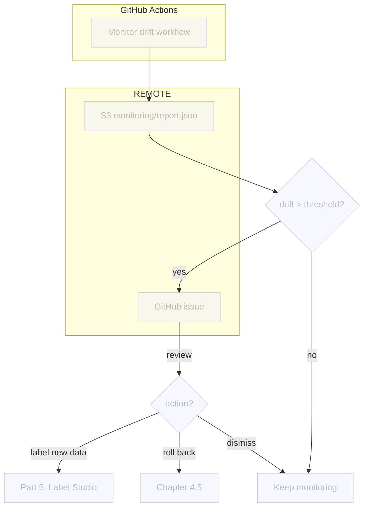

# Chapter 4.4 - Trigger drift alerts with the CI/CD workflow

## Introduction

A drift dashboard is useful only if it leads to action. In this chapter you will
turn the drift report into a signal that the team can act on.

Rather than reacting automatically the moment drift appears, this guide uses a
human-in-the-loop approach: when drift exceeds a threshold, the monitoring
workflow opens a GitHub issue containing a link to the Evidently dashboard. A
maintainer can then review the signal in the next chapter and decide whether to
roll back to a previous model version, label new data (Part 5), or dismiss the
alert and keep monitoring.

This mirrors the CML report workflow from Part 2: observation, review, and then
action.

In this chapter, you will learn how to:

1. Parse the Evidently JSON report to extract drift scores
2. Define thresholds that classify a report as "drifted"
3. Open a GitHub issue from the GitHub Actions monitoring workflow when drift
   exceeds a threshold
4. Commit the changes to Git

The following diagram illustrates the control flow at the end of this chapter:



## Steps

### Parse the Evidently drift report

The Evidently JSON report contains one metric object per preset. The drift
information you need is nested inside each metric's `value` field.

Create a small parser that extracts:

* Whether the dataset as a whole is flagged as drifted.
* The drift score for each numerical feature.
* The drift score for the predicted label distribution.

```py title="src/check_drift.py"
import json
import sys
from pathlib import Path
from typing import Any

REPORT_PATH = Path("monitoring/report.json")


def load_report(report_path: Path = REPORT_PATH) -> dict[str, Any]:
    with open(report_path, encoding="utf-8") as f:
        return json.load(f)


def extract_drift_scores(report_data: dict[str, Any]) -> dict[str, Any]:
    """Extract feature-level drift scores from an Evidently report."""
    scores: dict[str, Any] = {}

    for metric in report_data.get("metrics", []):
        name = metric.get("metric_name", "")
        value = metric.get("value", {})

        if "DatasetDrift" in name:
            scores["dataset"] = {
                "drift_detected": value.get("dataset_drift", False),
                "drift_share": value.get("drift_share", 0.0),
            }

        if "DataDrift" in name and "drift_by_columns" in value:
            for column, column_value in value["drift_by_columns"].items():
                scores[column] = {
                    "drift_detected": column_value.get("drift_detected", False),
                    "drift_score": column_value.get("drift_score", 0.0),
                }

        if "EmbeddingsDrift" in name:
            embedding_name = value.get("embeddings_name", "embedding")
            scores[embedding_name] = {
                "drift_detected": value.get("drift_detected", False),
                "drift_score": value.get("drift_score", 0.0),
            }

    return scores


def main() -> None:
    if not REPORT_PATH.exists():
        print(f"Report not found at {REPORT_PATH}")
        sys.exit(1)

    report_data = load_report()
    scores = extract_drift_scores(report_data)
    print(json.dumps(scores, indent=2))


if __name__ == "__main__":
    main()
```

Run the parser against the local report from Chapter 4.2 to see the expected
shape:

```sh title="Execute the following command(s) in a terminal"
python src/check_drift.py
```

The output is a flat map of drift scores, for example:

```json
{
  "dataset": {"drift_detected": false, "drift_share": 0.0},
  "image_mean": {"drift_detected": false, "drift_score": 0.12},
  "image_std": {"drift_detected": false, "drift_score": 0.05},
  "image_min": {"drift_detected": false, "drift_score": 0.04},
  "image_max": {"drift_detected": false, "drift_score": 0.03},
  "confidence": {"drift_detected": false, "drift_score": 0.06},
  "entropy": {"drift_detected": false, "drift_score": 0.07},
  "predicted_label": {"drift_detected": false, "drift_score": 0.08},
  "image_embedding": {"drift_detected": false, "drift_score": 0.52}
}
```

### Define drift thresholds

Create `monitoring/thresholds.yaml` with a global threshold and per-feature
overrides. Keeping thresholds in Git means every change is reviewed, versioned,
and reproducible.

```yaml title="monitoring/thresholds.yaml"
global:
  # Alert if this share of features is drifted
  max_drifted_features_ratio: 0.2
  # Default drift-score threshold for numerical features
  default_drift_score: 0.15

features:
  image_mean: 0.15
  image_std: 0.15
  image_min: 0.15
  image_max: 0.15
  confidence: 0.15
  entropy: 0.15

predicted_label:
  drift_score: 0.15

# Model-based embedding drift uses ROC AUC; 0.5 means no drift, 1.0 means perfect
# separability. Evidently defaults to 0.55 for drift_detected.
image_embedding:
  drift_score: 0.6
```

The exact values are not critical at first. Start with the defaults suggested by
Evidently (typically `0.05` for the statistical test) and tune them after you
have seen a few production reports. The important thing is that the thresholds
are explicit and committed.

### Open a GitHub issue from the monitoring workflow

Create an alerting module that loads the report from S3, loads the thresholds,
decides whether an alert is needed, and opens a GitHub issue if it is. To avoid
a flood of issues, the module first checks whether an open drift-alert issue
already exists.

#### Create `src/alert.py`

```py title="src/alert.py"
import json
import os
import sys
from pathlib import Path
from typing import Any

import boto3
import requests
import yaml

S3_BUCKET = os.environ.get("PREDICTION_LOG_BUCKET")
REPORT_KEY = os.environ.get("OUTPUT_JSON_KEY", "") or "monitoring/report.json"
THRESHOLDS_PATH = Path(
    os.environ.get("THRESHOLDS_PATH", "monitoring/thresholds.yaml")
)
GH_TOKEN = os.environ.get("GH_TOKEN")
GH_REPO = os.environ.get("GH_REPO")
DASHBOARD_URL = os.environ.get("DASHBOARD_URL", "")


def load_thresholds(path: Path = THRESHOLDS_PATH) -> dict[str, Any]:
    with open(path, encoding="utf-8") as f:
        return yaml.safe_load(f)


def load_report_from_s3(bucket: str, key: str) -> dict[str, Any]:
    """Download and parse the JSON report from S3."""
    if not bucket:
        print("PREDICTION_LOG_BUCKET environment variable is required")
        sys.exit(1)

    s3 = boto3.client("s3")
    response = s3.get_object(Bucket=bucket, Key=key)
    return json.loads(response["Body"].read().decode("utf-8"))


def extract_drift_scores(report_data: dict[str, Any]) -> dict[str, Any]:
    """Extract feature-level drift scores from an Evidently report."""
    scores: dict[str, Any] = {}
    for metric in report_data.get("metrics", []):
        name = metric.get("metric_name", "")
        value = metric.get("value", {})

        if "DatasetDrift" in name:
            scores["dataset"] = {
                "drift_detected": value.get("dataset_drift", False),
                "drift_share": value.get("drift_share", 0.0),
            }

        if "DataDrift" in name and "drift_by_columns" in value:
            for column, column_value in value["drift_by_columns"].items():
                scores[column] = {
                    "drift_detected": column_value.get("drift_detected", False),
                    "drift_score": column_value.get("drift_score", 0.0),
                }

        if "EmbeddingsDrift" in name:
            embedding_name = value.get("embeddings_name", "embedding")
            scores[embedding_name] = {
                "drift_detected": value.get("drift_detected", False),
                "drift_score": value.get("drift_score", 0.0),
            }

    return scores


def is_drift_alert(
    scores: dict[str, Any], thresholds: dict[str, Any]
) -> tuple[bool, list[dict[str, Any]]]:
    global_cfg = thresholds.get("global", {})
    max_ratio = global_cfg.get("max_drifted_features_ratio", 0.2)
    default_score = global_cfg.get("default_drift_score", 0.15)

    feature_cfg = thresholds.get("features", {})
    label_cfg = thresholds.get("predicted_label", {})
    label_threshold = label_cfg.get("drift_score", default_score)
    embedding_cfg = thresholds.get("image_embedding", {})
    embedding_threshold = embedding_cfg.get("drift_score", 0.6)

    drifted_features: list[dict[str, Any]] = []
    numerical_features = [
        "image_mean",
        "image_std",
        "image_min",
        "image_max",
        "confidence",
        "entropy",
    ]

    for feature in numerical_features:
        score_info = scores.get(feature)
        if not score_info:
            continue
        threshold = feature_cfg.get(feature, default_score)
        if score_info.get("drift_score", 0.0) > threshold:
            drifted_features.append(
                {"feature": feature, "score": score_info["drift_score"], "threshold": threshold}
            )

    label_score = scores.get("predicted_label", {})
    if label_score.get("drift_score", 0.0) > label_threshold:
        drifted_features.append(
            {
                "feature": "predicted_label",
                "score": label_score["drift_score"],
                "threshold": label_threshold,
            }
        )

    embedding_score = scores.get("image_embedding", {})
    if embedding_score.get("drift_score", 0.0) > embedding_threshold:
        drifted_features.append(
            {
                "feature": "image_embedding",
                "score": embedding_score["drift_score"],
                "threshold": embedding_threshold,
            }
        )

    dataset_info = scores.get("dataset", {})
    drift_share = dataset_info.get("drift_share", 0.0)
    if drift_share > max_ratio:
        return True, drifted_features

    return bool(drifted_features), drifted_features


def has_open_drift_issue() -> bool:
    """Return True if the repository already has an open drift-alert issue."""
    if not GH_TOKEN or not GH_REPO:
        print("GH_TOKEN and GH_REPO environment variables are required")
        sys.exit(1)

    response = requests.get(
        f"https://api.github.com/repos/{GH_REPO}/issues",
        headers={
            "Authorization": f"Bearer {GH_TOKEN}",
            "Accept": "application/vnd.github+json",
        },
        params={"labels": "drift-alert", "state": "open"},
    )
    response.raise_for_status()
    issues = response.json()
    return len(issues) > 0


def open_github_issue(title: str, body: str) -> None:
    if not GH_TOKEN or not GH_REPO:
        print("GH_TOKEN and GH_REPO environment variables are required")
        sys.exit(1)

    response = requests.post(
        f"https://api.github.com/repos/{GH_REPO}/issues",
        headers={
            "Authorization": f"Bearer {GH_TOKEN}",
            "Accept": "application/vnd.github+json",
        },
        json={"title": title, "body": body, "labels": ["drift-alert"]},
    )
    response.raise_for_status()
    issue = response.json()
    print(f"Created issue #{issue['number']}: {issue['html_url']}")


def build_issue_body(drifted_features: list[dict[str, Any]]) -> str:
    lines = [
        "## Drift alert",
        "",
        "The monitoring workflow detected drift in production predictions.",
        "",
        "| Feature | Drift score | Threshold |",
        "|---|---|---|",
    ]
    for item in drifted_features:
        lines.append(
            f"| {item['feature']} | {item['score']:.4f} | {item['threshold']:.4f} |"
        )

    if DASHBOARD_URL:
        lines.extend(["", f"[View dashboard]({DASHBOARD_URL})"])

    lines.extend(
        [
            "",
            "### Next steps",
            "",
            "- Review this alert in Chapter 4.5 to decide whether to roll back, "
            "label new data in Part 5, or dismiss and keep monitoring.",
        ]
    )

    return "\n".join(lines)


def check_and_alert() -> bool:
    thresholds = load_thresholds()
    report_data = load_report_from_s3(S3_BUCKET, REPORT_KEY)
    scores = extract_drift_scores(report_data)
    is_alert, drifted_features = is_drift_alert(scores, thresholds)

    if not is_alert:
        print("No drift alert")
        return False

    if has_open_drift_issue():
        print("An open drift-alert issue already exists; skipping")
        return False

    title = f"Drift alert: {len(drifted_features)} feature(s) exceeded threshold"
    body = build_issue_body(drifted_features)
    open_github_issue(title, body)
    return True


if __name__ == "__main__":
    check_and_alert()
```

The script queries GitHub for open drift-alert issues before creating a new one.
This prevents duplicate alerts between workflow runs.

#### Update `requirements.txt`

Add `requests` to the project requirements.

```txt title="requirements.txt" hl_lines="9"
tensorflow==2.21.0
matplotlib==3.10.9
pyyaml==6.0.3
dvc[gs]==3.67.1
bentoml==1.4.39
pillow==12.2.0
evidently==0.7.21
boto3==1.37.38
requests==2.32.3
```

Freeze the dependencies again:

```sh title="Execute the following command(s) in a terminal"
# Install the dependencies
pip install --requirement requirements.txt

# Freeze the dependencies
pip freeze --local --all > requirements-freeze.txt
```

#### Wire alerting into the monitoring workflow

The monitoring workflow from Chapter 4.3 already generates the report and
uploads it to S3. Update `.github/workflows/monitor.yaml` to run `src/alert.py`
right after `src/monitor_cloud.py`.

```yaml title=".github/workflows/monitor.yaml" hl_lines="37-49"
name: Monitor drift

on:
  # Run every hour
  schedule:
    - cron: "0 * * * *"
  # Allow manual runs from the Actions tab
  workflow_dispatch:

jobs:
  drift-report:
    runs-on: ubuntu-latest
    steps:
      - name: Checkout repository
        uses: actions/checkout@v6
      - name: Setup Python
        uses: actions/setup-python@v6
        with:
          python-version: '3.13'
          cache: pip
      - name: Install dependencies
        run: pip install --requirement requirements-freeze.txt
      - name: Login to Google Cloud
        uses: google-github-actions/auth@v3
        with:
          credentials_json: '${{ secrets.GOOGLE_SERVICE_ACCOUNT_KEY }}'
      - name: Pull reference dataset
        run: dvc pull data/reference_features.parquet
      - name: Run drift report
        env:
          PREDICTION_LOG_BUCKET: ${{ secrets.PREDICTION_LOG_BUCKET }}
          PREDICTION_LOG_PREFIX: ${{ secrets.PREDICTION_LOG_PREFIX }}
          EVIDENTLY_UI_URL: ${{ secrets.EVIDENTLY_UI_URL }}
          AWS_ACCESS_KEY_ID: ${{ secrets.AWS_ACCESS_KEY_ID }}
          AWS_SECRET_ACCESS_KEY: ${{ secrets.AWS_SECRET_ACCESS_KEY }}
        run: python src/monitor_cloud.py
      - name: Check drift and open alert issue
        env:
          PREDICTION_LOG_BUCKET: ${{ secrets.PREDICTION_LOG_BUCKET }}
          OUTPUT_JSON_KEY: ${{ secrets.OUTPUT_JSON_KEY }}
          THRESHOLDS_PATH: monitoring/thresholds.yaml
          GH_TOKEN: ${{ secrets.GITHUB_TOKEN }}
          GH_REPO: ${{ github.repository }}
          DASHBOARD_URL: ${{ secrets.DASHBOARD_URL }}
          AWS_ACCESS_KEY_ID: ${{ secrets.AWS_ACCESS_KEY_ID }}
          AWS_SECRET_ACCESS_KEY: ${{ secrets.AWS_SECRET_ACCESS_KEY }}
        run: python src/alert.py
```

Store the required secrets in the repository settings under
**Secrets and variables > Actions**:

- `OUTPUT_JSON_KEY` (optional): the S3 key of the JSON drift report (defaults to
  `monitoring/report.json`)
- `DASHBOARD_URL`: the public URL of the Evidently UI service, for example
  `http://<load-balancer-ip>:8000`
- `AWS_ACCESS_KEY_ID` and `AWS_SECRET_ACCESS_KEY`: credentials for the S3 bucket
  that holds the JSON report
- `PREDICTION_LOG_BUCKET`, `PREDICTION_LOG_PREFIX`, `EVIDENTLY_UI_URL`, and
  `GOOGLE_SERVICE_ACCOUNT_KEY`: already configured in Chapter 4.3

The workflow uses `secrets.GITHUB_TOKEN` to create issues, so no extra token is
needed as long as the default workflow permissions include write access to
issues. If your repository restricts the default token, grant **Issues** write
permission under **Settings > Actions > General > Workflow permissions**.

### Verify the flow end to end

Force a drift scenario and confirm the alert loop:

1. Send prediction requests with images that are visually different from the
   training data, for example by using images from a different telescope or
   preprocessing pipeline.

   ```sh title="Execute the following command(s) in a terminal"
   export SERVICE_IP=$(kubectl get service celestial-bodies-classifier-service \
     -o jsonpath='{.status.loadBalancer.ingress[0].ip}')

   for img in extra-data/extra_data/*.jpg; do
     curl -X POST -F "image=@$img" http://$SERVICE_IP/predict
   done
   ```

2. Wait for the upload sidecar to move the new logs to S3 (up to 15 minutes) and
   for the monitoring workflow to run on its hourly schedule, or trigger a manual
   run from the **Actions** tab.

3. Check that a drift alert issue was created in the GitHub repository:

   ```sh title="Execute the following command(s) in a terminal"
   gh issue list --label drift-alert
   ```

4. Open the issue, review the drift scores, and click the dashboard link. The
   decision on what to do next is covered in Chapter 4.5.

### Commit the changes

Check the changes with Git to ensure that all the necessary files are tracked:

```sh title="Execute the following command(s) in a terminal"
# Add all the files
git add .

# Check the changes
git status
```

The output should look similar to this:

```text
On branch main
Changes to be committed:
  (use "git restore --staged <file>..." to unstage)
        modified:   .github/workflows/monitor.yaml
        modified:   requirements-freeze.txt
        modified:   requirements.txt
        new file:   monitoring/thresholds.yaml
        new file:   src/alert.py
        new file:   src/check_drift.py
```

### Commit the changes to Git

Commit the changes:

```sh title="Execute the following command(s) in a terminal"
# Commit the changes
git commit -m "Add drift alerting to the CI/CD workflow"

# Push the changes
git push
```

## Summary

In this chapter, you have successfully:

1. Parsed the Evidently JSON report to extract drift scores
2. Defined versioned drift thresholds in a YAML file
3. Opened a GitHub issue from the GitHub Actions monitoring workflow when drift
   exceeds a threshold
4. Committed the changes to Git

You fixed some of the previous issues:

- [x] Drift signals can trigger retraining workflows

!!! abstract "Take away"

    - **Automated reactions to drift without review are risky**: a human decision
      point keeps costs and quality under control. The monitoring workflow opens an
      issue; a maintainer decides what to do in the next chapter.
    - **GitHub issues are a good alerting medium for data-science teams**: they
      preserve context, support discussion, and do not imply a code change like a pull
      request does.
    - **The CI/CD workflow is a natural place for alerting**: it already has the
      report, the reference dataset, and the cloud credentials. Adding an alert step
      reuses that infrastructure instead of running a separate Kubernetes CronJob.
    - **Thresholds should be versioned**: keeping `monitoring/thresholds.yaml` in
      Git means every threshold change is reviewed and reproducible.
    - **Avoid alert floods by querying existing issues**: checking for open
      drift-alert issues is more reliable than a local cooldown file inside an
      ephemeral runner.

## State of the MLOps process

- [x] Model predictions can be monitored in production
- [x] Data drift and concept drift can be detected automatically
- [x] Automated alerts and dashboards are configured
- [x] Drift signals can trigger retraining workflows
- [ ] Model cannot be rolled back to a previous version on degradation

Continue to the next chapters to address the remaining items.

## Sources

Highly inspired by:

- [_Evidently AI Documentation_](https://docs.evidentlyai.com/)
- [_GitHub REST API: Create an issue_](https://docs.github.com/en/rest/issues/issues#create-an-issue)
- [_PyYAML Documentation_](https://pyyaml.org/wiki/PyYAMLDocumentation)
