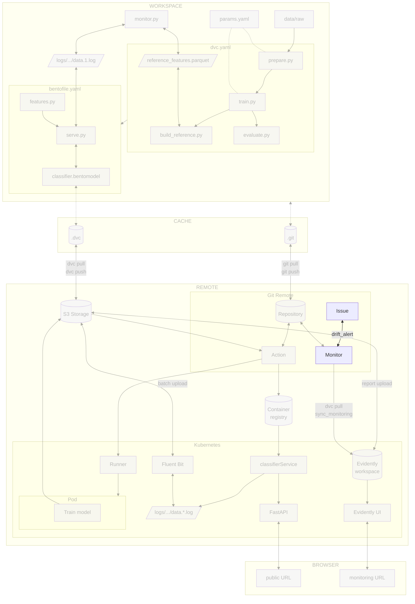

# Chapter 4.4 - Trigger drift alerts with the CI/CD workflow

## Introduction

A drift dashboard shows you when something changed, but it does not decide what
to do next. This chapter wires drift detection into the CI/CD workflow: the
monitoring job reads `monitoring/report.json`, compares each metric to the
threshold recorded by Evidently, and opens a GitHub issue when drift exceeds
that threshold. The issue gives the team a place to review the signal and decide
whether to roll back, label new data, or dismiss the alert.

In this chapter, you will learn how to:

1. Evaluate drift from the generated report
2. Open a GitHub issue from the monitoring workflow using the `gh` CLI
3. Commit the changes to Git

The following diagram illustrates the control flow at the end of this chapter:



## Steps

### Thresholds are defined in the monitoring script

Drift thresholds live in the existing `src/monitor.py`, alongside the report
configuration. Evidently writes those thresholds into `monitoring/report.json`,
and the alerting script in the next section reads them back from the report.
This keeps the dashboard's `drift_detected` flags and the CI/CD alert in sync
without a separate configuration file.

### Create `src/drift_alert.py`

The existing `src/monitor.py` and `src/sync_monitoring.py` stay unchanged. The
workflow already produces `monitoring/report.json`, so alerting can be a
separate, small step that reads the report, compares each metric value to the
threshold Evidently recorded, and opens a GitHub issue when drift exceeds that
threshold.

Create a new `src/drift_alert.py` file:

```py title="src/drift_alert.py"
import json
import os
import subprocess
from pathlib import Path

REPORT_PATH = Path(os.environ.get("REPORT_PATH", "monitoring/report.json"))
DASHBOARD_URL = os.environ.get("DASHBOARD_URL", "")
ISSUE_LABEL = "drift-alert"


def extract_alerts(report_data: dict) -> list[str]:
    """Return a list of human-readable alert lines from an Evidently report."""
    alerts: list[str] = []

    for metric in report_data.get("metrics", []):
        name = metric.get("metric_name", "")
        value = metric.get("value")
        config = metric.get("config", {})

        if "ValueDrift" in name:
            score = value if isinstance(value, (int, float)) else None
            threshold = config.get("threshold")
            if score is not None and threshold is not None and score > threshold:
                column = config.get("column", "unknown")
                alerts.append(f"{column}: {score:.4f} > {threshold:.4f}")

        elif "EmbeddingsDrift" in name:
            score = value if isinstance(value, (int, float)) else None
            threshold = config.get("drift_method", {}).get("threshold")
            if score is not None and threshold is not None and score > threshold:
                embeddings_name = config.get("embeddings_name", "embedding")
                alerts.append(f"{embeddings_name}: {score:.4f} > {threshold:.4f}")

        elif "DriftedColumnsCount" in name:
            share = value.get("share") if isinstance(value, dict) else None
            threshold = config.get("drift_share")
            if share is not None and threshold is not None and share > threshold:
                alerts.append(f"drifted columns share: {share:.4f} > {threshold:.4f}")

    return alerts


def open_drift_alert_issue_exists() -> bool:
    """Return True if an open drift-alert issue already exists."""
    result = subprocess.run(
        [
            "gh",
            "issue",
            "list",
            "--label",
            ISSUE_LABEL,
            "--state",
            "open",
            "--json",
            "number",
        ],
        capture_output=True,
        text=True,
        check=True,
    )
    return bool(json.loads(result.stdout))


def create_issue(body: str) -> None:
    """Open a GitHub issue with the given Markdown body."""
    subprocess.run(
        [
            "gh",
            "issue",
            "create",
            "--title",
            "Drift alert detected",
            "--body",
            body,
            "--label",
            ISSUE_LABEL,
        ],
        check=True,
    )


def build_issue_body(alerts: list[str]) -> str:
    """Build the Markdown body for a drift-alert GitHub issue."""
    lines = [
        "## Drift alert",
        "",
        "The monitoring workflow detected drift in production predictions.",
        "",
    ]
    lines.extend(f"- {alert}" for alert in alerts)

    if DASHBOARD_URL:
        lines.extend(["", f"[View dashboard]({DASHBOARD_URL})"])

    lines.extend(
        [
            "",
            "### Next steps",
            "",
            "- Review this alert to decide whether to roll back, label new "
            "data, or dismiss and keep monitoring.",
        ]
    )

    return "\n".join(lines)


def main() -> None:
    report_data = json.loads(REPORT_PATH.read_text(encoding="utf-8"))
    alerts = extract_alerts(report_data)

    if not alerts:
        print("No drift alert")
        return

    if open_drift_alert_issue_exists():
        print("An open drift-alert issue already exists; skipping")
        return

    create_issue(build_issue_body(alerts))
    print("Drift alert issue created")


if __name__ == "__main__":
    main()
```

This script has one job: read the already-generated report, compare each metric
value to the threshold Evidently recorded for it, and open a GitHub issue when
drift exceeds that threshold. It does not touch the Evidently workspace or the
dashboard; it only uses the `gh` CLI to create the issue.

### Update the monitoring workflow

The monitoring workflow already pulls the reference dataset, generates the
report, and uploads the reports to the storage bucket. Update it so it can open
GitHub issues:

* Add `permissions: issues: write` to the job. The default `GITHUB_TOKEN`
  permissions are read-only in many repositories, so an explicit permission is
  required for `gh issue create` to work.
* Add a step that creates the `drift-alert` label if it does not exist yet.
  `gh issue create --label` fails when the label is missing, so the workflow
  creates it idempotently before the alert step.
* Add the existing step that runs `src/drift_alert.py`. The script uses the
  pre-installed `gh` CLI to open a GitHub issue when drift exceeds a threshold,
  and it skips creation if an open drift-alert issue already exists.

```yaml title=".github/workflows/monitor.yaml" hl_lines="13-15 48-59"
name: Monitor drift

on:
  # Run every 24 hours
  schedule:
    - cron: "0 0 * * *"
  # Allow manual runs from the Actions tab
  workflow_dispatch:

jobs:
  drift-report:
    runs-on: ubuntu-latest
    permissions:
      contents: read
      issues: write
    steps:
      - name: Checkout repository
        uses: actions/checkout@v6
      - name: Setup Python
        uses: actions/setup-python@v6
        with:
          python-version: '3.13'
          cache: pip
      - name: Install dependencies
        run: pip install -r requirements-freeze.txt
      - name: Login to Google Cloud
        uses: google-github-actions/auth@v3
        with:
          credentials_json: '${{ secrets.GOOGLE_SERVICE_ACCOUNT_KEY }}'
      - name: Pull reference dataset
        run: dvc pull data/reference_features.parquet
      - name: Run drift report
        env:
          PYTHONPATH: src  # Let sync_monitoring.py import monitor.py
          GCP_BUCKET_NAME: ${{ secrets.GCP_BUCKET_NAME }}
        run: python src/sync_monitoring.py
      - name: Upload drift reports
        run: |
          gcloud storage cp monitoring/report.html gs://${{ secrets.GCP_BUCKET_NAME }}/monitoring/report.html
          gcloud storage cp monitoring/report.json gs://${{ secrets.GCP_BUCKET_NAME }}/monitoring/report.json
      - name: Get Google Cloud's Kubernetes credentials
        uses: google-github-actions/get-gke-credentials@v3
        with:
          cluster_name: ${{ secrets.GCP_K8S_CLUSTER_NAME }}
          location: ${{ secrets.GCP_K8S_CLUSTER_ZONE }}
      - name: Restart Evidently UI
        run: kubectl rollout restart deployment/evidently-ui
      - name: Ensure drift-alert label exists
        env:
          GH_TOKEN: ${{ secrets.GITHUB_TOKEN }}
        run: |
          gh label create drift-alert \
            --color ff0000 \
            --description "Production drift alert" || true
      - name: Check drift and open alert issue
        env:
          GH_TOKEN: ${{ secrets.GITHUB_TOKEN }}
          DASHBOARD_URL: ${{ secrets.DASHBOARD_URL }}
        run: python src/drift_alert.py
```

Store the required secret in the repository settings under
**Secrets and variables > Actions**:

- `DASHBOARD_URL`: the public URL of the Evidently UI service, for example
  `http://<load-balancer-ip>`

### Check the changes

Check the changes with Git to ensure that all the necessary files are tracked:

```sh title="Execute the following command(s) in a terminal"
# Add all the files
git add .

# Check the changes
git status
```

The output should look similar to this:

```text
On branch main
Changes to be committed:
  (use "git restore --staged <file>..." to unstage)
        modified:   .github/workflows/monitor.yaml
        new file:   src/drift_alert.py
```

### Commit the changes to Git

Commit the changes:

```sh title="Execute the following command(s) in a terminal"
# Commit the changes
git commit -m "Add drift alerting to the CI/CD workflow"

# Push the changes
git push
```

### Trigger a drift scenario

Force drift by sending images from `extra-data/`, which are different from the
training data.

Find the external IP of the deployed model service:

```sh title="Execute the following command(s) in a terminal"
# Get the external IP of the model service
kubectl get service celestial-bodies-classifier-service
```

Then send the extra images to the `/predict` endpoint. Replace `<EXTERNAL-IP>`
with the value from the previous command:

```sh title="Execute the following command(s) in a terminal"
# Send new images to the deployed model
for img in extra-data/extra_data/*.jpg; do
    curl -X POST -F "image=@$img" http://<EXTERNAL-IP>:80/predict
done
```

Wait for the Fluent Bit sidecar to upload the new logs to the storage bucket.
This can take up to 15 minutes, depending on the batch size and upload timeout
configured in the previous chapter.

### Run the monitoring workflow

The monitoring workflow runs on its daily schedule, but you can trigger it
manually to avoid waiting. Open the **Actions** tab, select the
**Monitor drift** workflow, and click **Run workflow**.

The workflow pulls the reference dataset, downloads the latest logs, generates
the drift report, uploads the reports to the storage bucket, and runs
`src/drift_alert.py` to open a GitHub issue if any metric exceeds its threshold.

### Check the alert issue

After the workflow finishes, go to the **Issues** section of your GitHub
repository. A new drift-alert issue should appear at the top of the list. Select
it to open the issue, review the drift scores, and click the dashboard link.

As this alert was only a test, close it so the next real alert is not
suppressed.

## Summary

In this chapter, you have successfully:

1. Reused the drift thresholds defined in the existing `src/monitor.py`
2. Created a standalone script that checks the generated drift report against
   the thresholds recorded in it
3. Opened a GitHub issue from the GitHub Actions monitoring workflow when drift
   exceeds a threshold
4. Committed the changes to Git
5. Triggered a drift alert by sending drift-inducing traffic and running the
   monitoring workflow
6. Verified the alert by reviewing the GitHub issue created by the workflow

You fixed some of the previous issues:

- [x] Drift signals trigger actionable alerts

!!! abstract "Take away"

    - **Automated reactions to drift without review are risky**: a human decision
      point keeps costs and quality under control. The monitoring workflow opens an
      issue; a maintainer decides what to do in the next chapter.
    - **GitHub issues are a good alerting medium for data-science teams**: they
      preserve context, support discussion, and do not imply a code change like a pull
      request does.
    - **The CI/CD workflow is a natural place for alerting**: it already has the
      report, the reference dataset, and the cloud credentials. Adding an alert step
      reuses that infrastructure instead of running a separate Kubernetes CronJob.
    - **Alert thresholds should match the dashboard thresholds**: by reading the
      thresholds back from `monitoring/report.json`, the CI/CD alert uses the same
      values Evidently used to compute `drift_detected`, so there is no separate
      configuration file to keep in sync.
    - **Avoid alert floods by querying existing issues**: checking for open
      drift-alert issues is more reliable than a local cooldown file inside an
      ephemeral runner.
    - **Use the `gh` CLI for GitHub operations inside Actions**: it removes the
      need for a GitHub API client library and keeps the workflow readable.

## State of the MLOps process

- [x] Model predictions can be monitored in production
- [x] Data drift and concept drift are monitored
- [x] Automated reports and dashboard are configured
- [x] Drift signals trigger actionable alerts
- [ ] Drift alerts do not lead to a reviewed decision

Continue to the next chapters to address the remaining items.

## Sources

Highly inspired by:

- [_Evidently AI Documentation_](https://docs.evidentlyai.com/)
- [_GitHub CLI: gh issue_](https://cli.github.com/manual/gh_issue)
- [_Authenticating with the GITHUB_TOKEN_](https://docs.github.com/en/actions/tutorials/authenticate-with-github_token)
