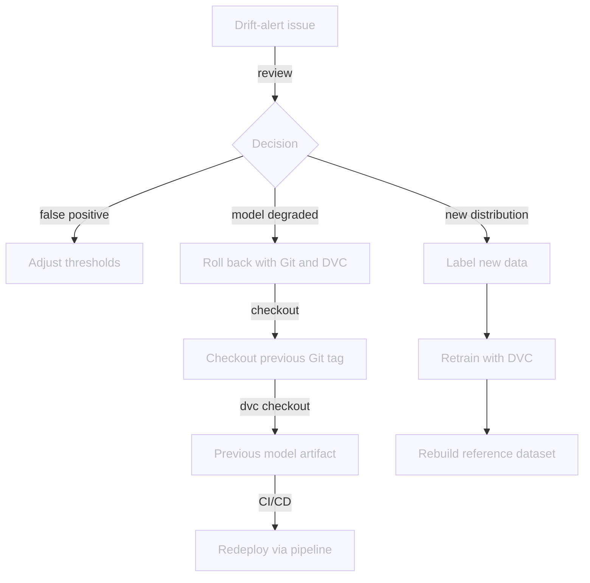

# Chapter 4.5 - Review drift alerts and decide on action

## Introduction

Now that the drift alert system is in place, the monitoring workflow opens a
GitHub issue whenever drift exceeds the thresholds defined in `src/monitor.py`.
The issue records the drift score, links to the Evidently dashboard, and lists
the next steps. It flags that something changed but the team still has to decide
what to do about it.

This chapter shows how to review that issue and choose one of three actions:

1. **Dismiss and tune the thresholds** when the alert is a false positive or the
   thresholds are too sensitive.
2. **Roll back** to the last known-good model when the deployed model degrades
   in production.
3. **Label new data and retrain** when the drift reflects a real new
   distribution that the model must learn.

Because the drift thresholds live in `src/monitor.py` and the model, data, and
deployment configuration are all versioned with Git and DVC, every decision from
a threshold tweak to a full rollback or retrain is a reproducible operational
procedure rather than an ad-hoc fix.

In this chapter, you will learn how to:

1. Open and read the drift-alert issue created by the monitoring workflow
2. Decide whether to tune thresholds, roll back, or label new data and retrain
3. Adjust drift thresholds quickly in `src/monitor.py`
4. Roll back the Kubernetes deployment and restore the canonical source of truth
5. Verify the chosen action and close the issue

The following diagram illustrates the decision flow at the end of this chapter:



## Steps

### Open the drift-alert issue

The monitoring workflow labels every drift alert with `drift-alert`. Open your
repository in the GitHub interface, go to the **Issues** tab, and filter by the
`drift-alert` label to find the open alert.

Click the issue to open it. The issue body contains:

* The metrics that crossed their thresholds, for example
  `image_mean: 0.2341 > 0.1500`.
* A link to the public Evidently dashboard, if `DASHBOARD_URL` was configured.
* A **Next steps** reminder to roll back, label new data, or dismiss the alert.

If this was a test alert or the drift has already been handled, click the
**Close issue** button so the next real alert is not suppressed.

### Review the evidence

The issue links to the Evidently dashboard and to `monitoring/report.json`. You
already inspected both in the previous chapter, so use that review to decide
which branch of the decision tree applies:

* **Noise or expected variation**: tune the thresholds.
* **Real degradation of the deployed model**: roll back.
* **A new but valid distribution**: label new data and retrain (the workflow is
  covered in Part 5).

### Option 1: Dismiss and tune the thresholds

When the alert is a false positive or the thresholds are too tight, adjust the
constants at the top of `src/monitor.py`:

```py title="src/monitor.py"
# Drift detection thresholds and methods.
DRIFT_SHARE_THRESHOLD = 0.5
NUM_DRIFT_METHOD = "wasserstein"
NUM_DRIFT_THRESHOLD = 0.3
CAT_DRIFT_METHOD = "jensenshannon"
CAT_DRIFT_THRESHOLD = 0.1
EMBEDDING_DRIFT_THRESHOLD = 0.7
```

Adjust the drift threshold values, then commit the change and close the issue:

```sh title="Execute the following command(s) in a terminal"
# Commit the adjusted thresholds
git add src/monitor.py
git commit -m "Adjust drift thresholds after reviewing extra-data alert"
git push
```

The next scheduled monitoring workflow (or manual trigger) will use the new
thresholds and only open a new issue if drift still exceeds them.

### Option 2: Roll back the deployment

If the deployed model is clearly worse than the previous version, roll back.
There are two rollback paths:

* **Fast rollback with Kubernetes** — revert the running deployment immediately.
  Use this first to stop the incident, but remember that it does not change Git or
  DVC.
* **Canonical rollback with Git and DVC** — restore the exact code, model
  artifact, and data that produced the previous version on `main`. Use this to
  make the source of truth consistent and let the CI/CD pipeline redeploy cleanly.

#### Find the previous known-good version

The CI/CD pipeline pushes a Docker image for every commit to `main`. Each image
is tagged with the Git commit SHA, so the registry is a history of deployed
model versions.

List the available image tags in the container registry:

```sh title="Execute the following command(s) in a terminal"
# List available tags for the classifier image
gcloud artifacts docker images list \
  $GCP_CONTAINER_REGISTRY_HOST/celestial-bodies-classifier \
  --include-tags \
  --format='table(TAG)'
```

The output looks similar to this:

```text
TAG
latest
a1b2c3d4e5f6789012345678901234567890abcd
b2c3d4e5f6789012345678901234567890abcdef
c3d4e5f6789012345678901234567890abcdef01
```

The `latest` tag always points to the most recent build. The long hexadecimal
strings are Git commit SHAs. Pick the SHA just before the bad deployment; that
is your rollback target.

You can also find the same SHA in Git:

```sh title="Execute the following command(s) in a terminal"
# Show recent commits on main
git log --oneline -10 main
```

If your team creates Git tags for releases, use those instead. A tag such as
`model-v1.2.2` is easier to communicate than a commit SHA:

```sh title="Execute the following command(s) in a terminal"
# List release tags
git tag --sort=-creatordate | head -10
```

Set the rollback target once so the following commands can reuse it:

```sh title="Execute the following command(s) in a terminal"
# Replace with the SHA you picked above
export PREVIOUS_SHA=a1b2c3d4e5f6789012345678901234567890abcd
```

#### Fast rollback with Kubernetes

If the previous pod revision is still available in Kubernetes,
`kubectl rollout undo` is the fastest operational shortcut. It reverts the
deployment to the previous ReplicaSet, which usually points to the image just
before the last update.

```sh title="Execute the following command(s) in a terminal"
# Roll back the deployment one revision
kubectl rollout undo deployment/celestial-bodies-classifier-deployment

# Verify the rollback
kubectl rollout status deployment/celestial-bodies-classifier-deployment
```

Check the rollout history to see which revision is active:

```sh title="Execute the following command(s) in a terminal"
kubectl rollout history deployment/celestial-bodies-classifier-deployment
```

This is the fastest way to recover, but it does not change Git or DVC. Use it
for immediate incident response, then follow with the Git/DVC rollback below to
keep the source of truth consistent.

If the previous ReplicaSet is no longer available, you can still redeploy a
specific image from the registry with `kubectl set image`:

```sh title="Execute the following command(s) in a terminal"
kubectl set image deployment/celestial-bodies-classifier-deployment \
  celestial-bodies-classifier=$GCP_CONTAINER_REGISTRY_HOST/celestial-bodies-classifier:$PREVIOUS_SHA

kubectl rollout status deployment/celestial-bodies-classifier-deployment
```

#### Canonical rollback with Git and DVC

The canonical rollback restores the exact code, model artifact, and data that
produced the previous version. It is slower than the Kubernetes rollback, but it
keeps the repository consistent and lets the CI/CD pipeline redeploy cleanly.

Using the same commit SHA as the previous step:

```sh title="Execute the following command(s) in a terminal"
# Checkout the previous known-good version
git checkout $PREVIOUS_SHA

# Restore the exact model artifact and data from DVC
dvc checkout
```

At this point your workspace contains the old model and data. You now have two
options to put that state back on `main`:

**Option A: revert commit (safest)**

Create a new commit on `main` that reverts the bad commits since the last
known-good version. This preserves history and works well when the problematic
change is contained in a small number of recent commits.

```sh title="Execute the following command(s) in a terminal"
git checkout main
git revert --no-commit $PREVIOUS_SHA..
git commit -m "Rollback to $PREVIOUS_SHA"
git push origin main
```

**Option B: reset main to the known-good commit**

Use this only if the bad deployment has not been pulled by other team members
and you are comfortable rewriting public history.

```sh title="Execute the following command(s) in a terminal"
git checkout main
git reset --hard $PREVIOUS_SHA
git push --force-with-lease origin main
```

After the push, the CI/CD pipeline will build and deploy the rolled-back version
automatically, bringing the container registry back into sync with Git.

After the rollback succeeds, close the drift-alert issue from the GitHub
interface and add a comment that records the action taken, for example "Rolled
back deployment to `$PREVIOUS_SHA`."

### Option 3: Label new data and retrain

Rolling back is the wrong choice when the drift reflects a real new distribution
that the previous model never saw. In that case the model needs to learn from
the new data.

The full labeling and retraining workflow is covered in Part 5. Close the
drift-alert issue once you have decided to send the new samples there.

### Verify the chosen action

Each decision has its own verification step.

The next scheduled monitoring workflow (or manual trigger) will use the new
thresholds and only open a new issue if drift still exceeds them.

For a **threshold tune**, wait for the next scheduled monitoring workflow or
trigger the workflow manually to confirm the alert no longer triggers.

For a **rollback**, confirm that the previous model is serving again by checking
the running image and sending a test prediction.

Check the deployed image:

```sh title="Execute the following command(s) in a terminal"
kubectl get deployment celestial-bodies-classifier-deployment \
  -o jsonpath='{.spec.template.spec.containers[0].image}'
```

The output should contain the rollback SHA, for example:

```text
europe-west6-docker.pkg.dev/mlops-surname-project/mlops-surname-registry/celestial-bodies-classifier:a1b2c3d4e5f6789012345678901234567890abcd
```

Find the external IP of the model service:

```sh title="Execute the following command(s) in a terminal"
# Get the external IP of the model service
kubectl get service celestial-bodies-classifier-service
```

Then send a test image to the `/predict` endpoint. Replace `<EXTERNAL-IP>` with
the value from the previous command:

```sh title="Execute the following command(s) in a terminal"
# Send a test image to the deployed model
curl -X POST -F "image=@data/raw/Mercury/Mercury_1.jpg" http://<EXTERNAL-IP>:80/predict
```

If the prediction distribution and confidence look like they did before the bad
deployment, the rollback succeeded.

For a **retrain**, verify the outcome once the Part 5 workflow is complete.

### Commit the changes

This chapter does not require manual code edits, but the rollback commands above
do change the Git history on `main`. If you chose to adjust drift thresholds
after reviewing the alert, update `src/monitor.py` and commit those changes
separately. If you sent new data to Part 5, the commits will come from that
workflow. In all cases, close the drift-alert issue from the GitHub interface
once the action is verified.

## Summary

In this chapter, you have successfully:

1. Opened and reviewed the drift-alert issue created by the monitoring workflow
2. Chose between tuning thresholds, rolling back, or labeling new data and
   retraining
3. Adjusted drift thresholds in `src/monitor.py`
4. Rolled back the Kubernetes deployment and restored the canonical source of
   truth with Git and DVC
5. Verified the chosen action and closed the issue

You fixed some of the previous issues:

- [x] Drift alerts lead to a reviewed decision

All the items of the MLOps process for this part are now addressed.

!!! abstract "Take away"

    - **A drift alert is a review ticket, not an automatic action**: the issue
      preserves the exact scores and a dashboard link so a human can decide what to do
      next.
    - **False positives are fixed by tuning thresholds**: `src/monitor.py` keeps
      thresholds, methods, and report generation in one place, so a threshold change
      propagates to both the dashboard and the CI/CD alert.
    - **Rollback is only possible because every artifact is versioned**: Git
      tracks the code, DVC tracks the model and data, and the container registry
      tracks every deployable image.
    - **Kubernetes rollout undo is the fastest operational shortcut**: use it
      first to stop an incident, then follow with the canonical Git/DVC rollback to
      keep the source of truth consistent.
    - **The Git/DVC rollback is the canonical recovery**: it restores the source
      of truth and lets the CI/CD pipeline redeploy the old version cleanly.
    - **Real new distributions need retraining, not rollback**: Part 5 covers
      the labeling workflow.
    - **Close the issue when the decision is executed**: the alerting script
      skips creation while an open drift-alert issue exists, so a stale issue blocks
      future alerts.

## State of the MLOps process

- [x] Model predictions can be monitored in production
- [x] Data drift and concept drift are monitored
- [x] Automated reports and dashboard are configured
- [x] Drift signals trigger actionable alerts
- [x] Drift alerts lead to a reviewed decision

Continue to the conclusion to review what you have learned.

## Sources

- [_Git Tags_ - git-scm.com](https://git-scm.com/book/en/v2/Git-Basics-Tagging)
- [_DVC Checkout_ - dvc.org](https://dvc.org/doc/command-reference/checkout)
- [_Kubernetes Rollout Undo_ - kubernetes.io](https://kubernetes.io/docs/concepts/workloads/controllers/deployment/#rolling-back-a-deployment)
- [_Artifact Registry: List images_ - cloud.google.com](https://cloud.google.com/artifact-registry/docs/docker/store-docker-container-images)
- [_GitHub CLI: gh issue_](https://cli.github.com/manual/gh_issue)
