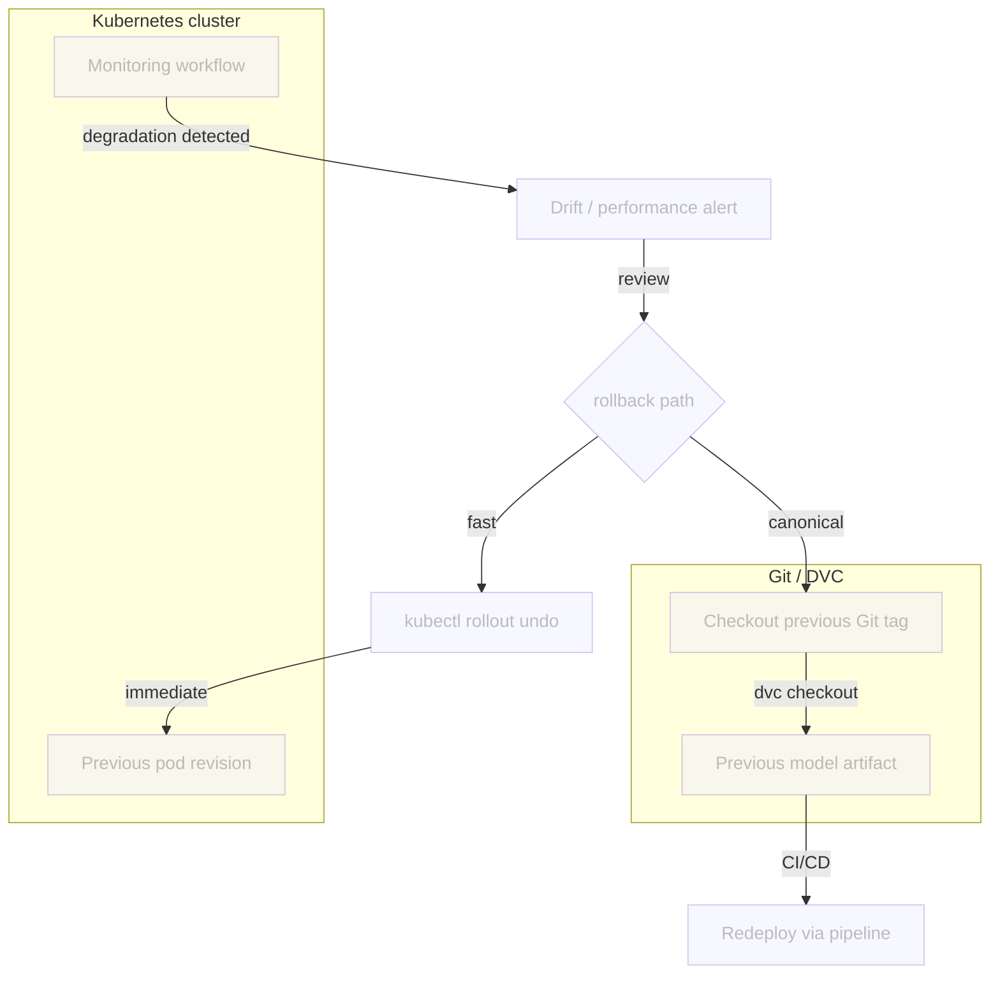

# Chapter 4.5 - Review drift alerts and decide on action

## Introduction

Retraining is not always the right answer. When a newly deployed model degrades
in production, the fastest and safest recovery is often to roll back to the last
known-good version. Because the model, data, and deployment configuration are
all versioned with Git and DVC, rollback becomes a reproducible operational
procedure rather than a scramble.

In this chapter you will learn two complementary rollback paths: a fast
Kubernetes rollback that quickly restores the previous deployment, and a
canonical Git/DVC rollback that redeploys an earlier model version through the
CI/CD pipeline.

In this chapter, you will learn how to:

1. Identify a degraded model from monitoring signals
2. Find the previous known-good Git tag or commit
3. Roll back the Kubernetes deployment with `kubectl rollout undo`
4. Roll back the model version with Git and DVC
5. Verify that the previous model is serving again

The following diagram illustrates the control flow at the end of this chapter:



## Steps

### Identify degradation

A rollback is triggered when the production model is clearly worse than the
previous version. Useful signals include:

* The drift score exceeds a threshold.
* The prediction distribution collapses to a single class.
* A held-out production sample shows a large accuracy drop.

When the monitoring workflow opens a drift-alert issue, review the Evidently
dashboard and the JSON report. If the drift looks real and impactful, proceed
with a rollback.

### Find the previous known-good version

The CI/CD pipeline from Chapter 3.6 pushes a Docker image for every commit to
`main`. Each image is tagged with the Git commit SHA, so the registry is a
history of deployed model versions.

List the available image tags in the container registry:

```sh title="Execute the following command(s) in a terminal"
# List available tags for the classifier image
gcloud artifacts docker images list \
  $GCP_CONTAINER_REGISTRY_HOST/celestial-bodies-classifier \
  --include-tags \
  --format='table(TAG)'
```

The output looks similar to this:

```text
TAG
latest
a1b2c3d4e5f6789012345678901234567890abcd
b2c3d4e5f6789012345678901234567890abcdef
c3d4e5f6789012345678901234567890abcdef01
```

The `latest` tag always points to the most recent build. The long hexadecimal
strings are Git commit SHAs. Pick the SHA just before the bad deployment; that
is your rollback target.

You can also find the same SHA in Git:

```sh title="Execute the following command(s) in a terminal"
# Show recent commits on main
git log --oneline -10 main
```

If your team creates Git tags for releases, use those instead. A tag such as
`model-v1.2.2` is easier to communicate than a commit SHA:

```sh title="Execute the following command(s) in a terminal"
# List release tags
git tag --sort=-creatordate | head -10
```

### Fast rollback with Kubernetes

If the previous pod revision is still available in Kubernetes,
`kubectl rollout undo` is the fastest operational shortcut. It reverts the
deployment to the previous ReplicaSet, which usually points to the image just
before the last update.

```sh title="Execute the following command(s) in a terminal"
# Roll back the deployment one revision
kubectl rollout undo deployment/celestial-bodies-classifier-deployment

# Verify the rollback
kubectl rollout status deployment/celestial-bodies-classifier-deployment
```

Check the rollout history to see which revision is active:

```sh title="Execute the following command(s) in a terminal"
kubectl rollout history deployment/celestial-bodies-classifier-deployment
```

This is the fastest way to recover, but it does not change Git or DVC. Use it
for immediate incident response, then follow with the Git/DVC rollback below to
keep the source of truth consistent.

If the previous ReplicaSet is no longer available, you can still redeploy a
specific image from the registry with `kubectl set image`:

```sh title="Execute the following command(s) in a terminal"
export PREVIOUS_SHA=a1b2c3d4e5f6789012345678901234567890abcd

kubectl set image deployment/celestial-bodies-classifier-deployment \
  celestial-bodies-classifier=$GCP_CONTAINER_REGISTRY_HOST/celestial-bodies-classifier:$PREVIOUS_SHA

kubectl rollout status deployment/celestial-bodies-classifier-deployment
```

### Roll back with Git and DVC

The canonical rollback restores the exact code, model artifact, and data that
produced the previous version. It is slower than the Kubernetes rollback, but it
keeps the repository consistent and lets the CI/CD pipeline redeploy cleanly.

Using the same commit SHA as the previous step:

```sh title="Execute the following command(s) in a terminal"
export PREVIOUS_SHA=a1b2c3d4e5f6789012345678901234567890abcd

# Checkout the previous known-good version
git checkout $PREVIOUS_SHA

# Restore the exact model artifact and data from DVC
dvc checkout
```

At this point your workspace contains the old model and data. You now have two
options to put that state back on `main`:

**Option A: revert commit (safest)**

Create a new commit on `main` that undoes the bad deployment. This preserves
history and works well when the bad change is a single commit.

```sh title="Execute the following command(s) in a terminal"
git checkout main
git revert --no-commit $PREVIOUS_SHA..
git commit -m "Rollback to $PREVIOUS_SHA"
git push origin main
```

**Option B: reset main to the known-good commit**

Use this only if the bad deployment has not been pulled by other team members
and you are comfortable rewriting public history.

```sh title="Execute the following command(s) in a terminal"
git checkout main
git reset --hard $PREVIOUS_SHA
git push --force-with-lease origin main
```

After the push, the CI/CD pipeline from Chapter 3.6 will build and deploy the
rolled-back version automatically, bringing the container registry back into
sync with Git.

### Verify the rollback

Confirm that the previous model is serving again by checking the running image
and sending a test prediction.

Check the deployed image:

```sh title="Execute the following command(s) in a terminal"
kubectl get deployment celestial-bodies-classifier-deployment \
  -o jsonpath='{.spec.template.spec.containers[0].image}'
```

The output should contain the rollback SHA, for example:

```text
europe-west6-docker.pkg.dev/mlops-surname-project/mlops-surname-registry/celestial-bodies-classifier:a1b2c3d4e5f6789012345678901234567890abcd
```

Send a test prediction and inspect the response:

```sh title="Execute the following command(s) in a terminal"
export SERVICE_IP=$(kubectl get service celestial-bodies-classifier-service \
  -o jsonpath='{.status.loadBalancer.ingress[0].ip}')

curl -X POST -F "image=@data/raw/Mercury/0001.jpg" http://$SERVICE_IP/predict
```

If the prediction distribution and confidence look like they did before the bad
deployment, the rollback succeeded.

### Commit the changes

This chapter does not modify any files. If you chose to adjust drift thresholds
after reviewing the alert, update `src/monitor.py` from Chapter 4.2 and commit
those changes separately.

## Summary

In this chapter, you have successfully:

1. Reviewed drift alerts and decided on the action to take when the model
   degrades
2. Found the previous known-good model version in the container registry
3. Rolled back the Kubernetes deployment with `kubectl rollout undo`
4. Rolled back the canonical source of truth with Git and DVC
5. Verified that the previous model is serving again

You fixed some of the previous issues:

- [x] Drift alerts lead to a reviewed decision

All the items of the MLOps process for this part are now addressed.

!!! abstract "Take away"

    - **Rollback is only possible because every artifact is versioned**: Git tracks
      the code, DVC tracks the model and data, and the container registry tracks every
      deployable image.
    - **Kubernetes rollout undo is the fastest operational shortcut**: it reverts
      to the previous pod revision without touching the registry, but it only works if
      that revision is still in the cluster's rollout history.
    - **The Git/DVC rollback is the canonical recovery**: it restores the source of
      truth and lets the CI/CD pipeline redeploy the old version cleanly.
    - **Fast recovery and canonical recovery are complementary**: use `kubectl
      rollout undo` to stop the bleeding, then use Git/DVC to keep the system
      consistent.

## State of the MLOps process

- [x] Model predictions can be monitored in production
- [x] Data drift and concept drift are monitored
- [x] Automated reports and dashboard are configured
- [x] Drift signals trigger actionable alerts
- [x] Drift alerts lead to a reviewed decision

Continue to the conclusion to review what you have learned.

## Sources

- [_Git Tags_ - git-scm.com](https://git-scm.com/book/en/v2/Git-Basics-Tagging)
- [_DVC Checkout_ - dvc.org](https://dvc.org/doc/command-reference/checkout)
- [_Kubernetes Rollout Undo_ - kubernetes.io](https://kubernetes.io/docs/concepts/workloads/controllers/deployment/#rolling-back-a-deployment)
- [_Artifact Registry: List images_ - cloud.google.com](https://cloud.google.com/artifact-registry/docs/docker/store-docker-container-images)
