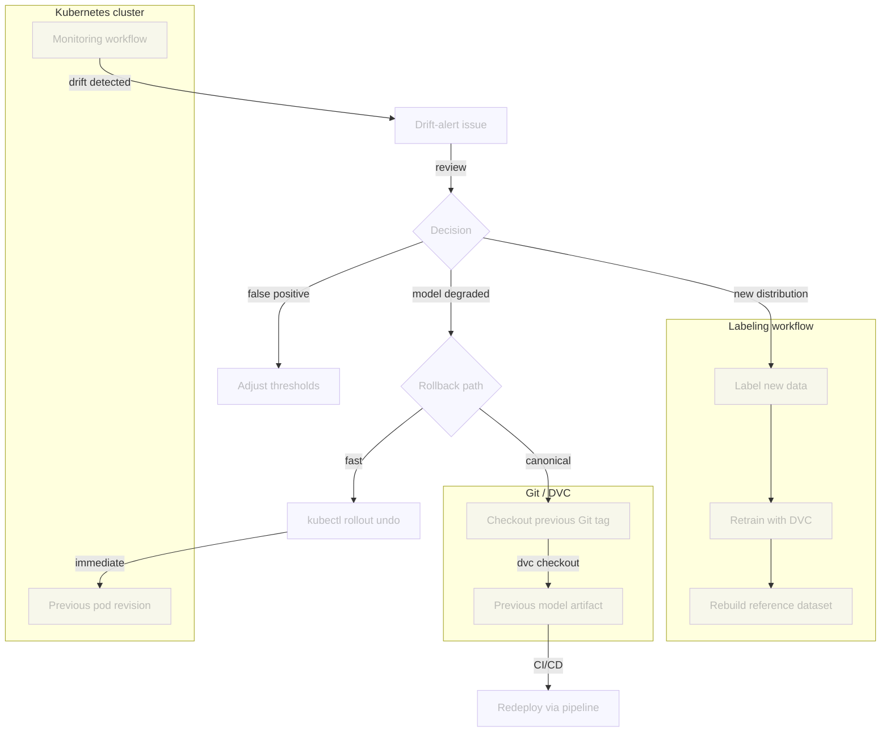

# Chapter 4.5 - Review drift alerts and decide on action

## Introduction

A drift alert is not a decision: it is a ticket that asks the team to review the
signal and decide what to do. The monitoring workflow opens a GitHub issue
whenever drift exceeds the thresholds defined in `src/monitor.py`. The issue
contains the drift scores, a link to the Evidently dashboard, and a short list
of next steps.

This chapter shows how to review that issue and choose one of three actions:

1. **Dismiss and tune the thresholds** when the alert is a false positive or the
   thresholds are too sensitive.
2. **Roll back** to the last known-good model when the deployed model degrades
   in production.
3. **Label new data and retrain** when the drift reflects a real new
   distribution that the model must learn.

Because the drift thresholds live in `src/monitor.py` and the model, data, and
deployment configuration are all versioned with Git and DVC, every decision from
a threshold tweak to a full rollback or retrain is a reproducible operational
procedure rather than an ad-hoc fix.

In this chapter, you will learn how to:

1. Open and read the drift-alert issue created by the monitoring workflow
2. Inspect the linked Evidently dashboard and JSON report
3. Decide whether to tune thresholds, roll back, or label new data and retrain
4. Adjust drift thresholds in `src/monitor.py`
5. Roll back the Kubernetes deployment quickly with `kubectl rollout undo`
6. Roll back the canonical source of truth with Git and DVC
7. Route new production data to the labeling workflow
8. Verify the chosen action and close the issue

The following diagram illustrates the decision flow at the end of this chapter:



## Steps

### Open the drift-alert issue

The monitoring workflow labels every drift alert with `drift-alert`. Open your
repository in the GitHub interface, go to the **Issues** tab, and filter by the
`drift-alert` label to find the open alert.

Click the issue to open it. The issue body contains:

* The metrics that crossed their thresholds, for example
  `image_mean: 0.2341 > 0.1500`.
* A link to the public Evidently dashboard, if `DASHBOARD_URL` was configured.
* A **Next steps** reminder to roll back, label new data, or dismiss the alert.

If this was a test alert or the drift has already been handled, click the
**Close issue** button so the next real alert is not suppressed.

### Review the evidence

Before choosing an action, inspect the dashboard and report linked in the issue.
Useful signals include:

* The drift score exceeds a threshold only on a feature that is expected to
  vary, such as `image_mean` for brighter telescope images.
* The prediction distribution collapses to a single class or shifts toward an
  entirely new class.
* A held-out production sample shows a large accuracy drop.

Download the JSON report from the storage bucket if you do not have a local
copy. Open the [Cloud Storage](https://console.cloud.google.com/storage/browser)
on the Google cloud interface and click on your bucket to access the details.
Navigate to `monitoring/report.json` and download it to
`monitoring/report.json`.

Then pretty-print the report:

```sh title="Execute the following command(s) in a terminal"
cat monitoring/report.json | python -m json.tool
```

The `metrics` array lists the same values that `src/drift_alert.py` compared to
the thresholds in `src/monitor.py`. If the scores look like noise, tune the
thresholds. If they look real and harmful, roll back. If they reflect a new but
valid distribution, prepare to label and retrain.

### Option 1: Dismiss and tune the thresholds

When the alert is a false positive or the thresholds are too tight, adjust the
constants at the top of `src/monitor.py`:

```py title="src/monitor.py"
# Drift detection thresholds and methods.
VALUE_DRIFT_THRESHOLD = 0.15
EMBEDDING_DRIFT_THRESHOLD = 0.6
NUM_DRIFT_METHOD = "wasserstein"
CAT_DRIFT_METHOD = "jensenshannon"
```

For example, if only `image_mean` drifts because of a known brightness shift,
you can raise `VALUE_DRIFT_THRESHOLD` slightly. If the embedding detector fires
on every batch, raise `EMBEDDING_DRIFT_THRESHOLD`. You can also change the
statistical method, although `wasserstein` and `jensenshannon` are good defaults
for numerical and categorical features respectively.

After editing the thresholds, regenerate the report locally to confirm the alert
no longer triggers:

```sh title="Execute the following command(s) in a terminal"
# Regenerate the drift report with the new thresholds
python src/monitor.py

# Check that src/drift_alert.py no longer finds alerts
python src/drift_alert.py
```

Commit the threshold change and close the issue from the GitHub interface:

```sh title="Execute the following command(s) in a terminal"
# Commit the adjusted thresholds
git add src/monitor.py
git commit -m "Adjust drift thresholds after reviewing extra-data alert"
git push
```

The next scheduled monitoring workflow will use the new thresholds and only open
a new issue if drift still exceeds them.

### Option 2: Roll back the deployment

If the deployed model is clearly worse than the previous version, roll back. Use
the fast Kubernetes path for immediate incident response, then follow with the
Git/DVC path to keep the source of truth consistent.

#### Find the previous known-good version

The CI/CD pipeline pushes a Docker image for every commit to `main`. Each image
is tagged with the Git commit SHA, so the registry is a history of deployed
model versions.

List the available image tags in the container registry:

```sh title="Execute the following command(s) in a terminal"
# List available tags for the classifier image
gcloud artifacts docker images list \
  $GCP_CONTAINER_REGISTRY_HOST/celestial-bodies-classifier \
  --include-tags \
  --format='table(TAG)'
```

The output looks similar to this:

```text
TAG
latest
a1b2c3d4e5f6789012345678901234567890abcd
b2c3d4e5f6789012345678901234567890abcdef
c3d4e5f6789012345678901234567890abcdef01
```

The `latest` tag always points to the most recent build. The long hexadecimal
strings are Git commit SHAs. Pick the SHA just before the bad deployment; that
is your rollback target.

You can also find the same SHA in Git:

```sh title="Execute the following command(s) in a terminal"
# Show recent commits on main
git log --oneline -10 main
```

If your team creates Git tags for releases, use those instead. A tag such as
`model-v1.2.2` is easier to communicate than a commit SHA:

```sh title="Execute the following command(s) in a terminal"
# List release tags
git tag --sort=-creatordate | head -10
```

#### Fast rollback with Kubernetes

If the previous pod revision is still available in Kubernetes,
`kubectl rollout undo` is the fastest operational shortcut. It reverts the
deployment to the previous ReplicaSet, which usually points to the image just
before the last update.

```sh title="Execute the following command(s) in a terminal"
# Roll back the deployment one revision
kubectl rollout undo deployment/celestial-bodies-classifier-deployment

# Verify the rollback
kubectl rollout status deployment/celestial-bodies-classifier-deployment
```

Check the rollout history to see which revision is active:

```sh title="Execute the following command(s) in a terminal"
kubectl rollout history deployment/celestial-bodies-classifier-deployment
```

This is the fastest way to recover, but it does not change Git or DVC. Use it
for immediate incident response, then follow with the Git/DVC rollback below to
keep the source of truth consistent.

If the previous ReplicaSet is no longer available, you can still redeploy a
specific image from the registry with `kubectl set image`:

```sh title="Execute the following command(s) in a terminal"
export PREVIOUS_SHA=a1b2c3d4e5f6789012345678901234567890abcd

kubectl set image deployment/celestial-bodies-classifier-deployment \
  celestial-bodies-classifier=$GCP_CONTAINER_REGISTRY_HOST/celestial-bodies-classifier:$PREVIOUS_SHA

kubectl rollout status deployment/celestial-bodies-classifier-deployment
```

#### Roll back with Git and DVC

The canonical rollback restores the exact code, model artifact, and data that
produced the previous version. It is slower than the Kubernetes rollback, but it
keeps the repository consistent and lets the CI/CD pipeline redeploy cleanly.

Using the same commit SHA as the previous step:

```sh title="Execute the following command(s) in a terminal"
export PREVIOUS_SHA=a1b2c3d4e5f6789012345678901234567890abcd

# Checkout the previous known-good version
git checkout $PREVIOUS_SHA

# Restore the exact model artifact and data from DVC
dvc checkout
```

At this point your workspace contains the old model and data. You now have two
options to put that state back on `main`:

**Option A: revert commit (safest)**

Create a new commit on `main` that reverts the bad commits since the last
known-good version. This preserves history and works well when the problematic
change is contained in a small number of recent commits.

```sh title="Execute the following command(s) in a terminal"
git checkout main
git revert --no-commit $PREVIOUS_SHA..
git commit -m "Rollback to $PREVIOUS_SHA"
git push origin main
```

**Option B: reset main to the known-good commit**

Use this only if the bad deployment has not been pulled by other team members
and you are comfortable rewriting public history.

```sh title="Execute the following command(s) in a terminal"
git checkout main
git reset --hard $PREVIOUS_SHA
git push --force-with-lease origin main
```

After the push, the CI/CD pipeline will build and deploy the rolled-back version
automatically, bringing the container registry back into sync with Git.

After the rollback succeeds, close the drift-alert issue from the GitHub
interface and add a comment that records the action taken, for example "Rolled
back deployment to `$PREVIOUS_SHA`."

### Option 3: Label new data and retrain

Rolling back is the wrong choice when the drift reflects a real new distribution
that the previous model never saw. In that case the model needs to learn from
the new data.

Follow the labeling and retraining workflow:

1. Collect the production images or logs that drifted. The BentoML monitoring
   logs in `logs/celestial_bodies_classifier/data/` and the storage bucket copy are
   the natural source.
2. Import the new samples into Label Studio and label them.
3. Export the labels, add the new images to `data/raw/<class>/`, and run the DVC
   pipeline again. The `build_reference` stage will rebuild the reference dataset
   automatically, so the new model is compared against its own training
   distribution.
4. Verify that the new evaluation metrics and drift report improve, then close
   the drift-alert issue from the GitHub interface.

```sh title="Execute the following command(s) in a terminal"
# After labeling and adding the new data, retrain and rebuild the reference
dvc repro

# Commit the new data version and the updated DVC lock file
git add data dvc.lock
git commit -m "Add labeled production data and retrain model"
git push
```

### Verify the chosen action

Each decision has its own verification step.

For a **threshold tune**, confirm that the next monitoring run does not open a
new drift-alert issue:

```sh title="Execute the following command(s) in a terminal"
# Run the monitoring workflow locally to verify the new thresholds
python src/monitor.py
python src/drift_alert.py
```

For a **rollback**, confirm that the previous model is serving again by checking
the running image and sending a test prediction.

Check the deployed image:

```sh title="Execute the following command(s) in a terminal"
kubectl get deployment celestial-bodies-classifier-deployment \
  -o jsonpath='{.spec.template.spec.containers[0].image}'
```

The output should contain the rollback SHA, for example:

```text
europe-west6-docker.pkg.dev/mlops-surname-project/mlops-surname-registry/celestial-bodies-classifier:a1b2c3d4e5f6789012345678901234567890abcd
```

Send a test prediction and inspect the response:

```sh title="Execute the following command(s) in a terminal"
export SERVICE_IP=$(kubectl get service celestial-bodies-classifier-service \
  -o jsonpath='{.status.loadBalancer.ingress[0].ip}')

curl -X POST -F "image=@data/raw/Mercury/0001.jpg" http://$SERVICE_IP/predict
```

If the prediction distribution and confidence look like they did before the bad
deployment, the rollback succeeded.

For a **retrain**, verify the new evaluation metrics and the fresh drift report:

```sh title="Execute the following command(s) in a terminal"
# Inspect the new evaluation metrics
cat evaluation/metrics.json

# Generate and inspect the drift report against the new reference
python src/monitor.py
cat monitoring/report.json | python -m json.tool
```

### Commit the changes

This chapter does not require manual code edits, but the rollback commands above
do change the Git history on `main`. If you chose to adjust drift thresholds
after reviewing the alert, update `src/monitor.py` and commit those changes
separately. If you labeled new data and retrained, the `dvc repro` output is the
commit. In all cases, close the drift-alert issue from the GitHub interface once
the action is verified.

## Summary

In this chapter, you have successfully:

1. Opened and reviewed the drift-alert issue created by the monitoring workflow
2. Inspected the linked Evidently dashboard and JSON report
3. Chose between tuning thresholds, rolling back, or labeling new data and
   retraining
4. Adjusted drift thresholds in `src/monitor.py`
5. Rolled back the Kubernetes deployment with `kubectl rollout undo`
6. Rolled back the canonical source of truth with Git and DVC
7. Routed new production data to the labeling and retraining workflow
8. Verified the chosen action and closed the issue

You fixed some of the previous issues:

- [x] Drift alerts lead to a reviewed decision

All the items of the MLOps process for this part are now addressed.

!!! abstract "Take away"

    - **A drift alert is a review ticket, not an automatic action**: the issue
      preserves the exact scores and a dashboard link so a human can decide what to do
      next.
    - **False positives are fixed by tuning thresholds**: `src/monitor.py` keeps
      thresholds, methods, and report generation in one place, so a threshold change
      propagates to both the dashboard and the CI/CD alert.
    - **Rollback is only possible because every artifact is versioned**: Git
      tracks the code, DVC tracks the model and data, and the container registry
      tracks every deployable image.
    - **Kubernetes rollout undo is the fastest operational shortcut**: it
      reverts to the previous pod revision without touching the registry, but it only
      works if that revision is still in the cluster's rollout history.
    - **The Git/DVC rollback is the canonical recovery**: it restores the source
      of truth and lets the CI/CD pipeline redeploy the old version cleanly.
    - **Real new distributions need retraining, not rollback**: when drift is a
      signal of legitimate new data, the right action is to label it and retrain the
      model with the new data.
    - **Close the issue when the decision is executed**: the alerting script
      skips creation while an open drift-alert issue exists, so a stale issue blocks
      future alerts.

## State of the MLOps process

- [x] Model predictions can be monitored in production
- [x] Data drift and concept drift are monitored
- [x] Automated reports and dashboard are configured
- [x] Drift signals trigger actionable alerts
- [x] Drift alerts lead to a reviewed decision

Continue to the conclusion to review what you have learned.

## Sources

- [_Git Tags_ - git-scm.com](https://git-scm.com/book/en/v2/Git-Basics-Tagging)
- [_DVC Checkout_ - dvc.org](https://dvc.org/doc/command-reference/checkout)
- [_Kubernetes Rollout Undo_ - kubernetes.io](https://kubernetes.io/docs/concepts/workloads/controllers/deployment/#rolling-back-a-deployment)
- [_Artifact Registry: List images_ - cloud.google.com](https://cloud.google.com/artifact-registry/docs/docker/store-docker-container-images)
- [_GitHub CLI: gh issue_](https://cli.github.com/manual/gh_issue)
