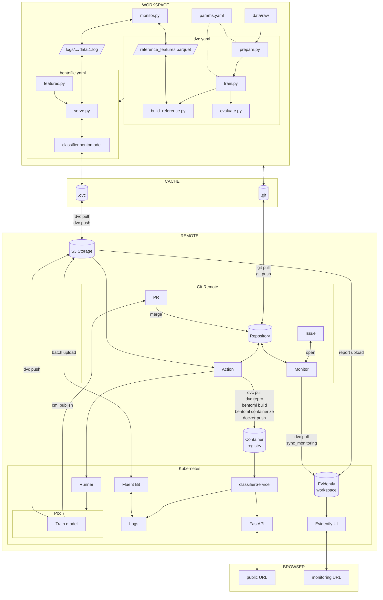

# Conclusion

Congratulations! You did it!

In this fourth part, you made the model observable in production. Predictions
and features are logged by the BentoML service and shipped to your storage
bucket by Fluent Bit, drift is detected by comparing these production logs
against a reference dataset with Evidently AI, and a dashboard is accessible on
Kubernetes. A GitHub Actions workflow refreshes the drift report from production
logs and raises alerts.

The monitoring feedback loop is now closed: production predictions are compared
to the training distribution, abnormal behavior is surfaced to the team, and you
can decide what action to take.

The following diagram illustrates the bricks you set up at the end of this part:



Part 5 is an improvement of the MLOps process. You will learn how to label new
data and retrain the model using Label Studio.

## Next steps

**Ready to continue?**

Proceed to
[Part 5 - Label data and retrain](../part-5-label-data-and-retrain/introduction.md)
to learn how to systematically label new data and continuously improve your
model.

**Stopping here?**

If you decide to conclude your progress at this point, see the
[Clean up guide](../clean-up.md) for instructions on removing the resources you
created:

- Local Git repository and DVC cache
- Python virtual environment
- Cloud storage bucket (S3/GCS)
- Container registry and Docker images
- Kubernetes cluster and deployments
- CI/CD pipeline configurations
- Self-hosted runners (if configured)

### Destroy the Kubernetes cluster

When you are done with this part, you can destroy the Kubernetes cluster.

```sh title="Execute the following command(s) in a terminal"
# Destroy the Kubernetes cluster
gcloud container clusters delete --zone $GCP_K8S_CLUSTER_ZONE $GCP_K8S_CLUSTER_NAME
```

!!! tip

    If you need to quickly recreate the cluster after destroying it, here are the
    steps involved:

    * Create the Kubernetes cluster.
    * Deploy the containerized model on Kubernetes.
    * Identify the specialized node.
    * Label the nodes.
    * Create the Kubernetes secret for the base runner registration.
    * Deploy the base runner.
    * Retrieve the Kubernetes cluster credentials.
    * Update the Kubernetes `GCP_K8S_KUBECONFIG` CI/CD secret.

    Refer to the previous chapters for the specific commands. Additionally, ensure
    that all necessary environment variables are correctly defined.

This is necessary to return to a clean state on your computer, avoid unnecessary
incurring costs, and address potential security concerns when using cloud
services.

!!! note

    Part 5 (data labeling) works entirely locally and doesn't require cloud
    infrastructure. If you're continuing to Part 5, you can
    **Clean up cloud resources** (delete your Kubernetes cluster, container
    registry, and cloud storage) to avoid costs but keep your local resources (local
    Git repository, DVC cache, and data files) as they are needed for the next
    section.

    You can safely skip cleanup if you plan to continue with the next part
    immediately, but we strongly recommend stopping the **Kubernetes cluster** to
    avoid unnecessary costs.
