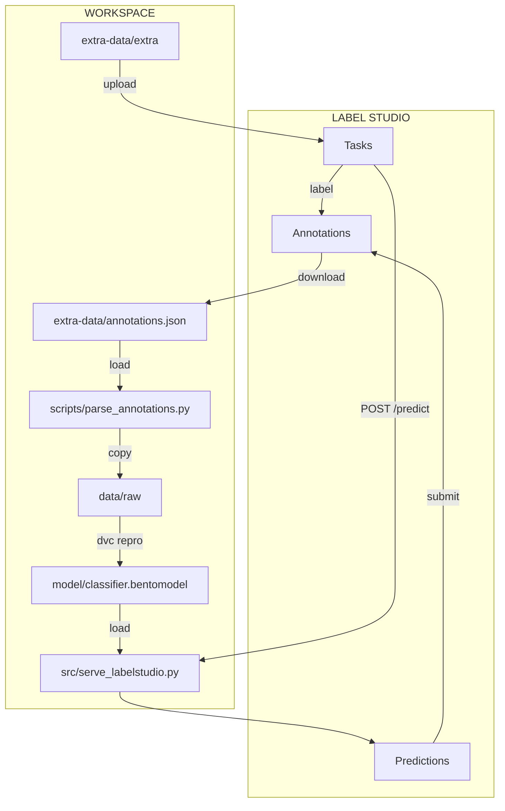

# Conclusion

Congratulations! You have successfully completed the fifth part of the guide. In
this part, you learned how to annotate the data in Label Studio with AI-assisted
labeling. You finally retrained the model using the newly labeled data.

As you work with your data and model, you may find that certain labels need
refinement or that additional data points require annotation. You can
continuously improve the quality of your labeled dataset, to improve your model
accuracy and effectiveness over time. Based on the model performance feedback,
you can revisit and update the annotations to create a broader and more robust
training set that better meets the needs of your project.

The following diagram illustrates the bricks you set up at the end of this part:

## Going further

!!! info

    - **Retrain on the cluster**: In this part you ran `dvc repro` locally to keep
      the tutorial simple. In production, push only the new labeled data with
      `dvc add data/raw` and `dvc push`, then let your CI/CD pipeline retrain the
      model on the Kubernetes cluster
      ([Part 3 - Serve and deploy](../part-3-serve-and-deploy/introduction.md)).
    - **Scale annotation to the cloud**: Deploy Label Studio on a shared server,
      in a container. The XML labeling interface, export format, and DVC retraining
      steps stay the same.

## Next steps

**Clean up your resources**

Now that you've completed the guide, see the [Clean up guide](../clean-up.md)
for comprehensive instructions on removing all resources you created:

- Local Git repository and DVC cache
- Python virtual environment
- Cloud storage bucket
- Container registry and Docker images
- Kubernetes cluster and deployments
- CI/CD pipeline configurations
- Self-hosted runners
- Label Studio installation and data

This is necessary to return to a clean state on your computer, avoid unnecessary
incurring costs, and address potential security concerns.

!!! warning

    Unlike previous parts where you could skip cleanup to continue, we
    **strongly recommend** completing the full cleanup after finishing Part 5 to
    avoid ongoing cloud costs (especially Kubernetes clusters) and potential
    security risks from exposed resources.
