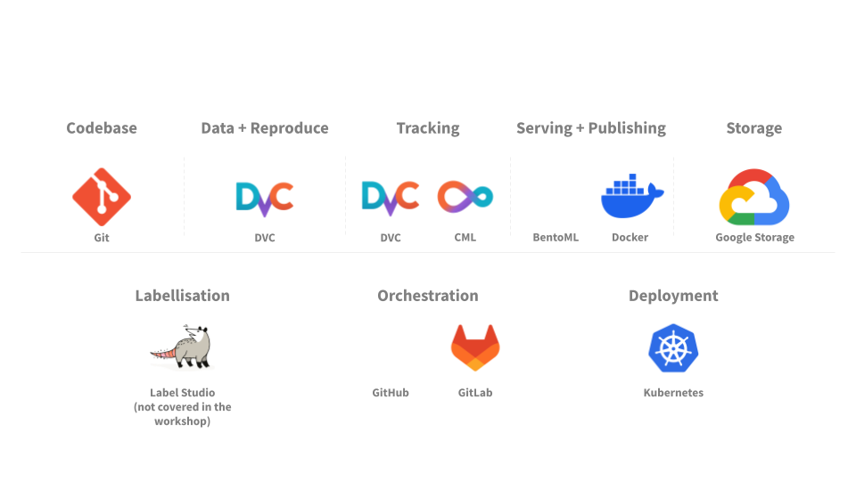

<!--
theme: gaia
size: 16:9
paginate: true
author: Swiss AI Center contributors
title: 'A guide to MLOps - Presentation'
description: 'Presentation of the MLOps guide'
url: https://mlops.swiss-ai-center.ch/presentation/
footer: '**Swiss AI Center** - A guide to MLOps 2024 - CC BY-SA 4.0'
style: |
    :root {
        --color-background: #080809;
        --color-foreground: #bcbec2;
        --color-highlight: #4051b5;
        --color-dimmed: #bcbec2;
        --color-headings: #4051b5;
    }
    blockquote {
        font-style: italic;
    }
    table {
        width: 100%;
    }
    th:first-child {
        width: 15%;
    }
    h1, h2, h3, h4, h5, h6 {
        color: var(--color-headings);
    }
    h2, h3, h4, h5, h6 {
        text-transform: uppercase;
        font-size: 1.5rem;
    }
    h1 a:link, h2 a:link, h3 a:link, h4 a:link, h5 a:link, h6 a:link {
        text-decoration: none;
    }
    hr {
        border: 1px solid var(--color-foreground);
        margin-top: 50px;
        margin-bottom: 50px
    }
headingDivider: 4
-->

[illustration]: ./images/cover.png
[license]:
  https://github.com/swiss-ai-center/a-guide-to-mlops/blob/main/LICENSE
[website]:
  https://mlops.swiss-ai-center.ch
[website-qrcode]:
  https://quickchart.io/qr?format=png&ecLevel=Q&size=400&margin=1&text=https://mlops.swiss-ai-center.ch

[github]:
  https://github.com/swiss-ai-center/a-guide-to-mlops

# A guide to MLOps

<!--
_class: lead
_paginate: false
-->

[Website][website] · [GitHub][github]

<small>Swiss AI Center contributors</small>

<small>This work is licensed under the [CC BY-SA 4.0][license] license.</small>

![bg opacity:0.5][illustration]

## Introduction

<!-- _class: lead -->

## Context

Our team works on a project called **Centre Suisse d’Intelligence Artificiel à destination des PMEs (CSIA-PME)**.

The Swiss AI Center’s mission is to **accelerate the adoption of artificial intelligence in the digital transition of Swiss SMEs**.

We work with four others HES: **HEIA-FR**, **HE-Arc**, **HEVS** and **HEPIA**.

**HEIG-VD** is responsible for **setting up tools to manage ML experiments from code to production**.

## Difficulties with ML projects

**Get out of the context of the experience**

> I ran the experiment but didn’t get the same results, can you check my way of running the experiment?

**Make sure you can build the model at all times**

> I tried to run your code on my machine but it doesn’t work… Are you sure it runs on yours?

---

**Monitor the evolution of the model over time**

> I’m not sure my changes really help the model’s performances… I hope it still works in production.

**Move to production quickly, efficiently and in a semi-automated way**

> Is your model available in production? Can I use it with my mobile app/website? How can I do so?

## Small and medium-sized enterprises (SMEs) face the same problems

<!-- _class: lead -->

## A solution

**MLOps**

➡️ Draw inspiration from Software and DevOps best practices

➡️ Adapting these practices to the world of machine learning

➡️ Improve the management and quality of machine learning projects

## Our proposal

**A guide to MLOps**

🛠️ Switch from a Jupyter Notebook to production using state-of-the-art MLOps tools

🚀 Go from experience to production on the Cloud

📖 Use the best practices for ML

## Presentation of the guide

<!-- _class: lead -->

---

---

---

---

---

---

---

---

---

### The big picture

## Target audience

🤖 You regularly work with machine learning projects

📊 You want to improve processes to ensure quality

🏗️ You want to consolidate your current infrastructure

☁️ You want to move to the Cloud

## Prerequisites

♿ Accessible to everyone!

🧠 Basic knowledge of Python and terminal is sufficient

💳 A valid credit card for cloud deployment

🤝 You will be accompanied throughout the guide!

## Access the guide

<!-- _class: lead -->

Access the guide at  
[mlops.swiss-ai-center.ch][website]

![bg right:40% w:60%][website-qrcode]

## Sources

- MLOps Venn diagram by Cmbreuel on [Wikipedia](https://commons.wikimedia.org/wiki/File:ML_Ops_Venn_Diagram.svg)
- Robot illustation by [OpenClipart-Vectors](https://pixabay.com/users/openclipart-vectors-30363/) on [Pixabay](https://pixabay.com/vectors/cartoon-comic-dance-happy-joy-1295224/)
- Python logo by [Python Software Foundation](https://www.python.org/community/logos/) on [Wikipedia](https://commons.wikimedia.org/wiki/File:Python-logo-notext.svg)
