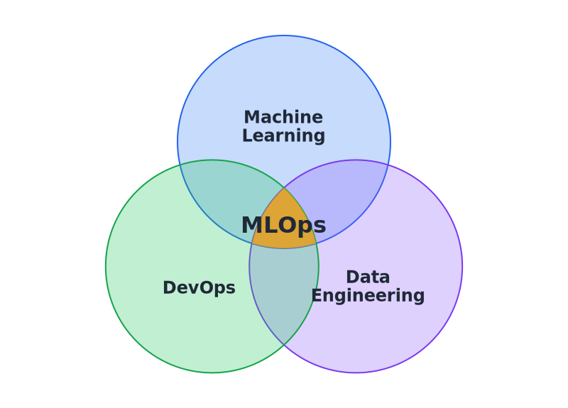
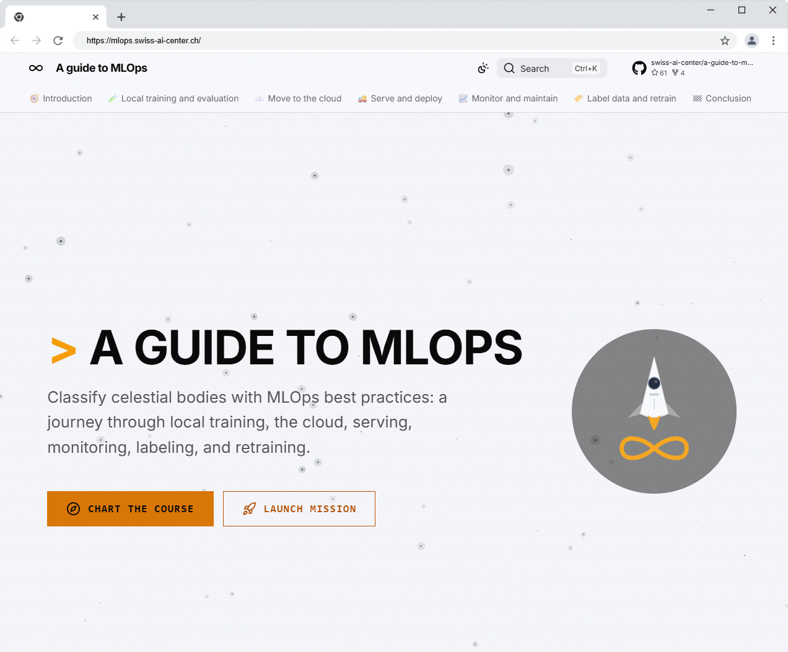
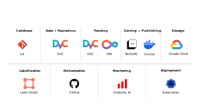
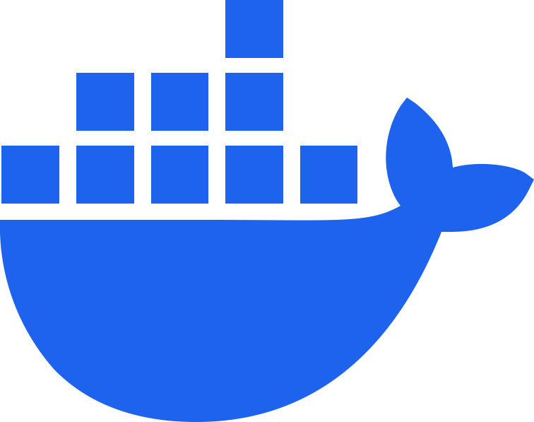

<!--
theme: gaia
size: 16:9
paginate: true
author: Swiss AI Center contributors
title: 'A guide to MLOps - Presentation'
description: 'Presentation of the MLOps guide'
url: https://mlops.swiss-ai-center.ch/presentation/
footer: '**Swiss AI Center** - A guide to MLOps 2026 - CC BY-SA 4.0'
style: |
    :root {
        --color-background: #f7f8fc;
        --color-foreground: #0a0a0a;
        --color-highlight: #d97706;
        --color-dimmed: #525252;
        --color-headings: #b45309;
        --color-card: #ffffff;
        --color-border: #d4d4d4;
    }
    section {
        background: var(--color-background);
        color: var(--color-foreground);
    }
    a:link, a:visited {
        color: var(--color-highlight);
    }
    strong {
        color: var(--color-highlight);
    }
    blockquote {
        font-style: italic;
        border-left: 4px solid var(--color-highlight);
        padding-left: 1rem;
        color: var(--color-dimmed);
    }
    table {
        width: 100%;
    }
    th {
        background: var(--color-card);
        color: var(--color-headings);
        border-bottom: 2px solid var(--color-border);
    }
    td {
        border-bottom: 1px solid var(--color-border);
    }
    th:first-child {
        width: 15%;
    }
    h1, h2, h3, h4, h5, h6 {
        color: var(--color-headings);
    }
    h2, h3, h4, h5, h6 {
        text-transform: uppercase;
        font-size: 1.5rem;
    }
    h1 a:link, h2 a:link, h3 a:link, h4 a:link, h5 a:link, h6 a:link {
        text-decoration: none;
    }
    hr {
        border: 1px solid var(--color-border);
        margin-top: 50px;
        margin-bottom: 50px;
    }
    footer {
        color: var(--color-dimmed);
        font-size: 0.5rem;
    }
    .four-columns {
        display: grid;
        grid-template-columns: repeat(4, minmax(0, 1fr));
        gap: 1rem;
    }
    .center {
        text-align: center;
    }
    .stars-bg {
        background-color: var(--color-background);
        background-image:
            radial-gradient(circle, var(--color-border) 1.5px, transparent 2px),
            radial-gradient(circle, var(--color-highlight) 1px, transparent 1.5px);
        background-size: 120px 120px, 180px 180px;
        background-position: 0 0, 60px 60px;
    }
    /* Tighten split-background layouts: Gaia's 70px section padding wastes
       space beside background images, so reduce the inner padding on the
       content side and align the background image toward the content. */
    section[data-marpit-advanced-background="content"][data-marpit-advanced-background-split="right"] {
        padding-right: 30px !important;
    }
    section[data-marpit-advanced-background="content"][data-marpit-advanced-background-split="left"] {
        padding-left: 30px !important;
    }
    section[data-marpit-advanced-background="background"][data-marpit-advanced-background-split="right"] > div[data-marpit-advanced-background-container] > figure {
        background-position: left center !important;
    }
    section[data-marpit-advanced-background="background"][data-marpit-advanced-background-split="left"] > div[data-marpit-advanced-background-container] > figure {
        background-position: right center !important;
    }
headingDivider: 4
-->

[license]: https://github.com/swiss-ai-center/a-guide-to-mlops/blob/main/LICENSE
[website]: https://mlops.swiss-ai-center.ch
[website-qrcode]:
    https://quickchart.io/qr?format=png&ecLevel=Q&size=400&margin=1&text=https://mlops.swiss-ai-center.ch
[github]: https://github.com/swiss-ai-center/a-guide-to-mlops

# A guide to MLOps

<!--
_class: lead stars-bg
_paginate: false
-->

[Website][website] · [GitHub][github]

<small>Swiss AI Center contributors</small>

## About us

<!-- _class: lead -->

## Swiss AI Center

**Five HES from the HES-SO** (HEIG-VD, HEIA-FR, HE-Arc, HEVS and HEPIA) work on
a project called **Swiss AI Center**.

Its mission is to **accelerate the adoption of artificial intelligence in the
digital transition of Swiss SMEs**.

**HEIG-VD** is responsible for **setting up tools to manage ML experiments from
code to production**.

## Our team

<!--
_paginate: false
-->

**Bertil Chapuis** 
<small>Professor</small>

[Mail](mailto:bertil.chapuis@heig-vd.ch)

**Ludovic Delafontaine** 
<small>Lecturer</small>

[Mail](mailto:ludovic.delafontaine@heig-vd.ch)

**Rémy Marquis** 
<small>aR&D Associate</small>

[Mail](mailto:remy.marquis@heig-vd.ch)

**Leonard Cseres** 
<small>Assistant</small>

[Mail](mailto:leonard.cseres@heig-vd.ch)

## The promise

<!-- _class: lead -->

## A promise

By the end of this workshop, you will know how to turn a **messy notebook**
into a **reproducible, cloud-deployed, monitored ML system**.

## The trap

<!-- _class: lead -->

## LLMs and agentic AI are everywhere

But most companies have **ordinary data problems**

- Data trapped in spreadsheets, logs, and sensors.
- Forecasts built on fragile business systems.
- Classifiers trained on years of messy history.
- Anomaly detection on manufacturing or server metrics.

## ML code vs ML system

Only a **small fraction** of real-world ML systems is composed of the ML code.

The required surrounding infrastructure is vast and complex.

## Difficulties with ML projects

Have you ever heard or said any of these?

> I ran the experiment but didn't get the same results

> I tried to build the model on my machine but it doesn't work...

> The model worked fine before, but not anymore. Did the data change?

> Can I use your model with my mobile app/website?

## Who faces these problems?

**Small teams** and **SMEs** without the dedicated MLOps teams that big tech
can afford.

## The fence

<!-- _class: lead -->

## What this guide is not

-   a course on LLMs or agentic AI
-   a course on machine learning theory
-   a big-bang transformation

## What this guide is

-   a path from notebook to production
-   one possible way of building an ML system
-   the intuition to build an adequate system for your needs

## The path

<!-- _class: lead -->

## A solution

**MLOps**

➡️ Draw inspiration from Software and DevOps best practices

➡️ Adapting these practices to the world of machine learning

➡️ Improve the management and quality of machine learning projects

## Our proposal

**A hands-on guide**

🛠️ A reproducible planet/moon classifier workflow

🚀 Deployed and monitored on the cloud

📖 Transferable to your own experiment and context

## Our principles

**Version-controlled.** Track code, data, and experiments together.

**Composable.** Use the best open-source tool for each job.

**Incremental.** Adopt one practice at a time.

**Pragmatic.** Reproducibility first, then automation, deployment, monitoring, and feedback loops.

## Our audience

For **small teams and SMEs** moving ML from notebooks to production.

-   **Data scientists** ready to leave ad-hoc notebooks and scripts behind
-   **Software engineers** extending DevOps practices to ML

## The guide

<!-- _class: lead -->

## Welcome to the team

You just joined a team of data scientists and ML engineers.

Their mission: build a model that visually identifies planets or moons from
images.

Their problem: the model lives in a Jupyter Notebook, and they cannot ship it.

**Your mission: help them improve the model and deploy it to the cloud.**

### The big picture

## 1. Track experiments with DVC

Every run is versioned and reproducible.

## 2. Review results with CML

Metrics and plots arrive directly in the pull request.

## 3. Serve and deploy the model

The model becomes an API that any application can call.

## 4. Monitor and maintain the model

Observe the model predictions for data drift.

## 5. Label and retrain

Add data with AI assistance and improve iteratively.

## What you need

-   Basic Python and terminal knowledge
-   macOS, Linux, or Windows with WSL2
-   Valid credit card, GitHub account, and Google Cloud account
-   Python 3.13, pip, git, unzip, Docker

## Your next step

-   Open [mlops.swiss-ai-center.ch][website]
-   Contributions and stars on [GitHub][github]
-   Built iteratively from your feedback

![bg right:40% w:60%][website-qrcode]

## Bonus slides

<!-- _class: lead -->

### Usual ML workflow

Each member of the team manages their own codebase, their own dataset and their
own models.

The reproducibility of the model creation is difficult and cannot be guaranteed
over time.

Improvements made to the model are hard to track.

Models are hard to share and deploy in production.

Model drift and degradation go unnoticed.

### High flexibility for the team...

<!-- _class: lead -->

...but hard to maintain.

...hard to reproduce in the future.

...time consuming.

**We can do better.**

### Codebase (1/2)

**Current situation**

-   Each developer has its own codebase
-   Sharing the code with peers is difficult

### Codebase (2/2)

**What we are trying to improve**

-   Allow each developer to improve a common codebase
-   Quickly benefit of the work from others

### Data (1/2)

**Current situation**

-   The dataset must be manually downloaded and put in the right place
-   Different datasets are being used at the same time
-   Datasets are hard to improve

### Data (2/2)

**What we are trying to improve**

-   Allow the usage of a common and up-to-date dataset
-   Efficiently share new revisions to train the model
-   Datasets can be stored anywhere

### Reproduce (1/2)

**Current situation**

-   Steps to create the model can be complex
-   Intermediate commands should not be skipped
-   Hyperparameters are hard to track from one run to another

### Reproduce (2/2)

**What we are trying to improve**

-   Document the steps to reproduce the experiment
-   Ensure it can be run anytime in the future
-   DVC can improve time efficiency

### Tracking (1/2)

**Current situation**

-   Changes to a model are difficult to track
-   Visualize the differences are hard
-   Cannot guarantee the changes are beneficial

### Tracking (2/2)

**What we are trying to improve**

-   Have a visual way to identify the consequences of the changes made to a
    model
-   Errors/anomalies are easily identified

### Serving and publishing (1/2)

**Current situation**

-   The model is hard to use outside the experiment context
-   The model is hard to deploy in production
-   The model is hard to share with others

### Serving and publishing (2/2)

**What we are trying to improve**

-   The model can be used outside the experiment context
-   The model can be deployed in production
-   The model can be shared with others

### Deployment (1/2)

**Current situation**

-   An experiment can run on one machine but can fail on another
-   Models must be prepared to be run outside its experiment context
-   Exposing the model to the outside world is hard

### Deployment (2/2)

**What we are trying to improve**

-   Run the experiment in a clean state to ensure it works everywhere
-   Package the model with all its dependencies
-   The model can be used over the Internet by other applications
-   Automate the process

### Monitoring (1/2)

**Current situation**

-   The model's behavior can drift over time
-   Degradation in performance is hard to detect
-   Issues are often discovered too late, after users are impacted

### Monitoring (2/2)

**What we are trying to improve**

-   Track model performance and data drift continuously
-   Detect anomalies and regressions early
-   Alert the team when the model needs attention

### Labeling (1/2)

**Current situation**

-   Model code and parameters are optimized
-   Model's performances is as good as the quality of the current data
-   We need new data to improve the model's performances

### Labeling (2/2)

**What we are trying to improve**

-   Labeling new data to further improve the model's performance
-   Use new data to retrain and improve the model
-   Make use of AI inference to speed up the labeling process

