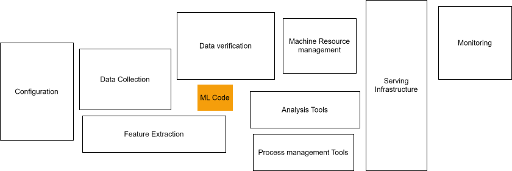
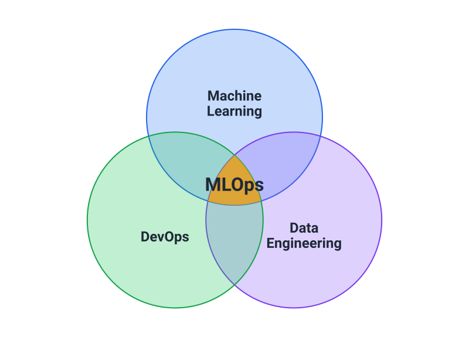
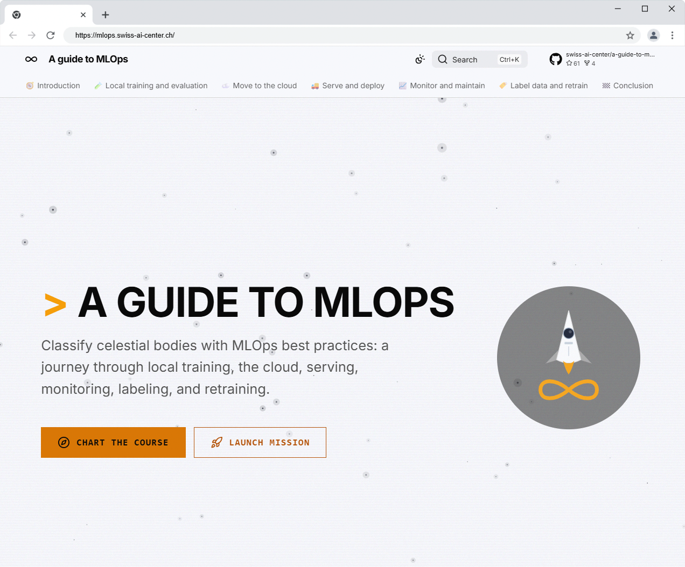
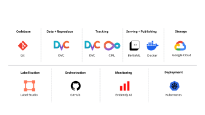

<!--
theme: gaia
size: 16:9
paginate: true
author: Swiss AI Center contributors
title: 'A guide to MLOps - Presentation'
description: 'Presentation of the MLOps guide'
url: https://mlops.swiss-ai-center.ch/presentation/
style: |
    :root {
        --color-background: #f7f8fc;
        --color-foreground: #0a0a0a;
        --color-highlight: #d97706;
        --color-dimmed: #525252;
        --color-headings: #b45309;
        --color-card: #ffffff;
        --color-border: #d4d4d4;
    }
    section {
        background: var(--color-background);
        color: var(--color-foreground);
    }
    a:link, a:visited {
        color: var(--color-highlight);
    }
    strong {
        color: var(--color-highlight);
    }
    blockquote {
        font-style: italic;
        border-left: 4px solid var(--color-highlight);
        padding-left: 1rem;
        color: var(--color-dimmed);
    }
    table {
        width: 100%;
    }
    th {
        background: var(--color-card);
        color: var(--color-headings);
        border-bottom: 2px solid var(--color-border);
    }
    td {
        border-bottom: 1px solid var(--color-border);
    }
    th:first-child {
        width: 15%;
    }
    h1, h2, h3, h4, h5, h6 {
        color: var(--color-headings);
    }
    h2, h3, h4, h5, h6 {
        text-transform: uppercase;
        font-size: 1.5rem;
    }
    h1 a:link, h2 a:link, h3 a:link, h4 a:link, h5 a:link, h6 a:link {
        text-decoration: none;
    }
    hr {
        border: 1px solid var(--color-border);
        margin-top: 50px;
        margin-bottom: 50px;
    }
    footer {
        color: var(--color-dimmed);
        font-size: 0.5rem;
    }
    .four-columns {
        display: grid;
        grid-template-columns: repeat(4, minmax(0, 1fr));
        gap: 1rem;
    }
    .center {
        text-align: center;
    }
    .stars-bg {
        background-color: var(--color-background);
        background-image:
            radial-gradient(circle, var(--color-border) 1.5px, transparent 2px),
            radial-gradient(circle, var(--color-highlight) 1px, transparent 1.5px);
        background-size: 120px 120px, 180px 180px;
        background-position: 0 0, 60px 60px;
    }
    /* Tighten split-background layouts: Gaia's 70px section padding wastes
       space beside background images, so reduce the inner padding on the
       content side and align the background image toward the content. */
    section[data-marpit-advanced-background="content"][data-marpit-advanced-background-split="right"] {
        padding-right: 30px !important;
    }
    section[data-marpit-advanced-background="content"][data-marpit-advanced-background-split="left"] {
        padding-left: 30px !important;
    }
    section[data-marpit-advanced-background="background"][data-marpit-advanced-background-split="right"] > div[data-marpit-advanced-background-container] > figure {
        background-position: left center !important;
    }
    section[data-marpit-advanced-background="background"][data-marpit-advanced-background-split="left"] > div[data-marpit-advanced-background-container] > figure {
        background-position: right center !important;
    }
headingDivider: 4
-->

[license]: https://github.com/swiss-ai-center/a-guide-to-mlops/blob/main/LICENSE
[website]: https://mlops.swiss-ai-center.ch
[github]: https://github.com/swiss-ai-center/a-guide-to-mlops

# A guide to MLOps

<!--
_class: lead stars-bg
_paginate: false
-->

**Swiss AI Center**

<small>Bertil Chapuis · Ludovic Delafontaine · Rémy Marquis · Leonard Cseres</small>

<small>CC BY-SA 4.0</small>

## The promise

<!-- _class: lead -->

<!--
Speaker notes:

By the end of this workshop, you will know how to turn a messy notebook into a
reproducible, cloud-deployed ML system.

This is the empowerment promise.
-->

You will know how to turn a messy **Jupyter notebook** into a **reproducible,
cloud-deployed ML system**.

## About us

<!--
_paginate: false
-->

**Swiss AI Center:** accelerates AI adoption in SMEs digital transition.
**HEIG-VD:** tools to manage ML experiments from code to production.

**Bertil Chapuis** 
<small>Professor</small>

**Ludovic Delafontaine** 
<small>Lecturer</small>

**Rémy Marquis** 
<small>aR&D Associate</small>

**Leonard Cseres** 
<small>Assistant</small>

<!--
Speaker notes:

Five HES from the HES-SO (HEIG-VD, HEIA-FR, HE-Arc, HEVS and HEPIA) work on a
project called Swiss AI Center.

HEIG-VD is responsible for setting up tools to manage ML experiments from code
to production.
-->

## The trap

<!-- _class: lead -->

<!--
Speaker notes:

This is the trap.

Ordinary ML problems:
- Models trained on data trapped in spreadsheets, logs, and sensors.
- Forecasts built on fragile business systems.
- Classifiers trained on years of messy history.
- Anomaly detection on manufacturing or server metrics.
-->

LLM hype is everywhere.

But most companies have **ordinary ML problems**.

## ML code vs ML system

<!--
Speaker notes:

This is the surprise.

The required surrounding infrastructure is vast and complex.
-->

Only a **small fraction** of real-world ML systems is composed of the ML code.

## Why ML projects get stuck

<!-- Speaker note: Pause after the question. -->

Have you ever **heard** or **said** any of these?

> <small>I ran the experiment but didn't get the same results.</small>

> <small>I hope my changes help... and that it still works in production.</small>

> <small>Can I use your model with my mobile app?</small>

> <small>The model worked fine before, but not anymore. Did the data change?</small>

<!--
Speaker notes — Bonus slide content:

When reading the mobile app example, also mention website orally.

Difficulties:
- Each member of the team manages their own codebase, their own dataset and their
  own models.
- The reproducibility of the model creation is difficult and cannot be guaranteed
  over time.
- Improvements made to the model are hard to track.
- Models are hard to share and deploy in production.
- Model drift and degradation go unnoticed.

High flexibility for the team, but:
- hard to maintain,
- hard to reproduce in the future,
- time consuming.

We can do better:
- Get out of the context of the experience.
- Make sure you can build the model at all times.
- Monitor the evolution of the model over time.
- Move to production quickly, efficiently and in a semi-automated way.
-->

## Who faces these problems?

**Data scientists** who train models in notebooks.

**Software engineers** moving to ML engineering.

**Small teams** and **SMEs** without a team to deploy and maintain models.

<!--
Speaker notes:

Data scientists train models in notebooks, save artifacts manually, and deploy
with ad-hoc scripts.

Software engineers already know DevOps practices but are moving to ML
engineering.

Small teams and SMEs where the same people build and run models.
-->

## The Path

<!--
Speaker notes:

This is the path from notebook to production.
The solution is MLOps.

MLOps draws inspiration from software and DevOps best practices.
It adapts these practices to the world of machine learning.
It improves the management and quality of machine learning projects.
-->

**MLOps**: Software and DevOps practices adapted to machine learning.

## Our scope

<!--
Speaker notes:

This is the fence.
This is our scope — what we cover and what we do not cover.

This guide is not:
- a heavy, all-in-one MLOps platform
- a course on LLMs, machine learning, or deep learning

This guide is:
- a lightweight, composable path
- for small teams who already use Git
- from notebook to production, one step at a time
-->

**This is not** an all-in-one MLOps platform or a machine learning course.

**This is** a step-by-step path for small teams who want to go from notebook to production.

## Our proposal

<!--
Speaker notes:

Our proposal:
- A hands-on guide built around a reproducible workflow
- Deployed and monitored on the cloud
- Transferable to your own experiment and context
-->

A **hands-on guide** built around a reproducible workflow, deployed and monitored on
the cloud.

## Our principles

<!--
Speaker notes:

Deliver on the opening promise.

Our principles:
- Version-controlled — track code, parameters, and deployments in Git, and keep
  data versions linked to them, so every model can be reproduced.
- Composable — use best-of-breed open-source tools that each solve one problem
  well.
- Incremental — adopt one practice at a time, not all at once.
- Pragmatic — prioritize reproducibility first, then automation, then
  deployment, then monitoring, then feedback loops. In this guide, that loop
  means using AI-assisted labeling to add data and retrain iteratively.

That is why we avoid all-in-one MLOps platforms that need dedicated
infrastructure or databases. A lightweight, Git-native stack is a pragmatic path
from notebooks to production while you stay in control of your tooling.
-->

**Version-controlled**

**Composable**

**Incremental**

**Pragmatic**

## The guide

<!-- _class: lead -->

**From notebook to production**

<!--
Speaker notes:

This is the story.
This is the hands-on mission.

From notebook to production — this is the recurring slogan of the guide.
-->

## Welcome to the team!

<!--
Speaker notes:

You just joined a team of data scientists and ML engineers.

Their mission: build a model that visually identifies planets or moons from
images.

Their problem: the model lives in a Jupyter Notebook, and they cannot ship it.

Your mission: help them improve the model and deploy it to the cloud.
-->

You just joined a team of data scientists and ML engineers.

**Their mission:** identify planets or moons from images.

**Their problem:** the model is stuck in a Jupyter Notebook.

**Your mission:** help them improve and deploy in production.

### The big picture

## 1. Track experiments

Every run is versioned and reproducible.

<!--
Speaker notes — Bonus slide content:

Codebase — current situation:
- Each developer has their own codebase.
- Sharing the code with peers is difficult.

Codebase — what we improve:
- Allow each developer to improve a common codebase.
- Quickly benefit from the work of others.

Data — current situation:
- The dataset must be manually downloaded and put in the right place.
- Different datasets are being used at the same time.
- Datasets are hard to improve.

Data — what we improve:
- Allow the usage of a common and up-to-date dataset.
- Efficiently share new revisions to train the model.
- Datasets can be stored anywhere.

Reproduce — current situation:
- Steps to create the model can be complex.
- Intermediate commands should not be skipped.
- Hyperparameters are hard to track from one run to another.

Reproduce — what we improve:
- Document the steps to reproduce the experiment.
- Ensure it can be run anytime in the future.
- DVC can improve time efficiency.
-->

## 2. Review results

Metrics and plots arrive directly in the pull request.

<!--
Speaker notes — Bonus slide content:

Tracking — current situation:
- Changes to a model are difficult to track.
- Visualizing the differences is hard.
- Cannot guarantee the changes are beneficial.

Tracking — what we improve:
- Have a visual way to identify the consequences of the changes made to a model.
- Errors and anomalies are easily identified.
-->

## 3. Serve and deploy

The model becomes an API that any application can call.

<!--
Speaker notes — Bonus slide content:

Serving and publishing — current situation:
- The model is hard to use outside the experiment context.
- The model is hard to deploy in production.
- The model is hard to share with others.

Serving and publishing — what we improve:
- The model can be used outside the experiment context.
- The model can be deployed in production.
- The model can be shared with others.

Deployment — current situation:
- An experiment can run on one machine but can fail on another.
- Models must be prepared to be run outside their experiment context.
- Exposing the model to the outside world is hard.

Deployment — what we improve:
- Run the experiment in a clean state to ensure it works everywhere.
- Package the model with all its dependencies.
- The model can be used over the Internet by other applications.
- Automate the process.
-->

## 4. Monitor and maintain

Observe the model predictions for data drift.

<!--
Speaker notes — Bonus slide content:

Monitoring — current situation:
- The model's behavior can drift over time.
- Degradation in performance is hard to detect.
- Issues are often discovered too late, after users are impacted.

Monitoring — what we improve:
- Track model performance and data drift continuously.
- Detect anomalies and regressions early.
- Alert the team when the model needs attention.
-->

## 5. Label and retrain

Add data with AI assistance and improve iteratively.

<!--
Speaker notes — Bonus slide content:

Labeling — current situation:
- Model code and parameters are optimized.
- Model performance is only as good as the quality of the current data.
- We need new data to improve the model's performance.

Labeling — what we improve:
- Label new data to further improve the model's performance.
- Use new data to retrain and improve the model.
- Make use of AI inference to speed up the labeling process.
-->

## What you need

**Knowledge:** Python & terminal basics

**System:** macOS, Linux, or WSL2

**Accounts:** GitHub, Google Cloud with valid credit card

**Tools:** Python 3.13, git, unzip, Docker, an editor

## Get started

<!--
Speaker notes:

The guide is open source, and contributions are welcome.

It is built iteratively from your feedback.

Each detail or pain point you encounter is useful to us.

Do not hesitate to share!

If you launch the cluster during the workshop, beware the costs.
Do not wrap up the workshop without shutting down the cluster!
-->

Your feedback is important.

Contributions and **stars** on GitHub.

Beware the costs.

Open **mlops.swiss-ai-center.ch**

