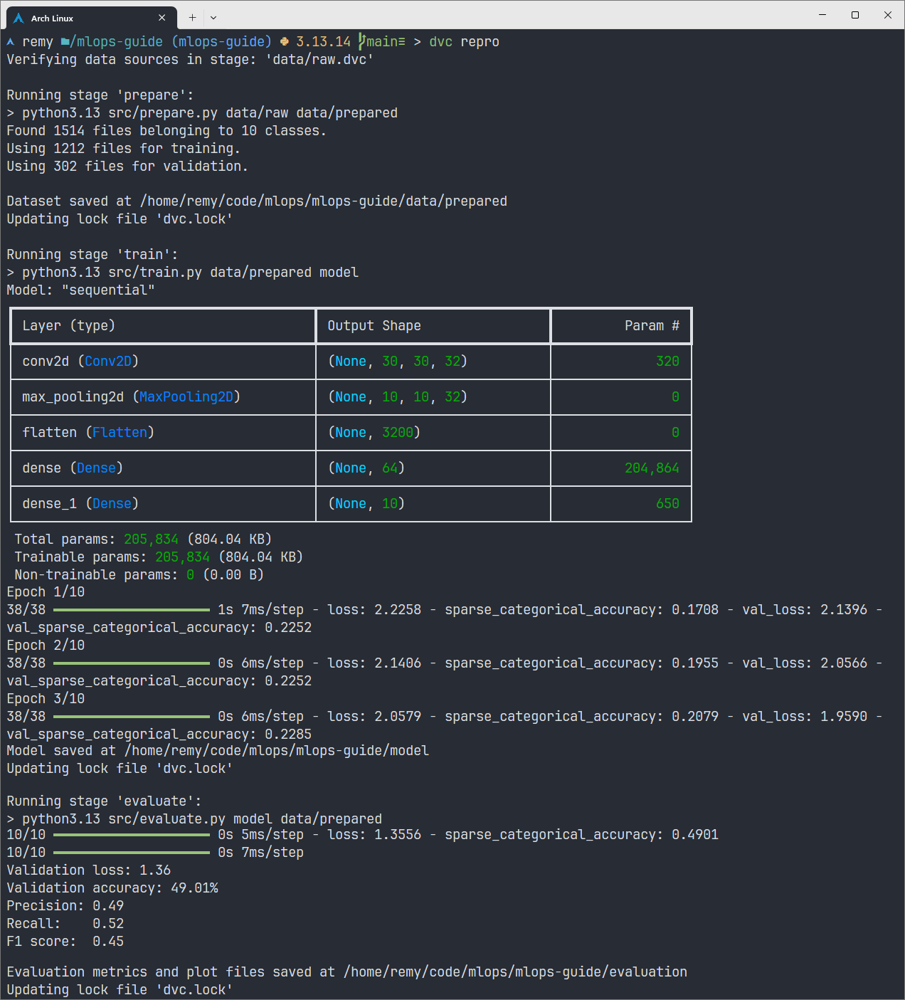
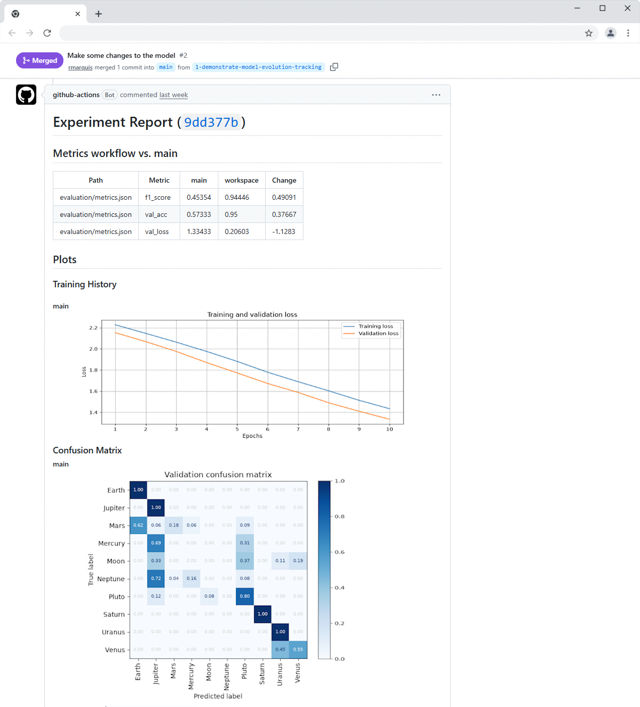
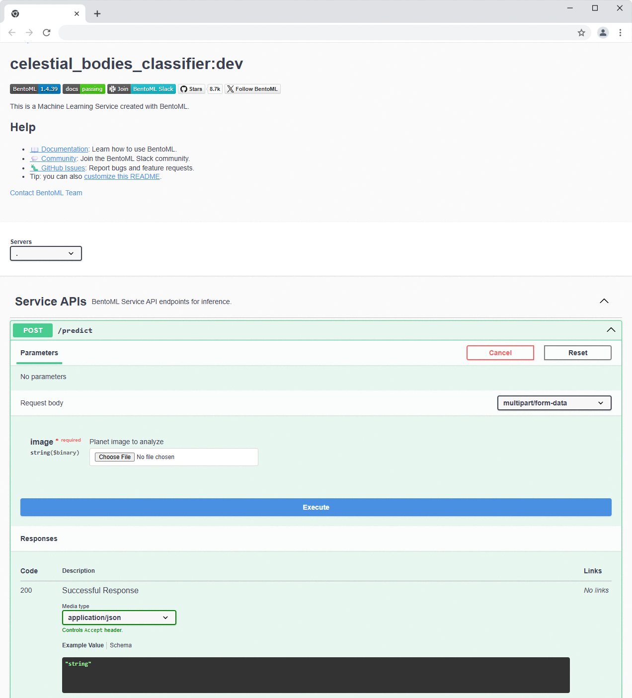
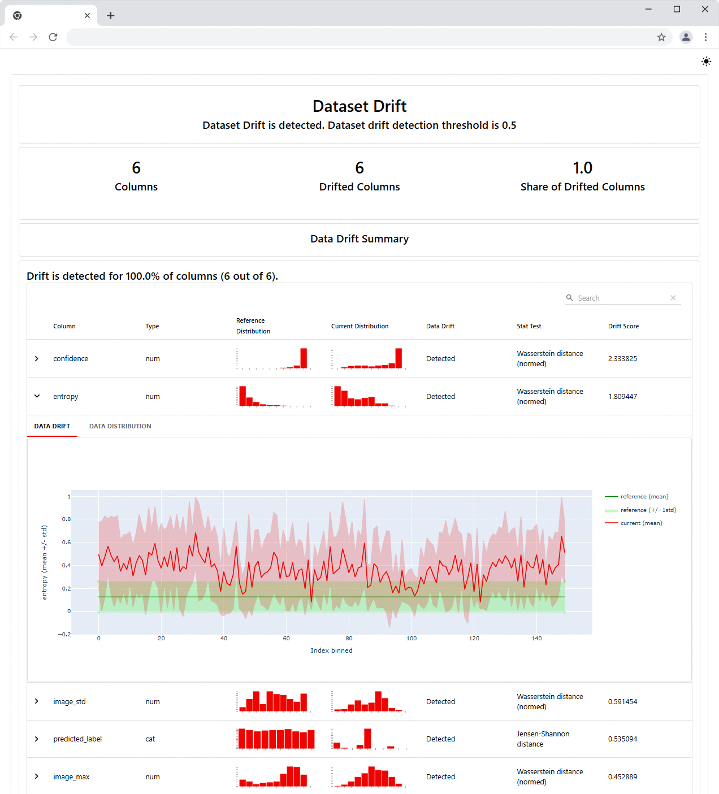
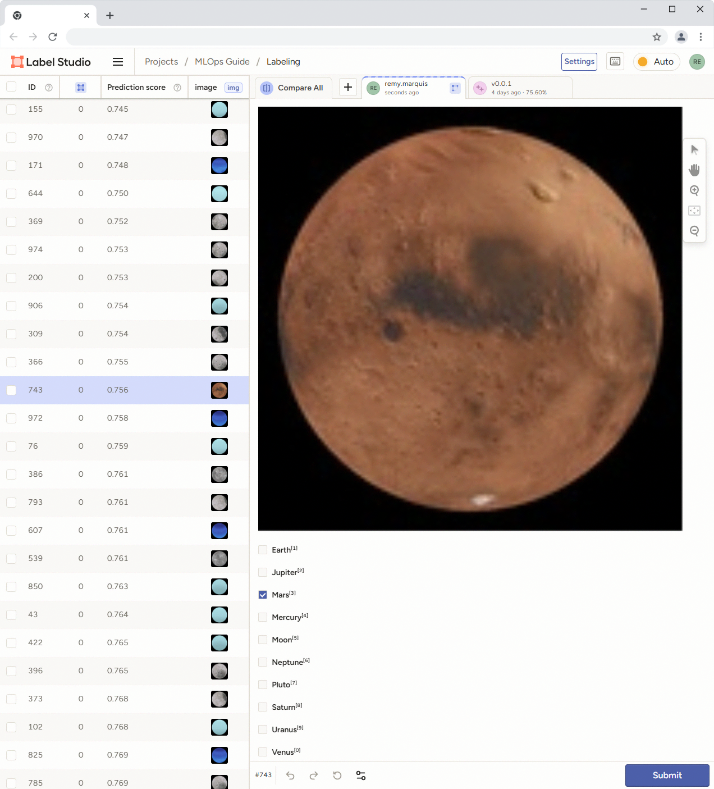

<!--
theme: gaia
size: 16:9
paginate: true
author: Swiss AI Center contributors
title: 'A guide to MLOps - Presentation'
description: 'Presentation of the MLOps guide'
url: https://mlops.swiss-ai-center.ch/presentation/
style: |
    :root {
        --color-background: #f7f8fc;
        --color-foreground: #0a0a0a;
        --color-highlight: #d97706;
        --color-dimmed: #525252;
        --color-headings: #b45309;
        --color-card: #ffffff;
        --color-border: #d4d4d4;
    }
    section {
        background: var(--color-background);
        color: var(--color-foreground);
    }
    a:link, a:visited {
        color: var(--color-highlight);
    }
    strong {
        color: var(--color-highlight);
    }
    blockquote {
        font-style: italic;
        border-left: 4px solid var(--color-highlight);
        padding-left: 1rem;
        color: var(--color-dimmed);
    }
    table {
        width: 100%;
    }
    th {
        background: var(--color-card);
        color: var(--color-headings);
        border-bottom: 2px solid var(--color-border);
    }
    td {
        border-bottom: 1px solid var(--color-border);
    }
    th:first-child {
        width: 15%;
    }
    h1, h2, h3, h4, h5, h6 {
        color: var(--color-headings);
    }
    h2, h3, h4, h5, h6 {
        text-transform: uppercase;
        font-size: 1.5rem;
    }
    h1 a:link, h2 a:link, h3 a:link, h4 a:link, h5 a:link, h6 a:link {
        text-decoration: none;
    }
    hr {
        border: 1px solid var(--color-border);
        margin-top: 50px;
        margin-bottom: 50px;
    }
    footer {
        color: var(--color-dimmed);
        font-size: 0.5rem;
    }
    .four-columns {
        display: grid;
        grid-template-columns: repeat(4, minmax(0, 1fr));
        gap: 1rem;
    }
    .center {
        text-align: center;
    }
    /* Tighten split-background layouts: Gaia's 70px section padding wastes
       space beside background images, so reduce the inner padding on the
       content side and align the background image toward the content. */
    section[data-marpit-advanced-background="content"][data-marpit-advanced-background-split="right"] {
        padding-right: 30px !important;
    }
    section[data-marpit-advanced-background="content"][data-marpit-advanced-background-split="left"] {
        padding-left: 30px !important;
    }
    section[data-marpit-advanced-background="background"][data-marpit-advanced-background-split="right"] > div[data-marpit-advanced-background-container] > figure {
        background-position: left center !important;
    }
    section[data-marpit-advanced-background="background"][data-marpit-advanced-background-split="left"] > div[data-marpit-advanced-background-container] > figure {
        background-position: right center !important;
    }
headingDivider: 4
-->

[license]: https://github.com/swiss-ai-center/a-guide-to-mlops/blob/main/LICENSE
[website]: https://mlops.swiss-ai-center.ch
[github]: https://github.com/swiss-ai-center/a-guide-to-mlops

# A guide to MLOps

<!--
_class: lead
_paginate: false
-->

Bertil Chapuis · Ludovic Delafontaine · Rémy Marquis · Leonard Cseres

**Swiss AI Center · HEIG-VD**

<small>CC BY-SA 4.0</small>

<!--
Speaker notes:

Open with the promise. Introduce yourself and the Swiss AI Center briefly.

Five HES from the HES-SO (HEIG-VD, HEIA-FR, HE-Arc, HEVS and HEPIA) work on a
project called Swiss AI Center, which accelerates AI adoption in SMEs digital
transition.

HEIG-VD is responsible for setting up tools to manage ML experiments from code
to production.
-->

## The promise

<!-- _class: lead -->

<!--
Speaker notes:

By the end of this workshop, you will know how to turn a messy notebook into a
reproducible, cloud-deployed ML system.

This is the empowerment promise.
-->

You will know how to turn a messy **Jupyter notebook** into a **reproducible,
cloud-deployed ML system**.

## The trap

<!-- _class: lead -->

<!--
Speaker notes:

This is the trap.

Ordinary ML problems:
- Models trained on data trapped in spreadsheets, logs, and sensors.
- Forecasts built on fragile business systems.
- Classifiers trained on years of messy history.
- Anomaly detection on manufacturing or server metrics.
-->

LLM hype is everywhere.

But most companies have **ordinary ML problems**.

## ML code vs ML system

<!--
Speaker notes:

This is the surprise.

The required surrounding infrastructure is vast and complex.
-->

Only a **small fraction** of real-world ML systems is composed of the ML code.

## Why ML projects get stuck

<!-- Speaker note: Pause after the question. -->

Have you ever **heard** or **said** any of these?

> <small>I ran the experiment but didn't get the same results.</small>

> <small>I hope my changes help... and that it still works in production.</small>

> <small>Can I use your model with my mobile app?</small>

> <small>The model worked fine before, but not anymore. Did the data change?</small>

<!--
Speaker notes — Bonus slide content:

When reading the mobile app example, also mention website orally.

Difficulties:
- Each member of the team manages their own codebase, their own dataset and their
  own models.
- The reproducibility of the model creation is difficult and cannot be guaranteed
  over time.
- Improvements made to the model are hard to track.
- Models are hard to share and deploy in production.
- Model drift and degradation go unnoticed.

High flexibility for the team, but:
- hard to maintain,
- hard to reproduce in the future,
- time consuming.

We can do better:
- Get out of the context of the experience.
- Make sure you can build the model at all times.
- Monitor the evolution of the model over time.
- Move to production quickly, efficiently and in a semi-automated way.
-->

## Who faces these problems?

**Data scientists** who train models in notebooks.

**Software engineers** moving to ML engineering.

**Small teams** and **SMEs** without a team to deploy and maintain models.

<!--
Speaker notes:

These are the people who build and run models, often without a dedicated MLOps
team: data scientists in notebooks, software engineers moving to ML, and small
teams in SMEs where the same people both build and operate models.
-->

## The Path

<!--
Speaker notes:

This is the path from notebook to production. MLOps adapts software and DevOps
practices to machine learning, improving the management and quality of ML
projects.
-->

**MLOps** adapts software and DevOps practices to machine learning.

## Our scope

<!--
Speaker notes:

This is the fence.
This is our scope — what we cover and what we do not cover.

This guide is not:
- a heavy, all-in-one MLOps platform
- a course on LLMs, machine learning, or deep learning

This guide is:
- a lightweight, composable path
- for small teams who already use Git
- from notebook to production, one step at a time
-->

**This is not** an all-in-one MLOps platform or a machine learning course.

**This is** a step-by-step path for small teams who want to go from notebook to production.

## Our proposal

<!--
Speaker notes:

Our proposal: a hands-on, cloud-deployed, monitored workflow you can transfer to
your own experiment.
-->

A **hands-on guide** built around a reproducible workflow, deployed and monitored on
the cloud.

## Our principles

<!--
Speaker notes:

This is the salient idea.

Say each principle as a contrast pair:
- Version-controlled: from scattered files to one source of truth.
- Composable: from monolithic platforms to best-of-breed tools.
- Incremental: from big bang to one step at a time.
- Pragmatic: from perfect theory to working production.

Then expand:
- Version-controlled means tracking code, parameters, and deployments in Git,
  with data versions linked to them, so every model can be reproduced.
- Composable means using best-of-breed open-source tools that each solve one
  problem well.
- Incremental means adopting one practice at a time, not all at once.
- Pragmatic means prioritizing reproducibility first, then automation,
  deployment, then monitoring, then feedback loops. In this guide, that loop
  means using AI-assisted labeling to add data and retrain iteratively.

That is why we avoid all-in-one MLOps platforms that need dedicated
infrastructure or databases. A lightweight, Git-native stack is a pragmatic path
from notebooks to production while you stay in control of your tooling.
-->

**Version-controlled:**
track code, data, and experiments together.

**Composable:**
pick the best open-source tool for each job.

**Incremental:**
adopt one practice at a time.

**Pragmatic:**
start with reproducibility, then automate, deploy, monitor, and retrain.

## The guide

<!-- _class: lead -->

**From notebook to production**

<!--
Speaker notes:

This is the story. This is the hands-on mission.

This is also the cycle. "From notebook to production" is the recurring slogan;
return to it during the talk.
-->

## Welcome to the team!

<!--
Speaker notes:

This is the protagonist. Put the audience in the role.

They just joined a team of data scientists and ML engineers. The team's mission
is to identify planets or moons from images, but the model is stuck in a
Jupyter Notebook. The audience's mission: help improve and deploy it.
-->

You just joined a team of data scientists and ML engineers.

**Their mission:** identify planets or moons from images.

**Their problem:** the model is stuck in a Jupyter Notebook.

**Your mission:** help them improve and deploy in production.

### The big picture

## 1. Track experiments

Every run is versioned and reproducible.

<!--
Speaker notes — Bonus slide content:

Without version control, code, data, and hyperparameters are scattered across
individual machines and reproducing a result is hard.

What changes: a shared codebase with Git, a common versioned dataset with DVC,
and documented, reproducible steps that anyone can rerun.
-->

## 2. Review results

Metrics and plots arrive directly in the pull request.

<!--
Speaker notes — Bonus slide content:

Today, model changes are hard to track and it is hard to know if they help.

What changes: metrics and plots arrive in the pull request, so the team can
review changes before merging.
-->

## 3. Serve and deploy

The model becomes an API that any application can call.

<!--
Speaker notes — Bonus slide content:

Today, models are hard to use outside the notebook and deployments are fragile.

What changes: package the model with BentoML and Docker, expose it as an API,
and deploy it on Kubernetes so other applications can call it.
-->

## 4. Monitor and maintain

Observe the model predictions for data drift.

<!--
Speaker notes — Bonus slide content:

Today, model drift and degradation are often discovered too late.

What changes: continuously log predictions, detect drift with Evidently AI, and
alert the team when the model needs attention.
-->

## 5. Label and retrain

Add data with AI assistance and improve iteratively.

<!--
Speaker notes — Bonus slide content:

A model is only as good as its data, and data ages.

What changes: collect new data with Label Studio, use the model's own
predictions to speed up labeling, and feed the new data back into training.
-->

## What you need

**Knowledge:** Python & terminal basics

**System:** macOS, Linux, or WSL2

**Accounts:** GitHub, Google Cloud with valid credit card

**Tools:** Python 3.13, git, unzip, Docker, an editor

## Get started

<!--
Speaker notes:

Launch the workshop.

Open mlops.swiss-ai-center.ch and start with the first chapter.

The guide is open source and built iteratively from feedback. If you hit a pain
point, a confusing step, or a typo, open an issue on GitHub or tell us during
the workshop. That is when the feedback is most useful.

If you launch the cluster during the workshop, beware the costs. We will come
back to cleanup at the end.
-->

Open **mlops.swiss-ai-center.ch**.

Start with the hands-on guide.

Share feedback as you go.

## Before you go

<!--
Speaker notes:

This is the close. Deliver on the opening promise.

Three things to leave them with:

1. Clean up — open docs/clean-up.md. Stress that every cloud resource they
   created is still costing money. Walk through the checklist: delete the
   Kubernetes cluster, Artifact Registry, Storage bucket, service account, and
   finally the project. Unlink billing and remove the payment method if they
   created a fresh account.

2. Apply — they now have a closed loop: version control with Git and DVC,
   automated training and review with CI/CD and CML, serving with BentoML,
   monitoring with Fluent Bit and Evidently AI, and retraining with Label
   Studio. The value is not the tools; it is the workflow they can reuse on
   their own experiment.

3. Star — if the guide was useful, star the repository on GitHub. This helps
   others find it and gives us a signal that the work is valuable.

Cycle back to the promise: "You started with a notebook stuck on one machine.
Now you know how to take a model to production — and keep it healthy."

Final words options — pick one, do not say "thank you":
- Salute the venue: "Enjoy the rest of the conference."
- Salute the audience: "Good luck with your models."
- Congratulate them: "You now have a roadmap from notebook to production. The
  next step is yours."
- Call to action: "Go clean up your resources, then go build something."
- Convention: simply gesture toward the slide and step back.

Deliver on the opening promise.
-->

**Clean up** your cloud resources.

**Star** the repository on GitHub.

**Apply** the workflow to your own model.
