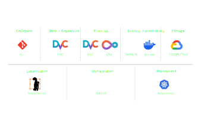
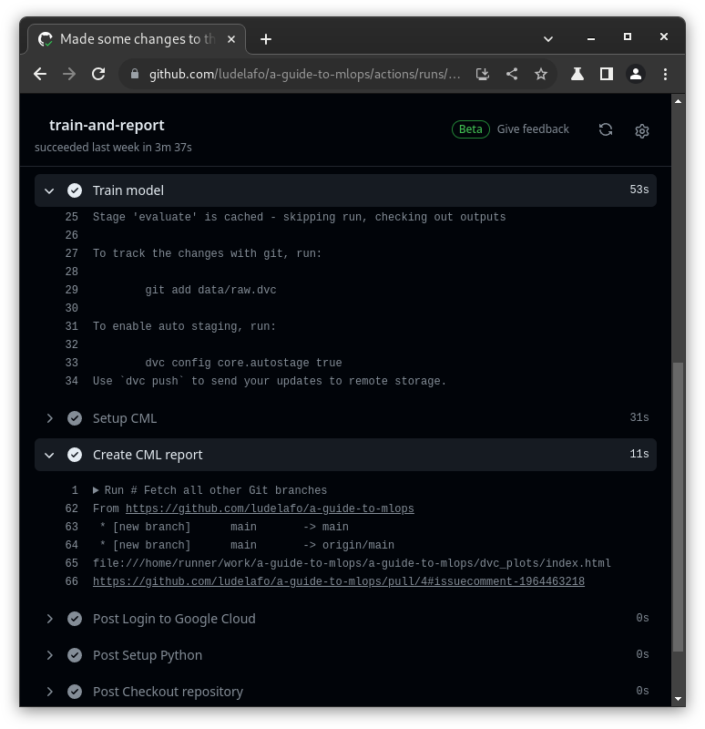

<!--
theme: gaia
size: 16:9
paginate: true
author: Swiss AI Center contributors
title: 'A guide to MLOps - Presentation'
description: 'Presentation of the MLOps guide'
url: https://mlops.swiss-ai-center.ch/presentation/
footer: '**Swiss AI Center** - A guide to MLOps 2025 - CC BY-SA 4.0'
style: |
    :root {
        --color-background: #080809;
        --color-foreground: #bcbec2;
        --color-highlight: #4051b5;
        --color-dimmed: #bcbec2;
        --color-headings: #4051b5;
    }
    blockquote {
        font-style: italic;
    }
    table {
        width: 100%;
    }
    th:first-child {
        width: 15%;
    }
    h1, h2, h3, h4, h5, h6 {
        color: var(--color-headings);
    }
    h2, h3, h4, h5, h6 {
        text-transform: uppercase;
        font-size: 1.5rem;
    }
    h1 a:link, h2 a:link, h3 a:link, h4 a:link, h5 a:link, h6 a:link {
        text-decoration: none;
    }
    hr {
        border: 1px solid var(--color-foreground);
        margin-top: 50px;
        margin-bottom: 50px
    }
    .four-columns {
        display: grid;
        grid-template-columns: repeat(4, minmax(0, 1fr));
        gap: 1rem;
    }
    .center {
        text-align: center;
    }
headingDivider: 4
-->

[illustration]: ./images/cover.png
[license]: https://github.com/swiss-ai-center/a-guide-to-mlops/blob/main/LICENSE
[website]: https://mlops.swiss-ai-center.ch
[website-qrcode]:
    https://quickchart.io/qr?format=png&ecLevel=Q&size=400&margin=1&text=https://mlops.swiss-ai-center.ch
[github]: https://github.com/swiss-ai-center/a-guide-to-mlops

# A guide to MLOps

<!--
_class: lead
_paginate: false
-->

[Website][website] · [GitHub][github]

<small>Swiss AI Center contributors</small>

<small>This work is licensed under the [CC BY-SA 4.0][license] license.</small>

![bg opacity:0.5][illustration]

## Introduction

<!-- _class: lead -->

## ML code vs ML system

Only a small fraction of real-world ML systems is composed of the ML code.

The required surrounding infrastructure is vast and complex.

## Difficulties with ML projects

**Get out of the context of the experience**

> I ran the experiment but didn’t get the same results, can you check my way of
> running the experiment?

**Make sure you can build the model at all times**

> I tried to build the model on my machine but it doesn’t work... Are you sure
> it builds on yours?

---

**Monitor the evolution of the model over time**

> I’m not sure my changes really help the model’s performances… I hope it still
> works in production.

**Move to production quickly, efficiently and in a semi-automated way**

> Is your model available in production? Can I use it with my mobile
> app/website? How can I do so?

## Small and medium-sized enterprises (SMEs) face the same problems

<!-- _class: lead -->

## A solution

**MLOps**

➡️ Draw inspiration from Software and DevOps best practices

➡️ Adapting these practices to the world of machine learning

➡️ Improve the management and quality of machine learning projects

## Our proposal

**A guide to MLOps**

🛠️ Switch from a Jupyter Notebook to production using state-of-the-art MLOps
tools

🚀 Go from experience to production on the Cloud

📖 Use the best practices for ML

## A guide to MLOps

<!-- _class: lead -->

A quick presentation of the guide

### _"Welcome to the team!"_

You just have joined a team of data scientists and machine learning (ML)
engineers (_welcome!_).

The team is working on a model capable of visually identifying planets or moons
within our solar system from images in a Jupyter Notebook.

The team is facing difficulties to move the model to production.

Your mission is to help the team to improve the model and deploy it to the cloud
using MLOps best practices.

### The big picture

---

 

---

 

---

 

---

 

---

 

---

 

---

 

---

 

---

 

## Target audience

🤖 You regularly work with machine learning projects

📊 You want to improve processes to ensure quality

🏗️ You want to consolidate your current infrastructure

☁️ You want to move to the Cloud

## Prerequisites

♿ Accessible to everyone!

🧠 Basic knowledge of Python and terminal is sufficient

💳 A valid credit card for cloud deployment

🤝 You will be accompanied throughout the guide!

## Technical checks

Before we start:

💻 macOS, Linux, Windows with WSL2

📝 Editor and Terminal (VS Code recommended)

🛠️ Python 3.13, pip, git, unzip, docker

☁️ GitHub account, Google Cloud account

## Access the guide

👉 Access the guide at [mlops.swiss-ai-center.ch][website].

💪 Feel free to open an issue on [GitHub][github] if you encounter any
difficulties or want to contribute.

🙏 Leave us a star if you like the guide!

![bg right:40% w:60%][website-qrcode]

## Now it's your turn!

<!-- _class: lead -->

Feel free to ask questions, share your feedback and contribute to the guide!

We are here to help.

## Clean up

Now that you have completed the guide, it is important to properly manage and
remove the resources and environments you have created.

This is necessary to avoid:

* unnecessary incurring costs
* potential security concerns

## Conclusion

Congratulations! You have completed the guide to MLOps!

You have learned how to improve the management and quality of machine learning
projects.

You are now able to switch from a Jupyter Notebook to production using
state-of-the-art MLOps tools.

You can go from experiment to production on the Cloud, using the best practices
for ML. 🚀

## Bonus slides

<!-- _class: lead -->

### Usual ML workflow

Each member of the team manages their own codebase, their own dataset and their
own models.

The reproducibility of the model creation is difficult and cannot be guaranteed
over time.

Improvements made to the model are hard to track.

Models are hard to share and deploy in production.

### High flexibility for the team...

<!-- _class: lead -->

...but hard to maintain.

...hard to reproduce in the future.

...time consuming.

**We can do better.**

### Codebase (1/2)

**Current situation**

-   Each developer has its own codebase
-   Sharing the code with peers is difficult

### Codebase (2/2)

**What we are trying to improve**

-   Allow each developer to improve a common codebase
-   Quickly benefit of the work from others

### Data (1/2)

**Current situation**

-   The dataset must be manually downloaded and put in the right place
-   Different datasets are being used at the same time
-   Datasets are hard to improve

### Data (2/2)

**What we are trying to improve**

-   Allow the usage of a common and up-to-date dataset
-   Efficiently share new revisions to train the model
-   Datasets can be stored anywhere

### Reproduce (1/2)

**Current situation**

-   Steps to create the model can be complex
-   Intermediate commands should not be skipped
-   Hyperparameters are hard to track from one run to another

### Reproduce (2/2)

**What we are trying to improve**

-   Document the steps to reproduce the experiment
-   Ensure it can be run anytime in the future
-   DVC can improve time efficiency

### Tracking (1/2)

**Current situation**

-   Changes to a model are difficult to track
-   Visualize the differences are hard
-   Cannot guarantee the changes are beneficial

### Tracking (2/2)

**What we are trying to improve**

-   Have a visual way to identify the consequences of the changes made to a
    model
-   Errors/anomalies are easily identified

### Serving and publishing (1/2)

**Current situation**

-   The model is hard to use outside the experiment context
-   The model is hard to deploy in production
-   The model is hard to share with others

### Serving and publishing (2/2)

**What we are trying to improve**

-   The model can be used outside the experiment context
-   The model can be deployed in production
-   The model can be shared with others

### Deployment (1/2)

**Current situation**

-   An experiment can run on one machine but can fail on another
-   Models must be prepared to be run outside its experiment context
-   Exposing the model to the outside world is hard

### Deployment (2/2)

**What we are trying to improve**

-   Run the experiment in a clean state to ensure it works everywhere
-   Package the model with all its dependencies
-   The model can be used over the Internet by other applications
-   Automate the process

### Labeling (1/2)

**Current situation**

-   Model code and parameters are optimized
-   Model's performances is as good as the quality of the current data
-   We need new data to improve the model's performances

### Labeling (2/2)

**What we are trying to improve**

-   Labeling new data to further improve the model's performance
-   Use new data to retrain and improve the model
-   Make use of AI inference to speed up the labeling process

## Sources

-   MLOps Venn diagram by Cmbreuel on
    [Wikipedia](https://commons.wikimedia.org/wiki/File:ML_Ops_Venn_Diagram.svg)
-   ML system diagram by [D. Sculley et. al. NIPS 2015: Hidden technical debt in Machine learning systems](https://dl.acm.org/doi/10.5555/2969442.2969519)
-   Robot illustation by
    [OpenClipart-Vectors](https://pixabay.com/users/openclipart-vectors-30363/)
    on
    [Pixabay](https://pixabay.com/vectors/cartoon-comic-dance-happy-joy-1295224/)
